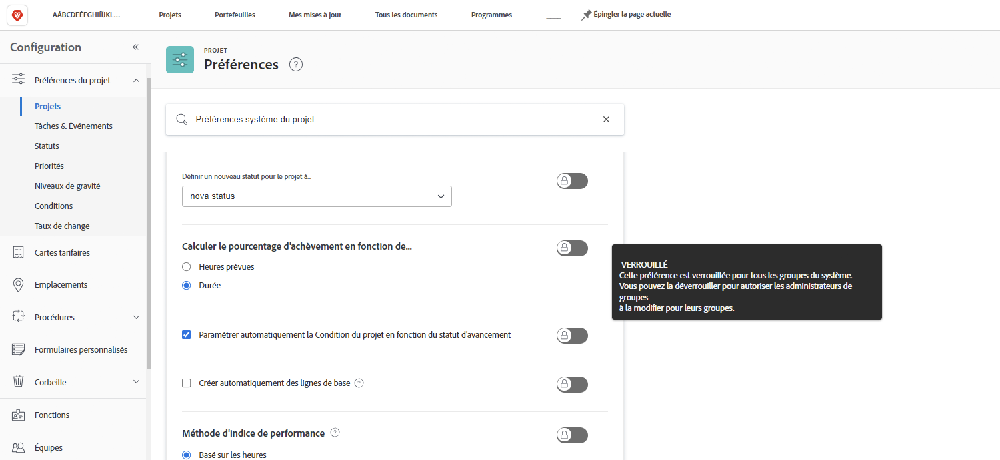
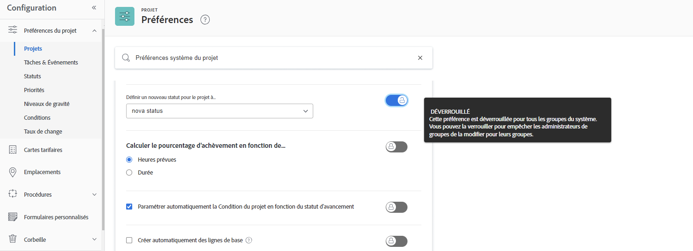
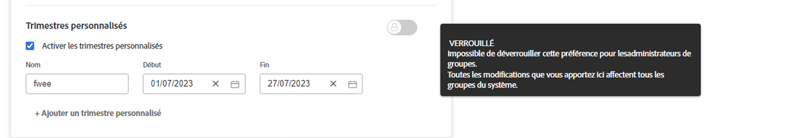

# Configurer les paramètres globaux du projet par défaut

<!---
21.4 updates have been made
--->

Dans cette vidéo, vous apprendrez à :

* Modifier un statut personnalisé
* Définir les préférences globales du projet
* Créer et utiliser des plannings

>[!VIDEO](https://video.tv.adobe.com/v/335065/?quality=12&learn=on&enablevpops)

## Paramètres globaux, de projet de groupe, de tâche et de problème

Lorsque vous ouvrez les paramètres de [!UICONTROL Projets] dans [!DNL Workfront], vous remarquerez qu’il est indiqué « [!UICONTROL Préférences du projet système] » dans la barre de recherche en haut de la fenêtre. Cela vous permet de savoir que ces paramètres s’appliquent à tous les utilisateurs et utilisatrices de votre système [!DNL Workfront], il s’agit d’une configuration globale.

Page ![[!UICONTROL Préférences du projet] dans [!UICONTROL Configuration]](assets/admin-fund-system-project-preferences-1.png)

Vous verrez quelque chose de similaire lorsque vous ouvrirez les paramètres [!UICONTROL Tâches et problèmes].

![[!UICONTROL Préférences des tâches et des problèmes] dans [!UICONTROL Configuration]](assets/admin-fund-task-issue-preferences-2.png)

Cependant, il est possible que tous les groupes dans [!DNL Workfront] n’aient pas les mêmes préférences en matière de projets, de tâches et de problèmes. Par exemple, le groupe marketing souhaite que le statut d’un nouveau projet soit Planification, tandis que le groupe des gestionnaires de projet préfère le statut Demande.

[!DNL Workfront] permet aux administrateurs et administratrices de groupes d’ajuster certaines préférences de projets, de tâches et de problèmes pour leurs groupes. Les préférences qui peuvent être ajustées sont déterminées par l’administrateur ou l’administratrice du système [!DNL Workfront] à l&#39;aide des boutons de verrouillage/déverrouillage.

Commencez par vous rendre dans la zone [!UICONTROL Configuration] :

1. Sélectionnez **[!UICONTROL Configuration]** dans le **[!UICONTROL menu principal]**.
1. Développez **[!UICONTROL Préférences du projet]** dans le menu de gauche.
1. Sélectionnez **[!UICONTROL Projets]** ou **[!UICONTROL Tâches et problèmes]**, en fonction des paramètres que vous souhaitez modifier.

Verrouillez une préférence pour empêcher les administrateurs et administratrices de groupe d’ajuster ce paramètre pour leur groupe.

Déverrouillez la préférence pour que les administrateurs et administratrices de groupe puissent la personnaliser.

Certains paramètres ne peuvent pas être déverrouillés et restent des paramètres système globaux.

### Définir les préférences des groupes et des sous-groupes

Pour tous les paramètres déverrouillés par l’administrateur ou l’administratrice système, les responsables de l’administration du groupe peuvent effectuer des ajustements pour le groupe qu’ils gèrent et tous les sous-groupes imbriqués dans ce groupe. En outre, les administrateurs et administratrices de groupe peuvent contrôler les paramètres que les administrateurs et administratrices de sous-groupe peuvent modifier.

1. Sélectionnez **[!UICONTROL Configuration]** dans le **[!UICONTROL menu principal]**.
1. Cliquez sur **[!DNL Groups]** dans le menu de gauche.
1. Cliquez sur le nom du groupe ou du sous-groupe pour l’ouvrir.
1. Sélectionnez **[!UICONTROL Préférences du projet]** ou **[!UICONTROL Préférences des tâches et des problèmes]** dans le menu de gauche.
1. Apportez les modifications nécessaires à chacune des préférences déverrouillées.
1. Sélectionnez **[!UICONTROL Enregistrer]**.

Section ![[!UICONTROL Statut du projet] sur la page [!UICONTROL Groupe]](assets/admin-fund-group-preferences.png)

Si votre entreprise n’a pas d’administrateurs et administratrices de groupe, c’est l’administrateur ou l’administratrice système qui peut gérer les paramètres de préférence pour les différents groupes.

<!---
learn more URLs and guides
Create or edit a group status 
Group administrators 
Configure system-wide project preferences 
Configure project preferences for a group 
Configure task and issue preferences for a group 
Create and modify a group’s schedule 
--->
