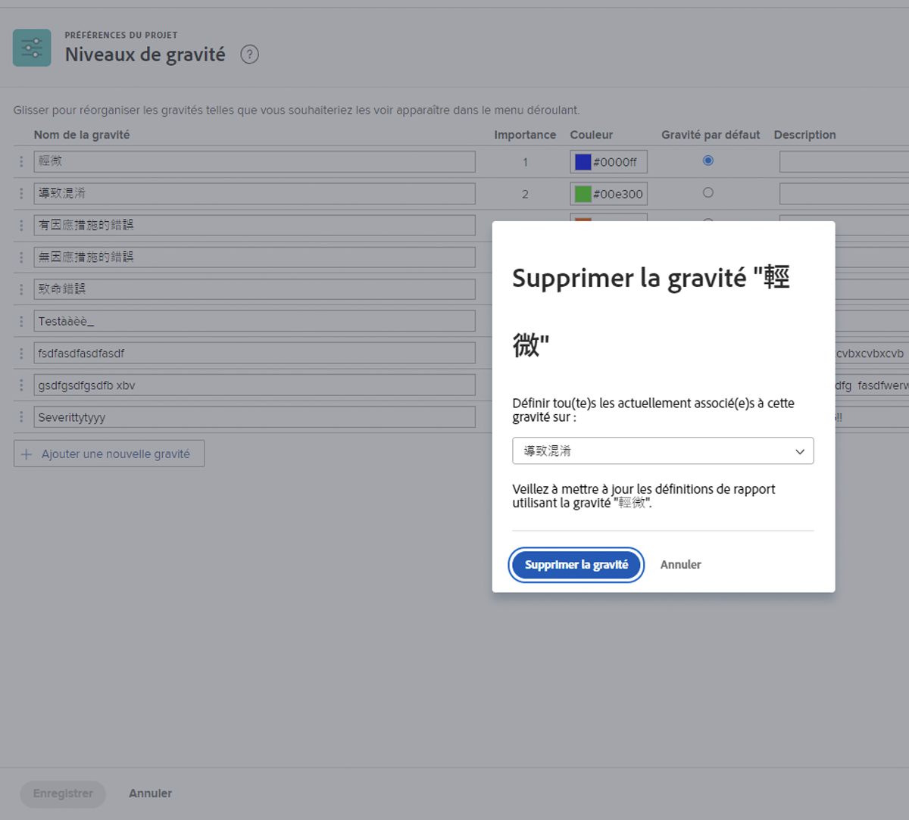

# Créer et gérer la gravité des problèmes

## Présentation de la gravité des problèmes

La gravité peut être utilisée pour indiquer l’importance d’un problème ou son impact sur le travail en cours.

Menu ![[!UICONTROL Gravité] dans la fenêtre [!UICONTROL Détails du problème]](assets/admin-fund-severity-issue-details.png)

Le champ [!UICONTROL Gravité] est accessible dans les [!UICONTROL Détails du problème]. Elle peut également être incluse dans les vues de colonnes des listes et dans les rapports personnalisés.

[!DNL Workfront] comporte cinq gravités par défaut :

* [!UICONTROL Décoratif]
* [!UICONTROL Cause de la confusion]
* [!UICONTROL Bogue qui a une solution]
* [!UICONTROL Bogue sans solution]
* [!UICONTROL Erreur fatale]

Si nécessaire, les administrateurs et administratrices système peuvent renommer ces niveaux de gravité par défaut ou en créer de nouveaux.

Les niveaux de gravité ne sont disponibles que pour les problèmes dans [!DNL Workfront].

## Créer et gérer la gravité des problèmes

En tant qu’administrateur ou administratrice système, vous pouvez créer de nouveaux niveaux de gravité, si nécessaire, pour effectuer le workflow du problème.

Page ![[!UICONTROL Gravités] dans [!UICONTROL Configuration]](assets/admin-fund-severity-section.png)

1. Cliquez sur **[!UICONTROL Configuration]** dans le **[!UICONTROL Menu principal]**.
1. Développez la section **[!UICONTROL Préférences du projet]** dans le panneau de menu gauche.
1. Sélectionnez **[!UICONTROL Gravités]**.
1. Cliquez sur **[!UICONTROL Ajouter une nouvelle gravité]**.
1. Donnez à la gravité un nom correspondant à sa future utilisation.
1. Le nombre **[!UICONTROL Importance]** correspond à la gravité du problème. Le nombre le plus élevé correspond au niveau de gravité le plus élevé. Le nombre [!UICONTROL Importance] doit être unique.
1. Sélectionnez une couleur pour votre priorité. Elle servira dans les rapports sous forme de graphique et à d’autres endroits dans [!DNL Workfront].
1. Désignez l’une des options de gravité comme **[!UICONTROL Gravité par défaut]**. Cette option est appliquée automatiquement à tous les nouveaux problèmes dans Workfront.
1. Incluez une description de la gravité, par exemple son utilité.
1. Cliquez en dehors des champs pour enregistrer.

Liste ![[!UICONTROL Gravités]](assets/admin-fund-severity-new.png)

### Modification des gravités

Si une gravité cesse d’être utile pour les workflows de votre problème, vous pouvez la renommer, la masquer ou la supprimer.

Si une gravité cesse d’être utile, [!DNL Workfront] vous recommande de la masquer (cliquez sur la case [!UICONTROL Masquer] à côté d’elle dans la zone de configuration). Cette opération supprime l’option de gravité du menu déroulant sur le problème, mais elle conserve la gravité des données historiques afin qu’elle soit toujours disponible à des fins de création de rapports.

Colonne ![[!UICONTROL Masquer] mise en surbrillance sur la page [!UICONTROL Gravités] dans [!UICONTROL Configuration]](assets/admin-fund-severity-hide.png)

[!DNL Workfront] recommande de ne **pas** supprimer une gravité qui a été utilisée pour des problèmes antérieurs. Lorsque vous supprimez une gravité, le système vous demande de la remplacer par une autre. Cela peut modifier les données historiques et affecter la création de rapports.

<!---
learn more URLs
Create and customize issue severities
Update issue severity
--->
