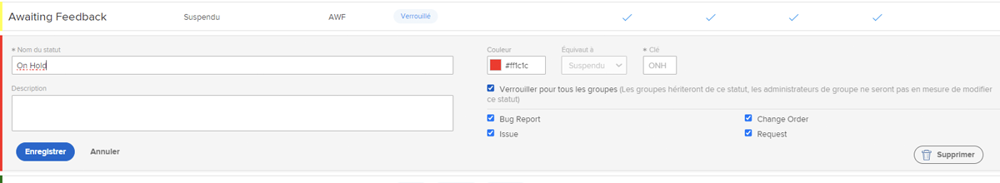
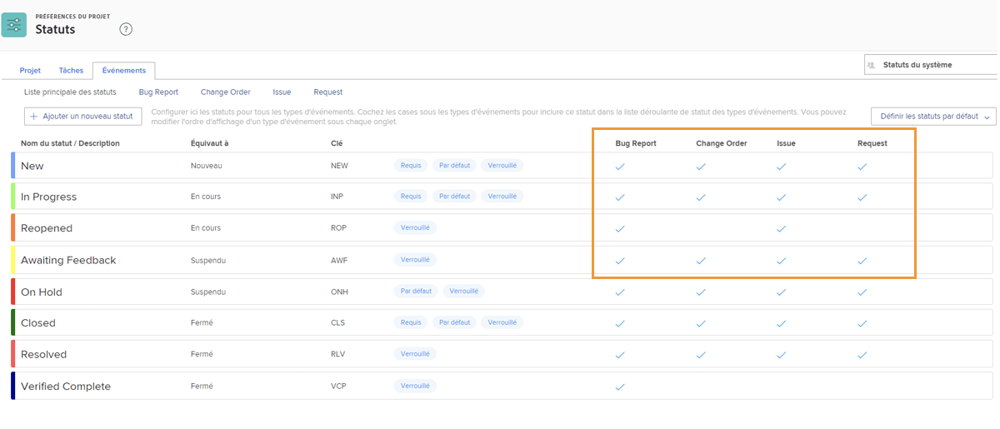

# Personnalisation des états à l’échelle du système

[!DNL Workfront] fournit diverses statues par défaut pour s’adapter aux workflows de gestion des problèmes de votre entreprise. Vous pouvez renommer ces états pour les adapter à la terminologie de votre entreprise. Et les états peuvent être attribués à des types de problèmes spécifiques.

D’autres états peuvent être créés, si nécessaire. Seuls les administrateurs système peuvent créer des états à l’échelle du système. En outre, les administrateurs système contrôlent les états qui peuvent être modifiés par les administrateurs de groupe.

![[!UICONTROL Problèmes] Onglet [!UICONTROL Statues] page [!UICONTROL Configuration]](assets/admin-fund-all-issue-statuses.png)

## Modifier les états existants

[!DNL Workfront] recommande un nombre minimum d’états. Cela facilite le choix de l’état approprié pour les utilisateurs et se traduit par une liste plus courte de statuts à gérer.

Vous pouvez modifier un état existant pour modifier le nom, les types de problèmes auxquels il est affecté, la couleur associée, etc.

![Liste d’état du problème avec [!UICONTROL Modifier] option mise en surbrillance](assets/admin-fund-edit-issue-status.png)

1. Cliquez sur **[!UICONTROL Configuration]** dans le **[!UICONTROL Menu Principal]**.
1. Développez l’objet **[!UICONTROL Préférences du projet]** dans le panneau du menu de gauche.
1. Sélectionner **[!UICONTROL Statuts]**.
1. Sélectionnez la **[!UICONTROL Problèmes]** et assurez-vous de [!UICONTROL États du système] s’affiche dans le coin supérieur droit.
1. Sélectionner **[!UICONTROL Liste des Principal]** pour afficher les états de tous les types de problèmes. C’est là que vous créez ou modifiez un état de problème.
1. Pointez sur le côté droit de l’état que vous souhaitez renommer, puis cliquez sur **[!UICONTROL Modifier]**.
1. Donnez un nouveau nom à l’état ou modifiez l’une des autres informations, suivant vos besoins.
1. Verrouillez l’état si ces paramètres doivent s’appliquer à tous les utilisateurs de votre [!DNL Workfront] instance.
1. Déverrouillez l’état pour permettre aux administrateurs de groupe de modifier l’état uniquement pour leurs groupes.
1. Cochez les cases correspondant au type de problème auquel le statut doit s’appliquer.
1. Cliquer sur **[!UICONTROL Enregistrer]**.

### Affectations d’état

Tous les statuts ne peuvent pas être attribués à tous les types de problèmes. Le [!UICONTROL Statuts] comporte des colonnes indiquant le type de problème pour lequel chaque état peut être utilisé.

Pour afficher uniquement les états affectés à un type de problème spécifique, cliquez simplement sur le nom du type de problème en haut de la fenêtre.

![[!UICONTROL Problème] de [!UICONTROL État] page avec colonnes surlignées](assets/admin-fund-statuses-issue-type.png)

À partir de là, vous pouvez faire glisser les problèmes et les déposer dans l’ordre dans lequel ils doivent apparaître dans le [!UICONTROL État] menu déroulant.

Pour modifier les états, vous devez revenir au [!UICONTROL Liste des Principal].
