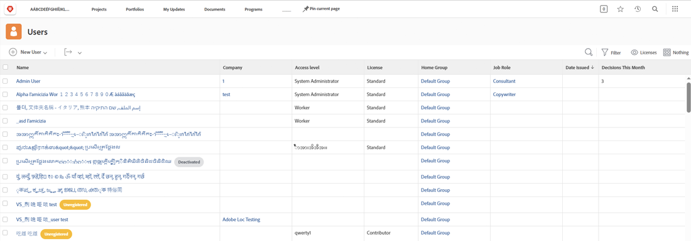

# Ajout d’utilisateurs en bloc

L’ajout d’utilisateurs un par un peut être fastidieux et fastidieux. [!DNL Workfront] permet à un administrateur système d’ajouter plusieurs utilisateurs en même temps à l’aide de la fonction d’importation.

![[!UICONTROL Importer des personnes] option de menu](assets/admin-fund-adding-users-5.png)

1. Sélectionner **[!UICONTROL Utilisateurs]** de la [!UICONTROL Menu Principal].
1. Sélectionnez la flèche sur le **[!UICONTROL Nouvelle personne]** et sélectionnez **[!UICONTROL Importer des personnes]**.
1. La fenêtre qui s’ouvre vous guide tout au long de la création d’une feuille de calcul des utilisateurs à importer.
1. Téléchargez le fichier d’exemple, qui est un [!DNL Excel] feuille de calcul.
1. Mettez à jour la feuille de calcul avec les informations sur l’utilisateur (prénom, nom, adresse électronique, niveau d’accès), en suivant les instructions du fichier lui-même.
1. Sélectionnez la **[!UICONTROL Choisir un fichier]** une fois la liste des utilisateurs enregistrée.
1. Accédez au fichier de feuille de calcul de l’utilisateur et sélectionnez-le.

Les utilisateurs importés apparaissent dans la variable [!UICONTROL Utilisateurs] liste. Si nécessaire, modifiez les informations d’un ou de plusieurs utilisateurs.

## Importer des utilisateurs : Utilisation des lancements de lancement

[!DNL Workfront] fournit un modèle de démarrage rapide pour importer des données dans le système. Il peut également être utilisé pour importer des utilisateurs. Avant d’utiliser le démarrage, [!DNL Workfront] vous recommande de travailler avec vos [!DNL Workfront] consultant, car vous devez tenir compte des points à prendre en compte.

<!---
paragraph below needs URL to article
--->

Pour plus d’informations, voir Importation de données dans Workfront par le biais de démarrage rapide .

![[!UICONTROL Importer des données] ([!UICONTROL Démarrages]) [!UICONTROL Configuration] area](assets/admin-fund-adding-users-8.png)

<!--
Learn more URLs
Import users
Import data into Workfront via Kick-Starts
-->
