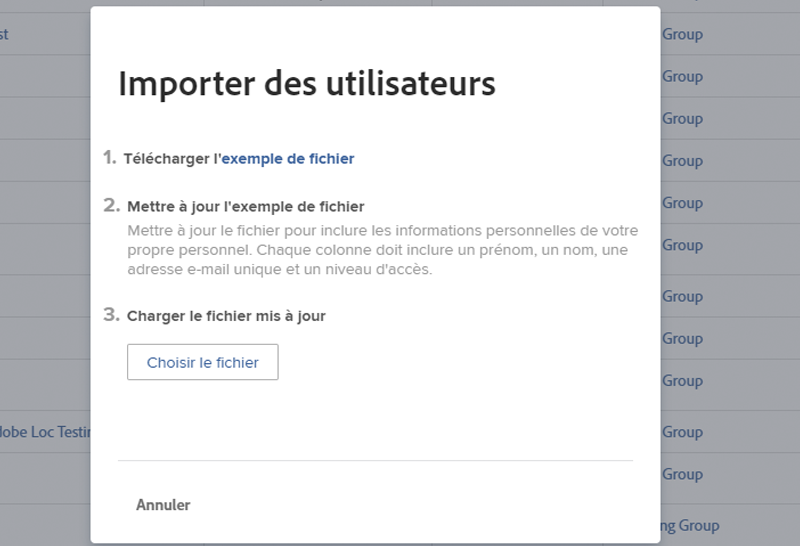

# Ajouter des utilisateurs ou utilisatrices en bloc

L’ajout de plusieurs utilisateurs et utilisatrices un par un peut prendre du temps et s’avérer fastidieux. [!DNL Workfront] permet à un administrateur ou une administratrice système d’ajouter plusieurs utilisateurs ou utilisatrices en même temps, à l’aide de la fonction d’import.

Option de menu ![[!UICONTROL Importer des personnes]](assets/admin-fund-adding-users-5.png)

1. Sélectionnez **[!UICONTROL Utilisateurs et utilisatrices]** dans le [!UICONTROL Menu principal].
1. Cliquez sur la flèche sur le bouton **[!UICONTROL Nouvelle personne]** et sélectionnez **[!UICONTROL Importer des personnes]**.
1. La fenêtre qui s’ouvre vous guide tout au long de la création d’une feuille de calcul des utilisateurs et utilisatrices à importer.
1. Téléchargez le fichier d’exemple, qui est une feuille de calcul [!DNL Excel].
1. Mettez à jour la feuille de calcul avec les informations sur l’utilisateur ou l’utilisatrice (prénom, nom, adresse électronique, niveau d’accès), en suivant les instructions du fichier lui-même.
1. Cliquez sur le bouton **[!UICONTROL Choisir un fichier]** une fois la liste des utilisateurs et utilisatrices enregistrée.
1. Accédez au fichier de feuille de calcul des utilisateurs et utilisatrices et sélectionnez-le.

Les utilisateurs et utilisatrices importés apparaissent dans la liste [!UICONTROL Utilisateurs et utilisatrices]. Si nécessaire, modifiez les informations d’un ou de plusieurs utilisateurs ou utilisatrices.

## Import d’utilisateurs et d’utilisatrices : utilisation des lancements

[!DNL Workfront] fournit un modèle de lancement pour importer des données dans le système. Il peut également être utilisé pour importer des utilisateurs ou des utilisatrices. Avant d’utiliser le lancement, [!DNL Workfront] vous recommande de travailler avec votre consultant ou consultante [!DNL Workfront], car vous devez tenir compte de certains points.

<!---
paragraph below needs URL to article
--->

Pour plus d’informations, voir Import de données dans Workfront par le biais des lancements.

Fenêtre ![[!UICONTROL Importer des données] ([!UICONTROL Lancements]) dans la zone [!UICONTROL Configuration]](assets/admin-fund-adding-users-8.png)

<!--
Learn more URLs
Import users
Import data into Workfront via Kick-Starts
-->
