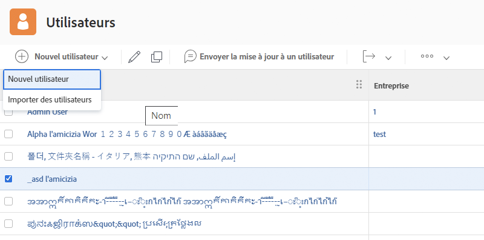

# Créer un profil utilisateur individuel

Lorsqu’une nouvelle personne est embauchée ou qu’une personne est transférée dans un service utilisant [!DNL Workfront], l’administrateur ou l’administratrice système ne doit créer qu’un seul profil utilisateur. Cela peut être effectué rapidement et facilement à partir de la zone [!UICONTROL Utilisateurs et utilisatrices] dans [!DNL Workfront].

1. Sélectionnez **[!UICONTROL Utilisateurs et utilisatrices]** dans le **[!UICONTROL Menu principal]**.
1. Cliquez sur le bouton **[!UICONTROL Nouvelle personne]**.
1. Saisissez le prénom et le nom de l’utilisateur ou de l’utilisatrice dans la fenêtre [!UICONTROL Nouvelle personne].
1. Saisissez l’adresse e-mail de l’utilisateur ou de l’utilisatrice. Il s’agit de leur nom d’utilisateur ou d’utilisatrice [!DNL Workfront] et il doit être unique dans votre instance de [!DNL Workfront].
1. Si vous souhaitez que la personne reçoive un e-mail lui indiquant son nouveau nom d’utilisateur ou d’utilisatrice, cochez la case Envoyer une invitation.
1. Attribuez un niveau d’accès à la personne. Cela lui accorde les autorisations principales dans [!DNL Workfront].
1. Affectez la personne à un groupe résidentiel pour vous assurer qu’elle a accès au bon travail.
1. Sélectionnez **[!DNL Add this Person]** pour terminer la création de l’utilisateur ou de l’utilisatrice.

![[!UICONTROL Fenêtre Nouvelle personne]](assets/admin-fund-adding-users-1.png)

Le lien [!UICONTROL Afficher les options avancées] permet d’ouvrir la fenêtre des détails de l’utilisateur ou de l’utilisatrice. Cela permet à l’administrateur ou à l’administratrice système de définir des informations supplémentaires sur la planification de l’organisation et des ressources, telles que les équipes et les fonctions, ainsi que de saisir des informations personnelles sur l’utilisateur ou l’utilisatrice (numéro de téléphone, titre de la tâche, etc.).

![[!UICONTROL Fenêtre Nouvelle personne] après avoir cliqué sur [!UICONTROL Afficher les options avancées]](assets/admin-fund-adding-users-2.png)

Certaines de ces informations peuvent être modifiées par l’utilisateur ou l’utilisatrice, d’autres non (selon les autorisations de niveau d’accès de l’utilisateur ou de l’utilisatrice).

## Copier un utilisateur existant ou une utilisatrice existance pour créer un profil utilisateur

Utilisez un utilisateur existant ou une utilisatrice exitante dans le système comme base pour créer un nouveau nom d’utilisateur ou d’utilisatrice. Certaines des informations de l’utilisateur existant ou de l’utilisatrice existante seront copiées, mais certaines doivent être complétées à partir de zéro.

1. Sélectionnez **[!UICONTROL Utilisateurs et utilisatrices]** dans le **[!UICONTROL Menu principal]**.
1. Sélectionnez l’utilisateur ou l’utilisatrice à copier en cochant la case en regard de son nom.
1. Sélectionnez la flèche sur le bouton **[!UICONTROL Nouvelle personne]** et choisissez **[!UICONTROL Nouveau à partir d’une personne sélectionnée]**.
1. Renseignez les **[!UICONTROL Informations personnelles]** avec les informations du nouvel utilisateur ou de la nouvelle utilisatrice.
1. Certains champs sont copiés à partir de l’utilisateur original ou de l’utilisatrice originale. Modifiez les informations, le cas échéant.
1. Sélectionnez **[!UICONTROL Ajouter cette personne]**.

![[!UICONTROL Fenêtre Nouvelle personne.]](assets/admin-fund-adding-users-4.png)

<!--
Learn more URLs
Add users
-->
