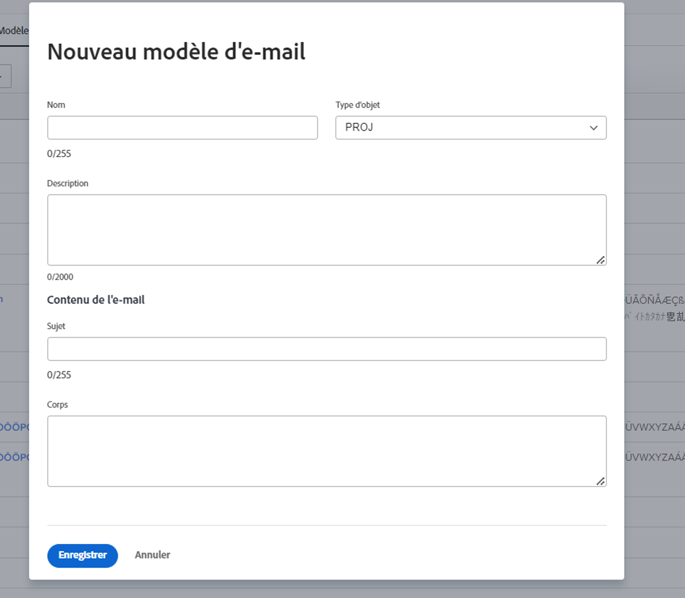

<!---
this has the same content as the system administrator notification setup and mangement section of the email and inapp notificiations learning path
--->

# Configuration des notifications de rappel

Les notifications de rappel sont créées par les administrateurs système dans le [!UICONTROL Configuration] zone. Ils peuvent ensuite être joints et utilisés par les propriétaires de projet, de tâche et d’émission comme rappels pour le moment où le travail est attendu rapidement ou en retard.

Les rappels sont spécifiques à un objet et doivent être joints manuellement à l’élément de travail correspondant afin que la notification puisse être envoyée.

**Créer une notification de rappel**

1. Cliquez sur **[!UICONTROL Configuration]** dans le **[!UICONTROL Menu Principal]**.
1. Cliquez sur le bouton **[!UICONTROL Email]** .
1. Cliquez sur le bouton **[!UICONTROL Notifications]** .
1. Cliquez sur le bouton **[!UICONTROL Nouveau rappel]** .
1. Cliquez sur le bouton **[!UICONTROL +Nouvelle notification de rappel]** bouton .
1. Sélectionnez l’objet souhaité pour le menu déroulant.
1. Renseignez les informations requises.
1. Cliquer sur **[!UICONTROL Enregistrer]**.

![[!UICONTROL Nouvelle notification de rappel] window](assets/admin-fund-reminder-notification-1.png)

Lors de la configuration du rappel, vous devez tenir compte des points suivants :

* **[!UICONTROL Nom de notification du rappel] —** Il s’agit du nom qui sera visible par les chefs de projet lorsqu’ils joignent un rappel à un objet. Assurez-vous que le nom est succinct mais descriptif.
* **[!UICONTROL Période de qualification] —** Nombre d’heures, de jours, de semaines ou de mois avant/après la date sélectionnée dans la section Minutage .
* **[!UICONTROL Minutage] —** Indiquez si le rappel doit être envoyé avant ou après les dates de début/fin prévues, prévues ou réelles de l’objet. Les options des feuilles de temps sont liées à la date de début, à la date de fin ou à la date de dernière mise à jour.
* **[!UICONTROL Critères] —** Indiquez les critères pour qualifier le rappel à envoyer. Les options varient en fonction du rappel spécifique à l’objet.
* **[!UICONTROL Destinataires] —** Sélectionnez à qui le rappel doit être envoyé. Les options des intervenants varient selon le type d’objet sélectionné pour le rappel.

Une fois les paramètres de rappel définis et enregistrés, les propriétaires d’objets peuvent utiliser la notification de rappel dans [!DNL Workfront].

## Personnalisation des emails

Les notifications de rappel utilisent un format d’email et un message par défaut. Si vous souhaitez personnaliser l&#39;email, vous pouvez créer un modèle.

<!---
paragraph above needs a hyperlink to an article
--->

<!---
learn more URLs
--->
