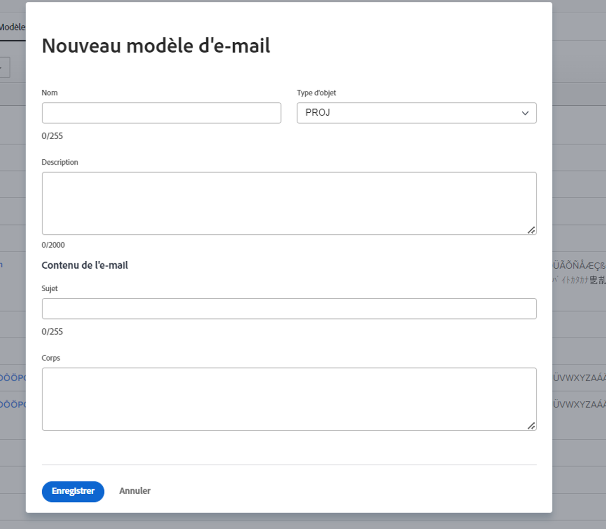

<!--
this has the same content as the system administrator notification setup and mangement section of the email and inapp notificiations learning path
-->

# Configurer des notifications de rappel

Les notifications de rappel sont créées par les administrateurs et administratrices système dans la zone [!UICONTROL Configuration]. Elles peuvent ensuite être jointes et utilisées par les responsables de projets, de tâches et de problèmes comme des rappels lorsque la date d’échéance d’un travail approche ou qu’elle a été dépassée.

Les rappels sont spécifiques à un objet et doivent être joints manuellement à l’élément de travail correspondant afin que la notification puisse être envoyée.

**Créer une notification de rappel**

1. Cliquez sur **[!UICONTROL Configuration]** dans le **[!UICONTROL Menu principal]**.
1. Cliquez sur la section **[!UICONTROL E-mail]**.
1. Cliquez sur la section **[!UICONTROL Notifications]**.
1. Cliquez sur l’onglet **[!UICONTROL Nouveau rappel]**.
1. Cliquez sur le bouton **[!UICONTROL +Nouvelle notification de rappel]**.
1. Sélectionnez l’objet de votre choix dans le menu déroulant.
1. Renseignez les informations requises.
1. Cliquer sur **[!UICONTROL Enregistrer]**.

![[!UICONTROL Fenêtre Nouvelle notification de rappel]](assets/admin-fund-reminder-notification-1.png)

Lors de la configuration du rappel, tenez compte des éléments suivants :

* **[!UICONTROL Nom de la notification de rappel] :** il s’agit du nom que verront les chefs de projet lorsqu’ils joindront un rappel à un objet. Le nom doit être bref, mais descriptif.
* **[!UICONTROL Période de qualification] :** nombre d’heures, de jours, de semaines ou de mois avant/après la date sélectionnée dans la section Timing.
* **[!UICONTROL Timing] :** indiquez si le rappel doit être envoyé avant ou après les dates de début/de fin prévues, projetées ou réelles de l’objet. Les options des feuilles de temps sont liées à la date de début, à la date de fin ou à la date de dernière mise à jour.
* **[!UICONTROL Critères] :** spécifiez les critères permettant de qualifier le rappel à envoyer. Les options varient en fonction du rappel spécifique à l’objet.
* **[!UICONTROL Destinataires] :** sélectionnez les personnes à qui envoyer le rappel. Les options des parties prenantes varient en fonction du type d’objet sélectionné pour le rappel.

Une fois les paramètres de rappel définis et enregistrés, la notification de rappel est à la disposition des propriétaires d’objets qui peuvent l’utiliser dans [!DNL Workfront].

## Personnalisation des e-mails

Les notifications de rappel utilisent un format d’e-mail et un message par défaut. Si vous souhaitez personnaliser l’e-mail, vous pouvez créer un modèle.

<!--
paragraph above needs a hyperlink to an article
-->

<!--
learn more URLs
-->
