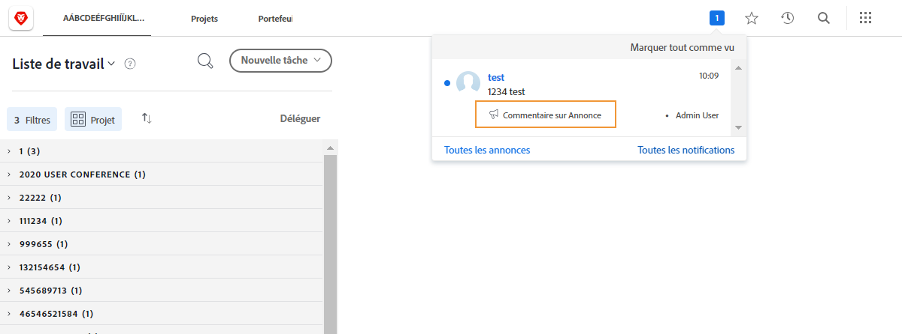
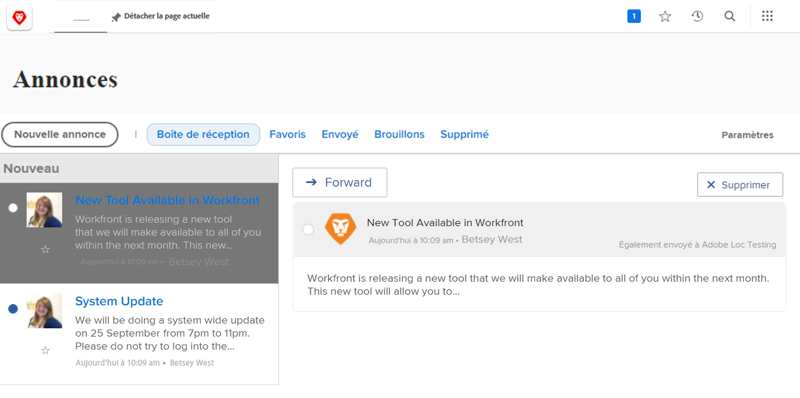

<!--
this has the same content as the system administrator notification setup and mangement section of the email and inapp notificiations learning path
-->

# Envoyer des messages du [!UICONTROL Centre d’annonces]

Le [!UICONTROL centre d’annonces] est un emplacement centralisé permettant aux administrateurs et administratrices système de recevoir des communications de [!DNL Workfront] ou d’envoyer des annonces aux utilisateurs et utilisatrices de [!DNL Workfront] dans votre organisation.

[!DNL Workfront] envoie des annonces aux administrateurs et administratrices système concernant les versions des logiciels, les webinaires à venir, la maintenance du système, etc. Le [!UICONTROL centre d’annonces] place toutes ces informations importantes en un seul endroit, afin que vous ne les perdiez pas parmi les autres messages de votre boîte de réception.

L’icône de notification indique toutes les notifications et annonces non lues envoyées par l’intermédiaire de [!DNL Workfront]. Les annonces dans la liste sont étiquetées et vous pouvez cliquer dessus si vous souhaitez les ouvrir.

Les administrateurs et administratrices système peuvent également utiliser le [!UICONTROL centre d’annonces] pour envoyer des messages à tous les utilisateurs et utilisatrices de [!DNL Workfront]. Vous pouvez envoyer des rappels à propos des personnes à contacter pour obtenir de l’aide, proposer une « astuce du jour », etc.

Lien ![[!UICONTROL Toutes les annonces]](assets/admin-fund-announcements-2.png)

**Pour envoyer une annonce**

1. Cliquez sur l’**icône de notification**.
1. Cliquez sur **[!UICONTROL Toutes les annonces]**.
1. Cliquez sur le bouton **[!UICONTROL Nouvelle annonce]**. Par défaut, la ligne [!UICONTROL Envoyer à] indique [!UICONTROL Tout le monde] pour que le message soit envoyé à tous les utilisateurs et toutes les utilisatrices de [!DNL Workfront]. Vous pouvez supprimer cette mention et saisir les noms des utilisateurs et utilisatrices, des rôles de tâche, des équipes, des groupes ou des entreprises.
1. Saisissez un objet.
1. Saisissez ensuite le texte de l’annonce, à l’aide des outils de modification de votre choix.
1. Le cas échéant, joignez des fichiers à partager en cliquant sur le bouton **[!UICONTROL Ajouter une pièce jointe]**.
1. Cliquez sur **[!UICONTROL Envoyer]**.

![Rédiger une annonce sur la page [!UICONTROL Annonces]](assets/admin-fund-announcements-3.png)

La zone des annonces ressemble à une boîte de réception, les messages reçus apparaissant dans le panneau de gauche. Cliquez sur un message pour le lire.

