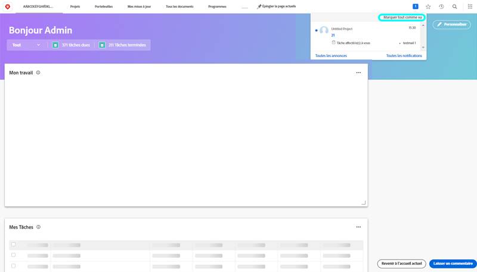
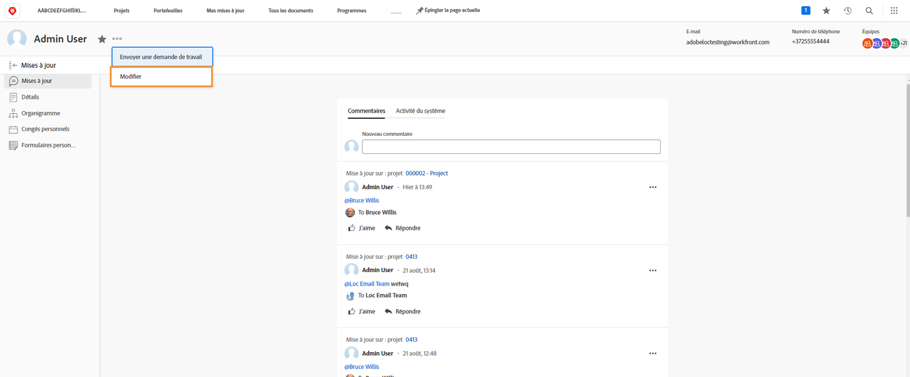

# Gestion des notifications d’événement in-app et par e-mail

Les emails font partie de la vie professionnelle quotidienne et, certains jours, la quantité d&#39;emails que vous recevez est écrasante. Toutefois, avec [!DNL Workfront], les administrateurs système peuvent s’assurer que tout le monde reçoit des e-mails pertinents et utiles concernant le travail avec lequel ils sont impliqués.

Il existe plusieurs types de notifications que Workfront peut envoyer aux utilisateurs. Certaines de ces notifications sont contrôlées au niveau du système et affectent tous les utilisateurs. Certaines notifications peuvent être définies pour générer des emails instantanément, dans un résumé quotidien. Vous pouvez également désactiver les courriers électroniques pour générer uniquement des notifications dans Workfront.

## Notifications d&#39;événements

Un événement peut ressembler à un changement d’état, à un commentaire publié ou à une affectation effectuée et peut déclencher une notification in-app dans [!DNL Workfront].

Vous pouvez toutefois déterminer les événements pour lesquels vous souhaitez recevoir des notifications par courrier électronique en sélectionnant ou en désélectionnant les options de vos préférences.

Pour apporter ces modifications, cliquez sur votre nom dans le [!UICONTROL Menu Principal].

![Nom d’utilisateur dans [!UICONTROL Menu Principal]](assets/admin-fund-user-notifications-02.png)

Cliquez sur [!UICONTROL Modifier] de la [!UICONTROL Plus] .

Cliquez sur [!UICONTROL Notifications] dans le [!UICONTROL Modifier la personne] de la fenêtre contextuelle.

![[!UICONTROL Modifier la personne] window](assets/admin-fund-user-notifications-04.png)

À partir de là, vous pouvez décider quelles notifications vous souhaitez recevoir instantanément, quotidiennement ou pas du tout. Toutes les modifications que vous apportez ici vous sont spécifiques et n’affectent aucun autre utilisateur de Workfront.

**[!UICONTROL Chaque jour]**

Par défaut, les emails sont configurés pour être envoyés instantanément. Cependant, vous pouvez changer la fréquence des notifications par e-mail de [!UICONTROL Instant] to [!UICONTROL Quotidien], en vous assurant que vous obtenez les informations dont vous avez besoin, lorsque vous le souhaitez.

![[!UICONTROL Notification] section [!UICONTROL Modifier la personne] window](assets/admin-fund-user-notifications-05.png)

L’option quotidienne envoie un résumé des événements du jour dans un seul email. Les utilisateurs reçoivent un email pour chaque groupe qu’ils voient dans la variable [!UICONTROL Notifications] .

Par exemple, la variable [!UICONTROL Informations sur les projets que je possède] génère un email quotidien, [!UICONTROL Action nécessaire] génère un email quotidien, etc.

![[!UICONTROL Résumé quotidien] e-mail pour [!UICONTROL Informations sur les projets que je possède]](assets/admin-fund-user-notifications-06.png)

![[!UICONTROL Résumé quotidien] e-mail pour [!UICONTROL Action nécessaire]](assets/admin-fund-user-notifications-07.png)

En plus de sélectionner l’option quotidienne, définissez une heure pour l’envoi de ces emails. En fonction de ce qui fonctionne le mieux, vous pouvez envoyer des emails de résumé avant d’entrer au travail le matin ou juste avant de partir pour la journée.

![[!UICONTROL Email Daily Digest après] dans le menu déroulant [!UICONTROL Modifier la personne] window](assets/admin-fund-user-notifications-08.png)

**Pas du tout**

La dernière option consiste à désactiver entièrement les notifications par courrier électronique.

![La notification sélectionnée a été désactivée dans [!UICONTROL Modifier la personne] window](assets/admin-fund-user-notifications-09.png)

Si vous décidez de le faire, sachez que même si vous ne recevez pas d’e-mails, le travail est toujours attribué, commenté et mis à jour dans [!DNL Workfront]. En désactivant toutes les notifications, il se peut que vous manquiez des informations importantes à connaître.

Il existe quelques cas où [!DNL Workfront] a vu des utilisateurs désactiver les notifications par e-mail. Par exemple, si vous effectuez la majeure partie de votre travail au moyen de la variable [!DNL Workfront] pour les applications mobiles, vous pouvez désactiver vos notifications par e-mail et recevoir des notifications uniquement via l’application.

Quelle que soit la variable [!UICONTROL Notifications d’événement] lorsque vous décidez de recevoir des notifications, celles-ci sont importantes pour le succès du travail effectué pour atteindre les objectifs de votre organisation.

## Recommendations

Il existe quelques notifications qui [!DNL Workfront] recommande de laisser coché, que ce soit pour un email instantané ou un résumé quotidien.

Pour la plupart des utilisateurs :

* [!UICONTROL Lorsqu&#39;une tâche est terminée, envoyer un e-mail aux cessionnaires principaux de toute les tâches dépendantes]
* [!UICONTROL Quelqu&#39;un m&#39;a inclus dans une mise à jour dirigée.]
* [!UICONTROL Quelqu’un commente ma tâche]
* [!UICONTROL Lorsque la date de fin prévue d&#39;une tâche est modifiée, envoyer un e-mail à l&#39;utilisateur affecté]

Spécifiquement pour les chefs de projet :

* [!UICONTROL Lorsque le statut d&#39;un projet passe du statut idée/approuvé/rejeté/demandé/planifié à courant, envoyez un e-mail à l&#39;équipe]
* [!UICONTROL Quand un projet passe d&#39;un statut de progression positive (Dans les délais) à un statut de progression négative (En retard), envoyer un e-mail au propriétaire du projet]
* [!UICONTROL Envoyer un e-mail au propriétaire du projet lorsqu&#39;un événement est ajouté.]
* [!UICONTROL La tâche Milestone s’achève sur un projet dont je suis propriétaire]

<!---
learn more URLs
Email notifications
guide: manage your notifications
--->
