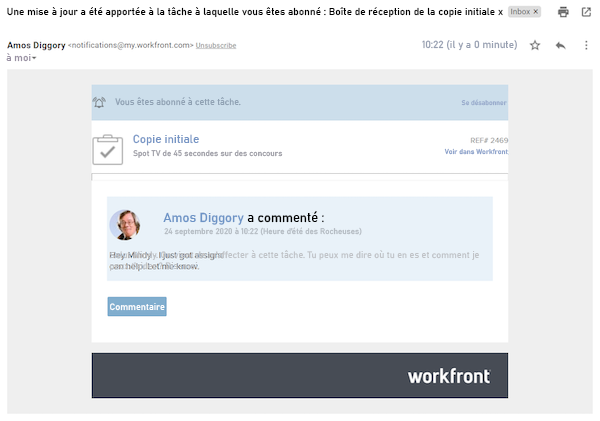
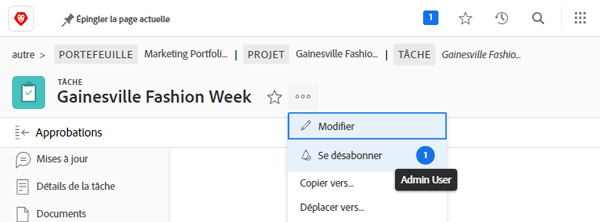

# S’abonner à des éléments de travail

Les notifications d’événements vous informent sur le travail qui vous a été affecté. Cependant, il peut arriver que vous souhaitiez suivre des travaux qui ne vous sont pas affectés, car ils peuvent avoir une incidence sur le travail que vous effectuez. Pour cela, vous pouvez vous abonner à un élément spécifique.

Par exemple, vous souhaitez connaître la progression de la tâche Copie initiale. Cette tâche ne vous incombe pas, mais vous êtes responsable de la modification de cette copie initiale et vous souhaitez suivre l’état d’avancement. Pour cela, vous pouvez vous abonner à la tâche et, lorsque des mises à jour sont effectuées, recevoir un e-mail de notification vous informant en temps réel de l’avancement de ce travail.

Notez que les notifications in-app et les e-mails d’abonnement ne sont envoyés que lorsque des commentaires seront émis sur l’élément. Les notifications et les e-mails ne sont en effet pas envoyés lors d’autres actions, telles que les modifications d’échéance ou d’affectation.

Pour vous abonner à un élément de travail, vous devez disposer d’au moins une autorisation de partage des vues pour cet élément.

Fenêtre ![[!UICONTROL Accès aux tâches]](assets/admin-fund-user-notifications-11.png)

Quand vous avez accès à l’élément de travail, abonnez-vous suivant cette procédure :

1. Accès à la page de destination du projet, de la tâche ou du problème.
1. Cliquez sur le menu **[!UICONTROL Actions]**.
1. Cliquez sur **[!UICONTROL S’abonner]**.

Option ![[!UICONTROL S’abonner] dans le menu des tâches](assets/admin-fund-user-notifications-12.png)

Vous pouvez voir si d’autres personnes se sont abonnées à l’élément de travail en pointant la souris sur le numéro en regard de [!UICONTROL S’abonner/Se désabonner] dans le menu.

Si vous avez les autorisations pour [!UICONTROL Gérer] ou [!UICONTROL Partager] l’élément de travail, vous pouvez abonner d’autres personnes à un projet, à une tâche ou à un problème en suivant cette procédure :

1. Cliquez sur le numéro en regard de l’option **[!UICONTROL S’abonner]**.
1. Ajoutez le nom de la ou des personnes à abonner à l’élément de travail.
1. Cliquez sur **[!UICONTROL Enregistrer]**.

Fenêtre ![[!UICONTROL S’abonner]](assets/admin-fund-user-notifications-15.png)

Les personnes que vous abonnez n’en sont pas informées. Toutes les personnes abonnées disposent d’autorisations permettant de visualiser l’élément. Toutefois, si la personne abonnée disposait déjà des autorisations de [!UICONTROL Contribution] ou de [!UICONTROL Gestion] pour l’élément, ces dernières restent inchangées.

Une entrée dans l’onglet [!UICONTROL Mises à jour] de l’élément individuel indique également les personnes qui se sont abonnées et quand. L’onglet [!UICONTROL Mises à jour] indique également les personnes abonnées par une tierce personne.

Page ![[!UICONTROL Mises à jour] d’une tâche qui affiche un abonnement](assets/admin-fund-user-notifications-16.png)

Pour désabonner une personne, cliquez à nouveau sur la bulle pour ouvrir la fenêtre [!UICONTROL Abonnés]. Cliquez ensuite sur la croix (X) en regard du nom de la personne. La personne n’est pas informée de son désabonnement.

Option de menu ![[!UICONTROL Se désabonner] d’un projet](assets/admin-fund-user-notifications-14.png)

<!--
learn more URL: Subscribe to items in Workfront
-->
