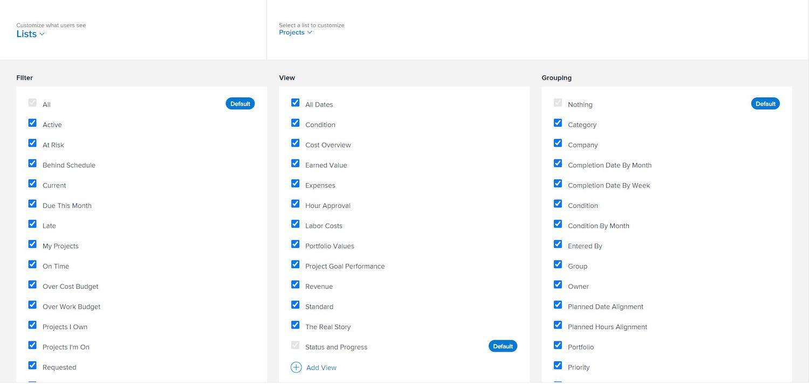

# Personnaliser les listes de rapports avec des modèles de disposition

Dans cette vidéo, vous apprendrez à :

* Accéder aux paramètres de la liste de rapports dans un modèle de disposition
* Supprimer des filtres, des vues et des regroupements
* Ajouter des filtres, des vues et des regroupements

>[!VIDEO](https://video.tv.adobe.com/v/335079/?quality=12&learn=on)

## Définir des valeurs par défaut de liste

Définir des filtres, des vues et/ou des regroupements par défaut permet d’accéder plus rapidement à des informations essentielles capables de faire avancer le travail plus rapidement.

En tant qu’administrateur ou administratrice système ou de groupe, vous pouvez déterminer ce que voient les personnes en premier lorsqu’elles visualisent une liste de projets, de tâches, de problèmes, etc., en définissant un filtre, une vue et/ou un regroupement par défaut au moyen d’un modèle de disposition.

Fenêtre [!UICONTROL Listes] de 

>[!NOTE]
>
>Bien qu’un filtre, une vue et/ou un regroupement par défaut puisse être configuré, le système a une mémoire et affiche tout filtre, vue et/ou regroupement utilisé en dernier par l’utilisateur ou l’utilisatrice.

Si vous souhaitez définir une liste par défaut, vous pouvez effectuer l’une des opérations suivantes :

* Placez le pointeur de la souris sur une option déjà répertoriée, puis cliquez sur [!UICONTROL Définir comme valeur par défaut].

Fenêtre [!UICONTROL Listes] de ![modèles de disposition avec [!UICONTROL Définir comme valeur par défaut] visible](assets/admin-fund-layout-template-default-lists-1-2.JPG)

* Ou ajoutez un filtre, une vue ou un regroupement personnalisé et cochez la case en regard de [!UICONTROL Définir comme valeur par défaut].

Fenêtre ![[!UICONTROL Ajouter une vue existante]](assets/admin-fund-layout-template-default-lists-1-3.JPG)

Une fois cette opération terminée, vous verrez l’étiquette [!UICONTROL Par défaut].

Étiquette ![[!UICONTROL Par défaut] en regard de l’option de liste](assets/admin-fund-layout-template-default-lists-1-4.JPG)
