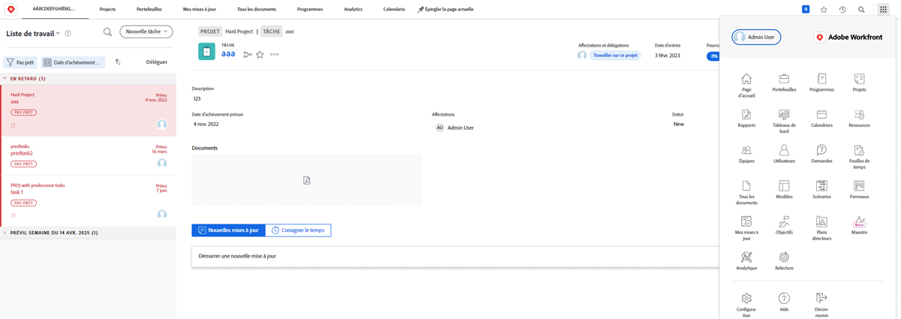
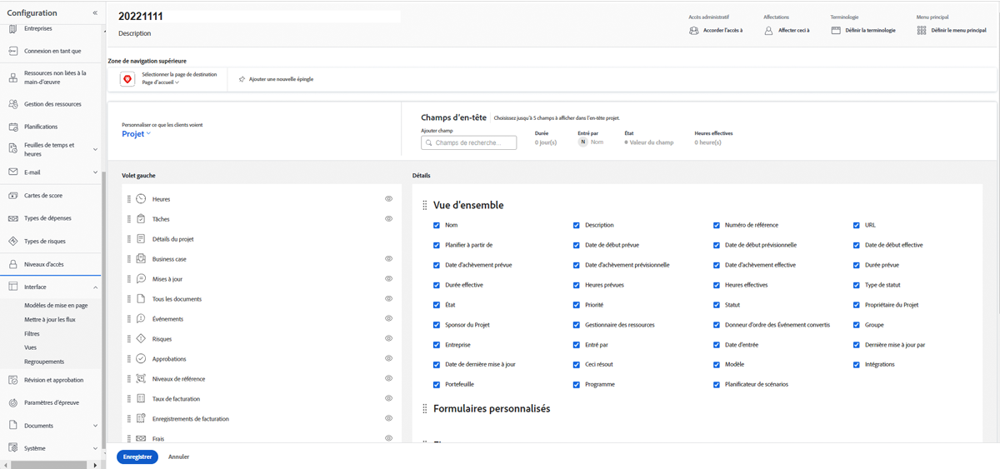
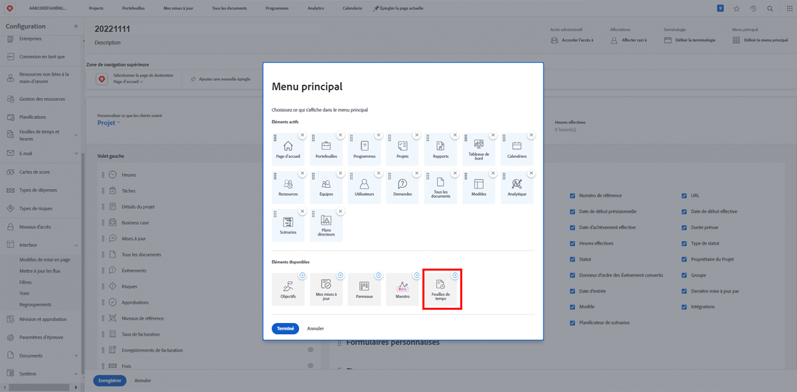
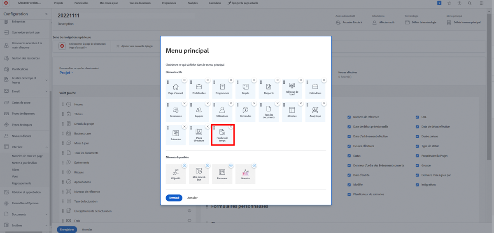

# Que sont les modèles de mise en page ?

Workfront dispose de nombreux bons outils pour vous aider à faire du travail. Mais trop de bonnes choses peuvent être écrasantes.

Les modèles de mise en page permettent aux administrateurs système et aux administrateurs de groupe de personnaliser l’expérience de l’utilisateur et permettent à ces utilisateurs de se concentrer sur ce qui est important pour eux.

Par exemple, la majorité de votre entreprise ne consigne pas de temps. Toutefois, l’équipe de conseillers effectue des factures avec les clients. Elle doit donc consigner le temps de facturation pour garantir une facturation exacte. Avec un modèle de mise en page, les feuilles de temps peuvent être masquées pour ceux qui n’en ont pas besoin et s’afficher pour ceux qui en ont besoin.

## Avant la création

Workfront recommande de discuter avec vos utilisateurs avant de créer un modèle de mise en page. L’implication de ceux qui utiliseront le modèle de mise en page, comme les administrateurs de groupe, rendra le placement des informations et des outils adéquats devant les personnes appropriées beaucoup plus fluide.

Et n’ayez pas peur d’apporter des modifications après la création d’un modèle. Continuez à obtenir des commentaires sur ce dont ils ont besoin, ce qu’ils veulent voir et accéder. N’oubliez pas que les modèles de mise en page ont pour but de créer une expérience simple et propre pour vos utilisateurs.
