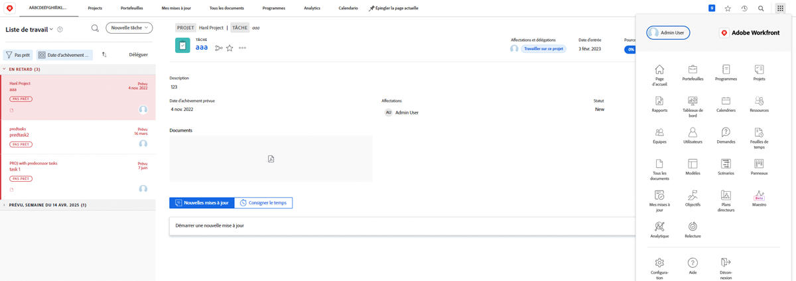
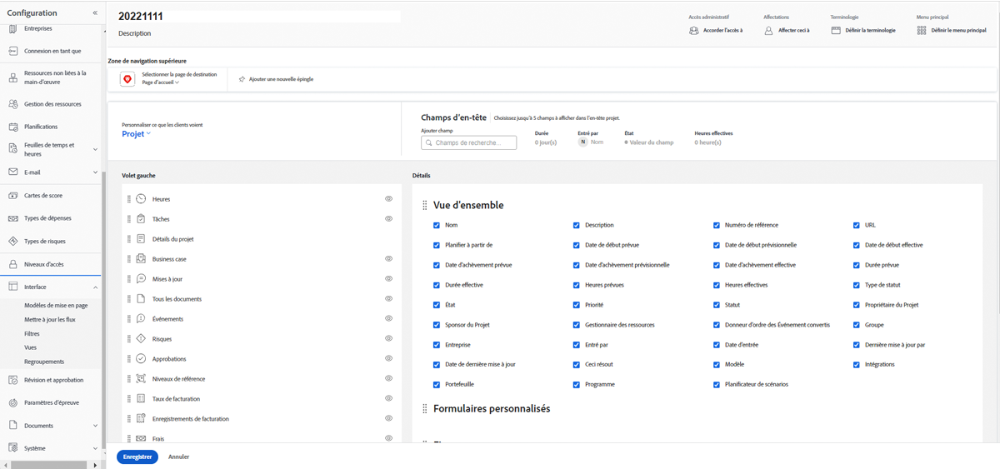
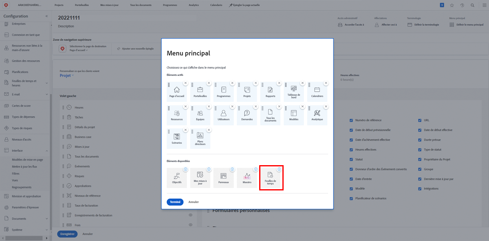
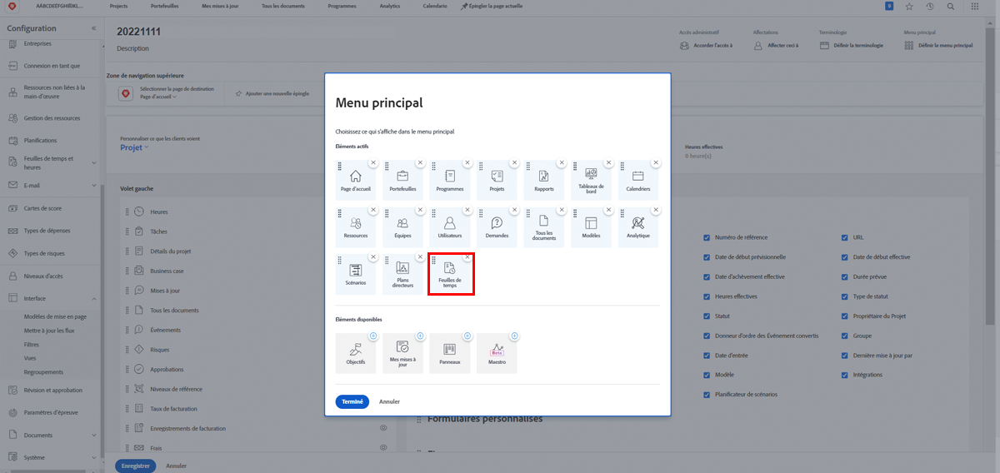

# Que sont les modèles de mise en page ?

Workfront dispose de nombreux outils pratiques pour vous aider à travailler. Mais quand il y en a trop, cela peut nous submerger.

Les modèles de mise en page permettent aux administrateurs et administratrices système et aux administrateurs et administratrices de groupe de personnaliser l’expérience d’utilisation, et de leur permettre de se concentrer sur ce qui est important pour eux.

Par exemple, la majorité des membres de votre organisation ne consigne pas son temps de travail. Cependant, l’équipe des consultantes et consultants facture les clientes et clients et doit donc consigner le temps de travail pour garantir une facturation précise. Avec un modèle de mise en page, les feuilles de temps peuvent être masquées pour celles et ceux qui n’en ont pas besoin et s’afficher pour celles et ceux qui en ont besoin.

## Avant la création

Workfront recommande d’en discuter avec vos utilisateurs et utilisatrices avant de créer un modèle de mise en page. L’implication de celles et ceux qui utiliseront le modèle de mise en page, comme les administrateurs et administratrices de groupe, rendra le placement des informations et des outils adéquats à destination des personnes appropriées beaucoup plus fluide.

N’hésitez pas à apporter des modifications après la création d&#39;un modèle. Continuez à obtenir des retours sur ce dont ils et elles ont besoin, ce qu’ils et elles souhaitent voir, et à quoi ils et elles souhaitent accéder. N’oubliez pas que les modèles de mise en page ont pour but de créer une expérience simple et claire pour vos utilisateurs et utilisatrices.
