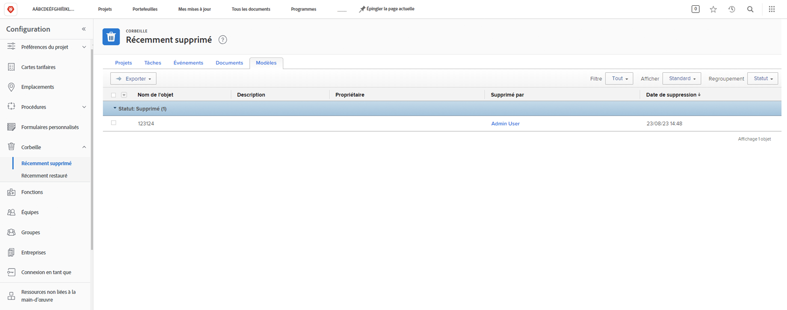
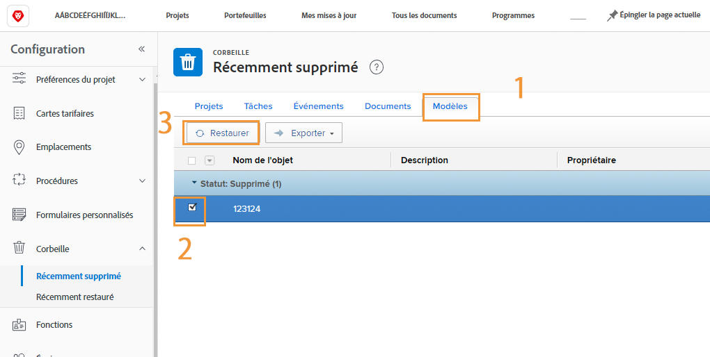
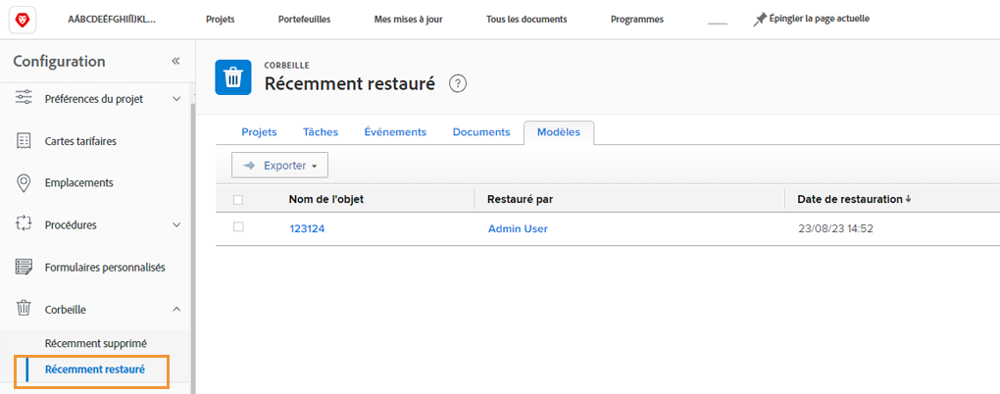

# Restaurer des objets de la corbeille

Le projet subit de nombreux changements. Il se peut que vous supprimiez quelque chose, pour vous rendre compte 30 minutes plus tard que la tâche était nécessaire ou que le document était essentiel pour le problème que vous essayez de résoudre.

Lorsque l’objet est supprimé, Workfront le place dans la corbeille pour une durée maximale de 30 jours. L’administrateur ou l’administratrice système peut restaurer l’objet à son emplacement d’origine dans Workfront, avec toutes ses informations (mises à jour, heures enregistrées, documents, etc.).

## Restaurer un objet

1. Sélectionnez la zone **Configuration** dans le **Menu principal**.
1. Cliquez sur **Corbeille** dans le panneau de gauche.
1. Sélectionnez **Supprimé récemment**.

Chaque objet restaurable dispose d’un onglet pour faciliter la recherche de l’élément à restaurer en particulier.

1. Cliquez sur l’onglet de l’objet souhaité.
1. Cochez la case en regard du ou des objets à restaurer.
1. Cliquez sur le bouton **Restaurer**.

Le ou les objets en cours de restauration apparaissent brièvement dans une section [!UICONTROL En cours]. Une fois l’écran actualisé, le ou les objets n’apparaissent plus à l’écran car ils ont été restaurés. Les éléments apparaissent à l’endroit où ils se trouvaient auparavant dans [!DNL Workfront], ce que vous pouvez vérifier sur l’écran [!UICONTROL Restauré récemment].

Les administrateurs ou administratrices de groupe peuvent restaurer un projet associé au groupe qu’ils ou elles gèrent, ainsi que les tâches, problèmes ou documents associés au projet.

<!--
learn more URL
Restoring deleted items
Viewing items that have been recently restored
-->
