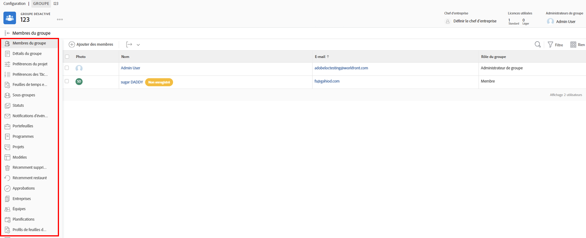

# Comprendre les besoins des administrateurs de groupe

<!---
21.4 updates have been made
--->

Lorsque vous êtes l’administrateur système d’une grande entreprise ou d’une grande entreprise qui possède de nombreux [!DNL Workfront] utilisateurs, maintenance [!DNL Workfront] les paramètres de chaque groupe et sous-groupe peuvent prendre du temps.

Nommer les administrateurs de groupe qui peuvent exécuter certaines fonctions administratives pour leurs propres groupes dans [!DNL Workfront] aide à équilibrer la charge lorsqu’il s’agit de mettre à jour et de gérer le système.

Les administrateurs de groupe ont tendance à être plus en phase avec les défis quotidiens de leur groupe, afin de pouvoir gérer les besoins du groupe. Cela vous permet, en tant qu’administrateur système, de vous concentrer sur l’événement [!DNL Workfront] configurations qui bénéficient à l’ensemble de votre organisation.

Ce que les administrateurs de groupe peuvent faire dans [!DNL Workfront] inclure :

* Créez des sous-groupes et ajoutez des utilisateurs aux sous-groupes.
* Créez des modèles de mise en page pour leur groupe.
* Créez des processus de validation pour le groupe.
* Créez des statuts de workflow au niveau du groupe.
* Accédez aux projets, programmes et portfolios associés au groupe à partir de la page du groupe.
* Gérez les préférences de projet, de tâche et de problème au niveau du groupe.
* Gérez les préférences de la feuille de temps au niveau du groupe.
* Gérez les notifications d’événement au niveau du groupe.
* Connectez-vous en tant qu’autres membres du groupe.
* Affectez un chef d’entreprise au groupe.
* Gérez une entreprise.

En tant qu’administrateur système ou groupe, vous pouvez créer des sous-groupes au sein des groupes et des sous-groupes que vous administrez. Ces sous-groupes peuvent se voir attribuer leurs propres administrateurs de groupe.

>[!NOTE]
>
>Il existe une limite de 14 niveaux de sous-groupes dans un groupe.

**En savoir plus sur les administrateurs de groupes**

<!---
bullet points below need hyperlinks
--->

Pour obtenir une liste des actions que peuvent effectuer les administrateurs système, les administrateurs de groupe et les administrateurs de sous-groupe dans [!DNL Workfront], voir l’article Actions autorisées pour différents types d’administrateurs .

## Gestion d’un groupe

Gérez rapidement et efficacement les membres du groupe, les sous-groupes, les états du groupe, les préférences du projet de groupe, etc. à partir de la page de groupe dans [!DNL Workfront].

1. Sélectionner **[!UICONTROL Configuration]** de la **[!UICONTROL Menu Principal]**.
1. Accédez à **[!UICONTROL Groupes]** dans le panneau de gauche.
1. Sélectionnez le nom d’un groupe pour l’ouvrir.
1. Ouvrez la section dans laquelle vous souhaitez effectuer des mises à jour en cliquant dessus dans le panneau de gauche.

<!---
learn more URLs
Create and manage groups 
Create and manage subgroups 
Business leader overview 
--->
