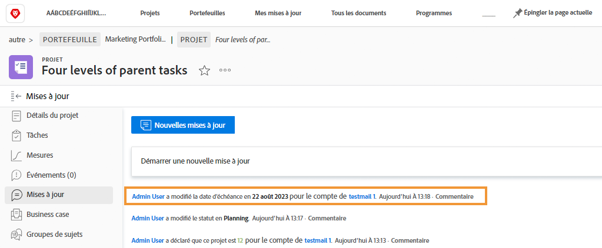

# Se connecter sous une autre identité

La fonctionnalité « Se connecter en tant que » est très utile aux administrateurs et aux administratrices de Workfront car cela leur permet de configurer l’expérience utilisateur. Cette fonction, dans la zone [!UICONTROL Configuration], vous permet de vous connecter en tant qu’autre utilisateur ou utilisatrice sans avoir à vous déconnecter de votre propre compte.

Page ![[!UICONTROL Se connecter en tant que] dans la zone [!UICONTROL Configuration]](assets/admin-fund-log-in-as-1.png)

## Avantages de la fonctionnalité Se connecter en tant que

Cette fonctionnalité est utile pour diverses raisons :

* Les administrateurs et les administratrices peuvent prévisualiser les modèles de disposition attribués aux utilisateurs et aux utilisatrices afin de s’assurer que les éléments de menu ou les tableaux de bord s’affichent correctement.
* Cela permet de s’assurer que les autorisations d’un utilisateur ou d’une utilisatrice sont correctement configurées lors des tests de workflow.
* Les administrateurs et les administratrices peuvent même utiliser cette fonctionnalité pour marquer l’achèvement d’une tâche ou donner une approbation à une personne qui n’est pas en mesure de le faire.

## Accéder à la fonctionnalité Se connecter en tant que

1. Sélectionnez **[!UICONTROL Configuration]** dans **[!DNL Main Menu]**.
1. Cliquez sur **[!UICONTROL Se connecter en tant que]** dans le panneau de gauche.
1. Saisissez le nom de l’utilisateur ou de l’utilisatrice sous lequel vous devez vous connecter.

Onglet ![[!UICONTROL Journal d’accès] sur la page [!UICONTROL Se connecter en tant que]](assets/admin-fund-log-in-as-3.png)

Une fois la connexion établie, une notification en haut de l’écran indique sous quel nom vous êtes connecté.

Message ![[!UICONTROL Actuellement connecté en tant que] en haut de la fenêtre [!DNL Workfront]](assets/admin-fund-log-in-as-2.png)

## L’onglet Mises à jour permet de suivre l’activité.

Lorsqu’un administrateur ou une administratrice se connecte sous le nom d’un autre utilisateur ou d’une autre utilisatrice et effectue des modifications/mises à jour à son nom, les modifications sont visibles dans la zone Mises à jour pour cet élément spécifique. L’exemple ci-dessous montre que Joan Harris a modifié une date d’échéance au nom de Roy Campbell.

