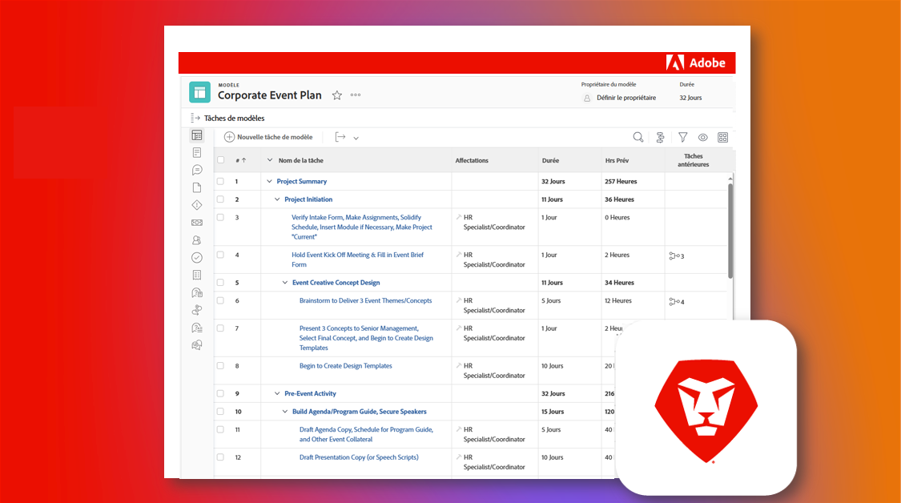

# Prendre en charge une instance Adobe Workfront existante

Ce qui est formidable avec Workfront, c’est qu’il est tellement personnalisable. Ce qui est compliqué avec Workfront, c’est qu’il est tellement personnalisable. Et si vous êtes un nouvel administrateur ou une nouvelle administratrice système ou groupe, qui prend en main une instance Workfront existante, il peut s’avérer fastidieux de comprendre comment elle a été configurée à l’origine.

Cependant, grâce à notre liste de contrôle des instances héritées, vous pouvez apprendre tout ce que vous devez savoir sur votre instance.

  

Dans la liste de contrôle des instances héritées, vous passerez en revue un ensemble complet de questions, de ressources et de liens afin de bien comprendre comment elle a été configurée.

La liste de contrôle a été créée en tant que plan directeur Workfront et en tant que feuille de calcul Excel téléchargeable. Nous vous recommandons d’utiliser le plan directeur pour gérer et documenter votre travail directement dans Workfront.

Le plan directeur et la feuille de calcul sont organisés par thème, plutôt que par chronologie, afin que vous puissiez progresser de la manière la plus logique pour vous et votre organisation. Les durées indiquées ne sont qu’un exemple et vous devez les adapter à vos besoins spécifiques. Il n’est pas nécessaire de le faire en une seule fois !

Dans la mesure du possible, nous vous encourageons à collaborer avec d’autres membres de votre organisation pour examiner et documenter ces éléments, et à tenir votre documentation à jour en cas de changements majeurs. Les futurs administrateurs et les futures administratrices de votre instance vous remercieront !

* <b>Pour télécharger le plan directeur</b>, accédez au menu principal de votre instance Workfront et sélectionnez Plans directeur. Trouvez le plan directeur intitulé « Règles de base sur les instances héritées | Liste de contrôle » et cliquez sur Installer. Choisissez votre environnement d’exploitation ou de sandbox et poursuivez la configuration. De plus amples informations sur l’installation et la configuration des plans directeurs sont disponibles à l’adresse suivante : [ici](https://experienceleague.adobe.com/docs/workfront/using/administration-and-setup/blueprints/blueprints-install.html?lang=fr).

* <b>Pour télécharger la liste de contrôle Excel</b>, cliquez [ici](assets/adobe-workfront-system-admin-playbook-inherited-instance.xlsx).

Que vous utilisiez le plan directeur ou la liste de contrôle Excel, vous pouvez envisager ce processus en trois phases clés : la découverte, l’audit et la documentation. Les descriptions et les résultats idéaux sont énumérés ci-dessous.

 
 

## Phase 1 : apprentissage et découverte

<b>Période suggérée : 4 semaines</b>

La première chose à faire est de comprendre comment votre instance Workfront est configurée aujourd’hui.

Cela implique de mener des entretiens avec les parties prenantes et de revoir toute documentation existante pour comprendre comment les différents groupes de votre entreprise utilisent Workfront.

Si vous ne connaissez pas bien Workfront du point de vue technologique, suivez la formation d’administrateur ou administratrice système. Cela vous fournira les informations nécessaires sur le fonctionnement et l’impact des différents paramètres sur chaque outil, et éventuellement sur chaque utilisateur et utilisatrice, dans Workfront.

À la fin de cette phase, vous devriez disposer des éléments suivants :

* Comprendre clairement les raisons pour lesquelles votre entreprise utilise Workfront

* Une connaissance générale de l’intégrité de votre instance, y compris les cas d’utilisation clés.

* Un document décrivant ce qui fonctionne bien ainsi que les difficultés et/ou les lacunes au niveau des processus et des besoins des utilisateurs et utilisatrices.
 
 

## Phase 2 : audit du système

<b>Période suggérée : 4 semaines </b>

Après la découverte initiale, il est recommandé de procéder à un audit plus technique de votre instance. Cela signifie que vous devez déterminer les modifications ou les améliorations qui peuvent être nécessaires pour vous assurer que vos configurations actuelles répondent aux besoins de votre entreprise.

À la fin de cette phase, vous devriez disposer des éléments suivants :

* Une vue plus approfondie de l’état actuel de votre instance.

* Modifications ou améliorations identifiées que vous souhaitez apporter à votre instance pour répondre aux besoins de l’entreprise.
 
 

## Phase 3 : documentation et optimisation

<b>Période suggérée : initiale = 2 semaines ; mise à jour continue </b>

En fonction de ce que vous avez appris dans les phases 1 et 2, vous allez créer, ou mettre à jour et documenter votre instance et élaborer des feuilles de route pour relever les défis stratégiques et relatifs au programme.

Pendant cette phase, vous devez disposer des éléments suivants :

* Documentation centralisée écrite qui répond aux questions dans les onglets de ce document.

* Schéma visuel des workflows, des automatisations et des intégrations prioritaires.

* Une liste d’attente ou une feuille de route qui documente les améliorations à venir pour améliorer les défis organisationnels et stratégiques.

 
En passant en revue chaque phase, et avec l’aide de la liste de contrôle des instances héritées, vous devez, en tant que nouvel administrateur ou nouvelle administratrice système ou groupe, mieux comprendre comment votre instance Workfront est configurée, les ajustements ou améliorations nécessaires et solidifier votre documentation pour optimiser l’expérience Workfront de votre entreprise.

 
 

Vous trouverez des informations supplémentaires ci-dessous :
* [Webinaire : Conseils pour reprendre la main sur une instance héritée](https://experienceleaguecommunities.adobe.com/t5/workfront-discussions/webinar-system-admin-essentials-tips-for-taking-over-an-existing/td-p/571873?lang=fr)
* [Définition des objectifs de votre mise en œuvre Workfront](https://experienceleague.adobe.com/docs/workfront/using/administration-and-setup/get-started-administration/define-wf-goals-objectives.html?lang=fr)
* [Article de blog : parrainage de la direction et valeur pour le leadership](https://experienceleaguecommunities.adobe.com/t5/workfront-blogs/logging-in-for-the-first-time-as-a-new-or-existing-workfront/ba-p/518353?lang=fr)
* [Article de blog : KPI Adobe Workfront - Introduction](https://experienceleaguecommunities.adobe.com/t5/workfront-blogs/logging-in-for-the-first-time-as-a-new-or-existing-workfront/ba-p/549001?lang=fr)
