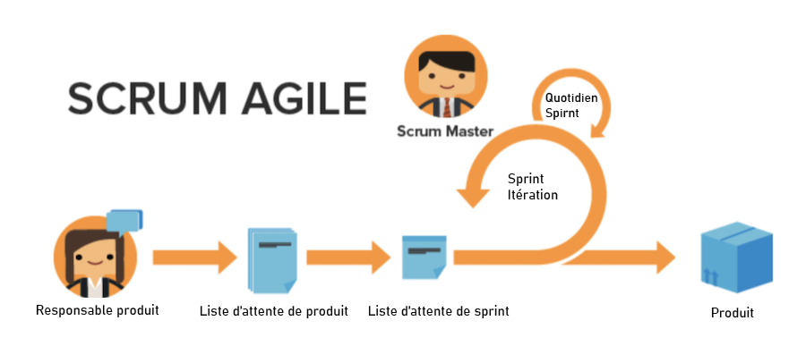

# Avantages de l’utilisation d’Agile

## Possibilité d’ajuster et de changer rapidement de direction

Comme son nom l’indique, la méthodologie agile permet aux équipes d’être mieux équipées pour changer rapidement de direction et d’orientation. Les entreprises de logiciels et de marketing sont particulièrement conscientes de la tendance à l’évolution de la demande d’une semaine à l’autre. La méthodologie agile permet aux équipes de réévaluer le travail qu’elles font et de s’ajuster par incréments donnés afin de s’assurer que, à mesure que le travail et le paysage client changent, la cible d’action change également pour l’équipe.

## Transparence dans le travail d’une équipe

Les équipes agile organisent des réunions quotidiennes appelées « stand-up » pour s’assurer que l’équipe reste concentrée sur la liste prioritaire des fonctionnalités ou des produits à développer. Elles n’ont plus à subir la confusion de ne pas savoir sur quoi travaillent les autres membres de leur équipe. Elles gardent régulièrement un œil sur ce que l’équipe a accompli la veille, sur les problèmes ou les obstacles qu’elles pourraient avoir à résoudre et sur ce qu’elles prévoient de faire ce jour-là.

Disposer de cette transparence et d’une direction unifiée permet à chaque personne d’aller de l’avant, plus vite.

## Commentaires fréquents

Le dernier avantage majeur de l’adoption de la méthodologie agile est la boucle de commentaires qui est incorporée à la fin de chaque itération (rappelons qu’une itération est une période de temps déterminée pendant laquelle l’équipe doit travailler à l’achèvement de produits spécifiques). La boucle de commentaires permet à une équipe de regarder en arrière au cours des deux dernières semaines afin de déterminer les problèmes qui se sont posés, comment le plan peut changer à l’avenir, ce dont la clientèle a maintenant besoin si les besoins précédents ont changé et les leçons apprises en tant qu’équipe.
