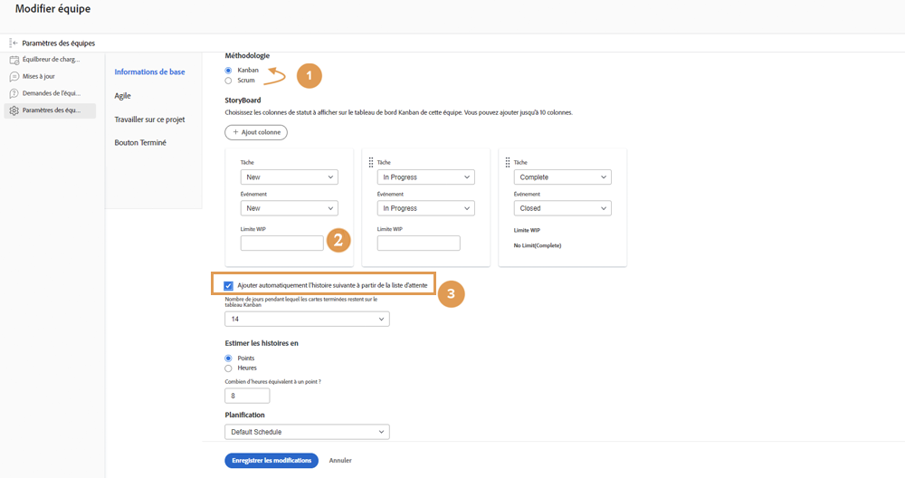
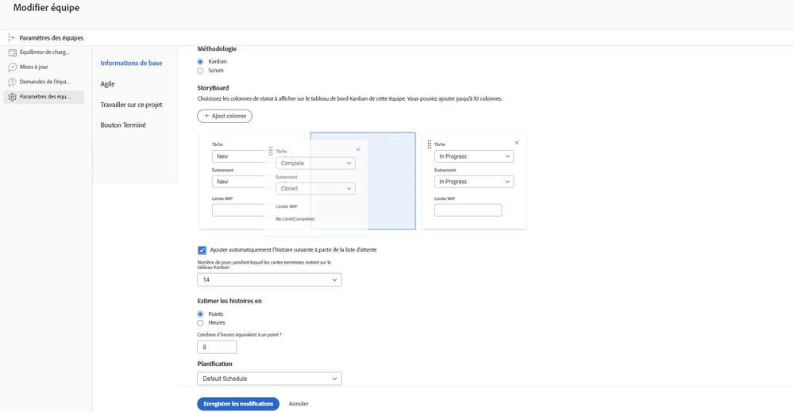
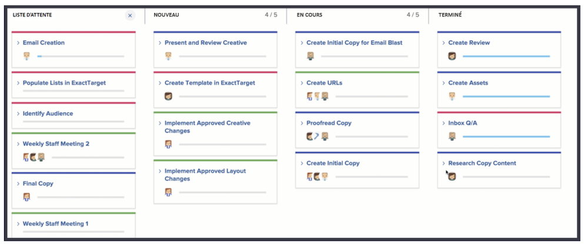
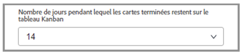

# Créer une équipe Kanban

L’équipe de marketing créatif utilise Scrum depuis un certain temps. Les personnes membres de l’équipe apprécient l’environnement flexible d’une équipe agile, mais elles ont du mal à soumettre des stories dans un délai spécifique en raison de la fréquence à laquelle les priorités changent pour leur équipe.

Il existe une alternative à Scrum. Elle s’appelle Kanban.

Kanban fonctionne pour les équipes qui ne veulent pas définir ce sur quoi elles travaillent dans les délais requis par une itération basée sur Scrum. Kanban permet plutôt aux équipes de travailler en continu sur leur liste d’attente.

Faisons passer l’équipe de marketing créatif d’une équipe Scrum à une équipe Kanban [1]. Apportez cette modification dans la section Agile des paramètres de l’équipe.

Après avoir modifié la méthodologie, vous devez spécifier le nombre de stories qu’une équipe Kanban peut avoir à la fois dans chaque colonne en ajustant la « limite de travaux en cours ». [2]. WIP est l’abréviation de Work in Progress (travail en cours). Le nombre que vous choisissez d’indiquer ici dépend du nombre d’éléments actifs que l’équipe peut gérer. Il s’affichera sur le storyboard de l’équipe pour lui rappeler s’il y a suraffectation ou non. Vous (et toute personne membre de l’équipe disposant de droits de modification) pouvez également modifier la limite de travaux en cours directement depuis le storyboard.

Vous pouvez faire glisser et déposer des colonnes de statut pour les placer dans l’ordre dans lequel vous souhaitez qu’elles se trouvent.

Les équipes Kanban peuvent également choisir de faire apparaître automatiquement sur le storyboard la story suivante de la file d’attente lorsqu’une story est terminée [voir le numéro 3 dans l’image du haut]. Cela aidera les équipes qui préfèrent un cycle de travail continu.

L’image ci-dessous montre à quoi ressemble une nouvelle story lorsqu’elle apparaît automatiquement sur le storyboard à la fin d’une story.

Pour une gestion plus efficace de votre travail terminé, les articles restent sur le storyboard pendant 14 jours par défaut.

Si nécessaire, ce paramètre peut être ajusté entre 1 ou 30 jours dans la fenêtre des paramètres de l’équipe.

Gardez à l’esprit que même s’il s’agit d’une méthodologie différente, il est toujours important, lorsque vous travaillez dans un environnement agile, de maintenir continuellement la file d’attente en discutant des exigences des stories et en ajustant leur priorité. Chaque fois que vous souhaitez reclasser la file d’attente par priorité, vous devez déplacer un onglet vers l’onglet File d’attente pour le réorganiser.
