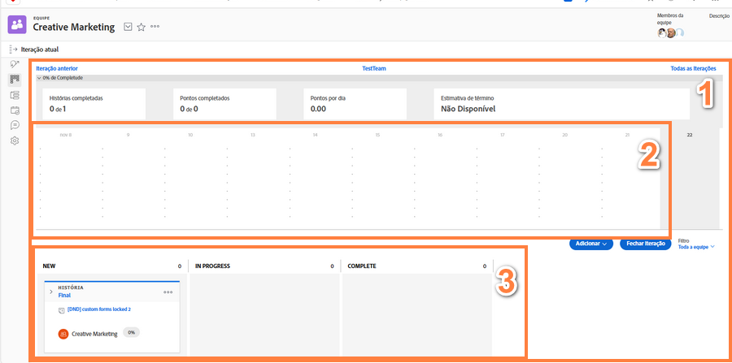

# Créer une équipe Agile Scrum

## Configurer une équipe Scrum

Une équipe Agile dans Workfront effectue son travail à partir de la page d’itération [1]. Le graphique d’avancement [2] en haut de la page est une vue d’ensemble des progrès réalisés jusqu’à présent au cours de cette itération. Dans le graphique d’avancement se trouvent les stories [3] envers lesquelles l’équipe s’est engagée pour cette itération.

Dans cette vidéo, vous apprendrez à créer une équipe Agile, à sélectionner la méthodologie Scrum et à déterminer les paramètres de l’équipe Scrum.

### Configurer une équipe Scrum à partir de zéro

Maintenant que vous savez à quoi elle ressemblera une fois configurée, vous pouvez passer directement à sa configuration dans Workfront. Passons en revue les configurations à l’aide d’une étude de cas pour une entreprise appelée Swains. Vous êtes responsable des opérations de l’équipe créative, et vous avez donné l’autorisation à l’équipe de marketing créatif de passer à Agile.

Cette équipe a décidé d’adopter la méthodologie Scrum parce qu’elle apprécie le fait que le storyboard lui donne beaucoup plus de visibilité pour savoir qui fait quoi et quel est le statut ou l’étape d’avancement des éléments. Le fait de pouvoir planifier des itérations courtes s’accorde bien avec les exigences de leur travail actuel. L’équipe dispose généralement de campagnes marketing de 2 à 3 semaines et doit être en mesure de hiérarchiser ce que son équipe peut faire ou gérer en si peu de temps.

## Créer une équipe Agile Scrum dans Workfront

Dans cette vidéo, vous apprendrez à :

- Créer une équipe Agile
- Sélectionner la méthodologie Scrum
- Déterminer les paramètres de l’équipe Scrum

>[!VIDEO](https://video.tv.adobe.com/v/346281/?quality=12&learn=on&enablevpops=1)

Vous disposez déjà d’une équipe dans Workfront que vous souhaitez convertir en équipe Agile ? Pas de problème! Accédez à Paramètres de l’équipe et cochez la case « Ceci est une équipe Agile ».

## Modification de la configuration de l’équipe Scrum

L’option « Dans l’onglet des problèmes, afficher » n’est plus incluse dans la page des paramètres de l’équipe car l’onglet des problèmes n’est plus nécessaire pour les équipes Agile. Les problèmes affectés à une équipe se trouvent dans l’onglet Liste d’attente, ce qui facilite la planification des itérations qui incluent à la fois des tâches et des problèmes.
