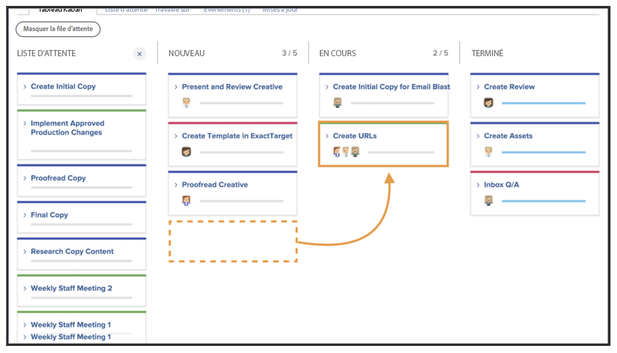
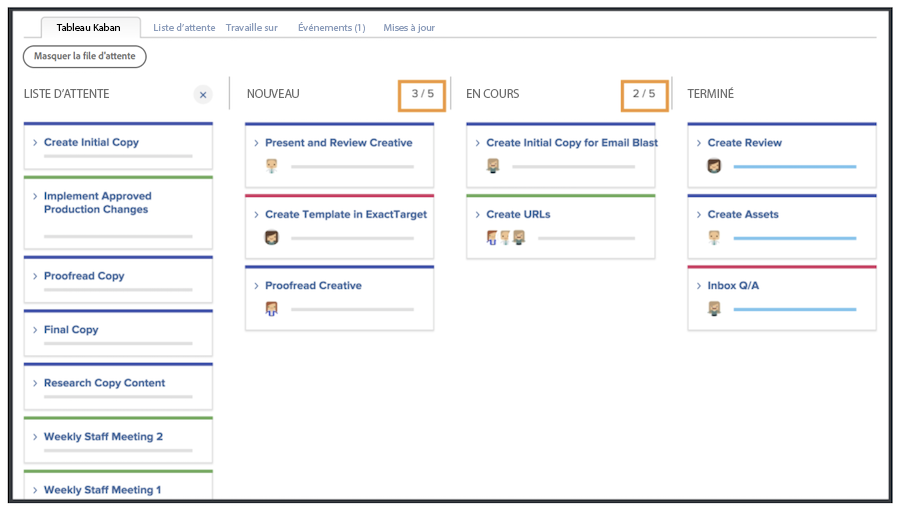
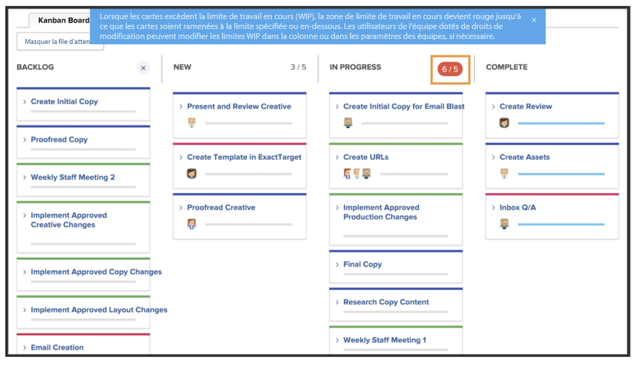

# Gérer du travail en tant qu’équipe Kanban

Gérer le travail en tant qu’équipe Kanban
Ajouter des stories à la liste d’attente Kanban
Il existe plusieurs façons d’ajouter des stories à la liste d’attente de l’équipe de marketing créatif.

L’équipe peut ajouter des stories directement à partir de sa liste d’attente.
Elle peut également se voir attribuer des tâches dans le cadre d’un projet. Si des demandes sont acheminées vers l’équipe de marketing créatif, elles apparaîtront dans l’onglet Demandes de l’équipe. Elles s’affichent dans la liste d’attente de l’équipe si celle-ci sélectionne la demande et la convertit en story.

## Utilisation du tableau Kanban

Après avoir hiérarchisé les stories dans la liste d’attente, passons au tableau Kanban. Vous pouvez faire des affectations en faisant glisser les avatars des membres de l’équipe qui travailleront sur cette story sur la carte de la story.

À mesure que les stories progressent, l’équipe leur attribue le statut approprié sur le storyboard. Les membres de l’équipe peuvent utiliser les indicateurs Kanban pour indiquer si une story est active, bloquée ou prête à être extraite. Cela informe les autres membres de l’équipe des tâches actives et si elles sont prêtes ou non à être traitées.

Les membres de l’équipe peuvent également mettre à jour les cartes directement sur le storyboard pour refléter des changements tels que la description, le statut ou la priorité. Pour ce faire, ils cliquent sur le menu déroulant de la carte d’une story et effectuent les modifications dans le champ approprié [1].

## Exécution d’une story Kanban

Notez que vous utilisez une limite Travail en cours de cinq stories. Lorsque vous consultez votre tableau, vous constatez qu’au fur et à mesure que vous déplacez les tâches en colonnes de statut, le nombre de tâches dans chaque volet s’affiche en haut à droite de chaque colonne de statut.

Si vous dépassez la limite dans une colonne de statut correspondant à Nouveau ou En cours, un message d’erreur vous indique que vous avez dépassé la limite de travail en cours.

Si votre équipe décide qu’elle peut traiter plus ou moins d’éléments à la fois, vous (ainsi que les autres membres de l’équipe disposant de droits de modification) pouvez modifier le nombre de la limite Travail en cours directement à partir du storyboard en cliquant sur le nombre Travail en cours et en le modifiant.
