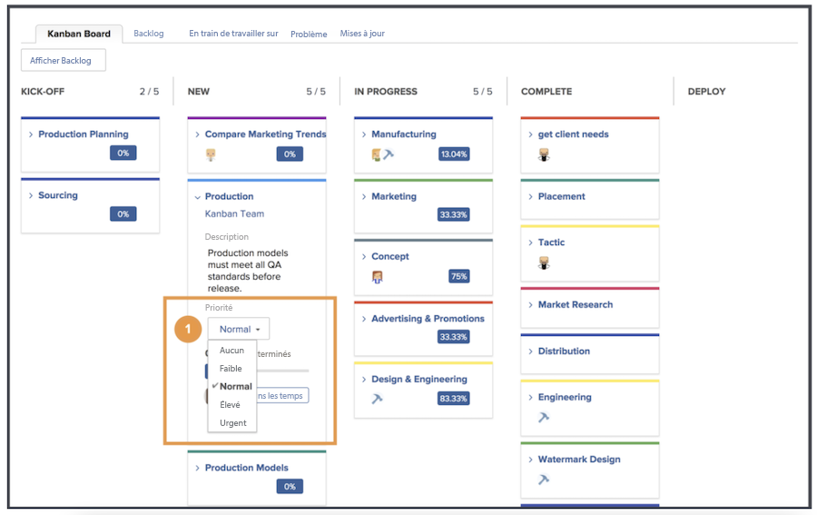

# Gérer le travail en tant qu&#39;équipe Kanban

Gérer le travail en tant qu’équipe Kanban Ajoutez des articles au journal Kanban Il existe plusieurs façons d’ajouter des articles au journal de l’équipe Creative Marketing.

L&#39;équipe peut ajouter des articles directement depuis son retard.
Ils peuvent également se voir attribuer des tâches sur un projet. Si l’équipe de marketing créatif reçoit des demandes, celles-ci s’affichent dans l’onglet Demandes de l’équipe. Elles s’affichent dans le journal de l’équipe si celle-ci sélectionne la demande et la convertit en article.

## Utilisation de la carte Kanban

Après avoir hiérarchisé les articles en souffrance, il est temps de passer à l&#39;assemblée de Kanban. Vous pouvez faire des affectations en faisant glisser les avatars des membres de l’équipe qui travailleront sur cette histoire sur la carte de l’histoire.

Au fur et à mesure que les articles progressent, l&#39;équipe les déplacera vers le statut approprié sur le storyboard. Les membres de l’équipe peuvent utiliser les indicateurs Kanban pour indiquer si un article est activé, bloqué ou prêt à être extrait. Cela communique aux autres membres de l’équipe les tâches qui sont en cours et s’ils sont prêts ou non à être traités.

Les membres de l’équipe peuvent également apporter des mises à jour aux cartes directement sur le storyboard pour refléter les modifications apportées à des éléments tels que la description, l’état ou la priorité. Pour ce faire, ils cliquent sur le menu déroulant d’une carte de reportage et effectuent leurs modifications dans le champ approprié. [1].

## Exécution de l&#39;article de Kanban

Notez que vous utilisez une limite de cinq étages de travail en cours. Lorsque vous consultez votre panorama, vous constatez qu’au fur et à mesure que vous déplacez les tâches en colonnes d’état, le nombre de tâches dans chaque volet s’affiche en haut à droite de chaque colonne d’état.

Si vous dépassez la limite dans une colonne d’état correspondant à Nouveau ou En cours, un message d’erreur vous indique que vous avez dépassé la limite de travail en cours.

Si votre équipe décide qu’elle peut traiter plus ou moins d’éléments à la fois, vous (ainsi que d’autres membres de l’équipe disposant de droits d’édition) pouvez modifier le numéro de travail en cours directement à partir du storyboard en cliquant sur le numéro de travail en cours et en l’modifiant afin de refléter votre nouvelle décision.
