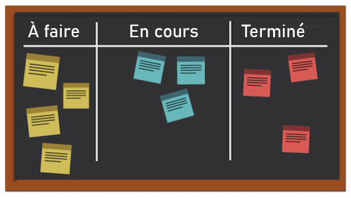
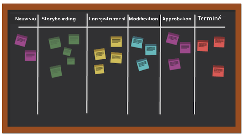

# En quoi consiste la méthodologie Kanban et comment fonctionne-t-elle ?

Contrairement à d’autres méthodologies agiles qui se concentrent sur un processus cyclique, la méthodologie Kanban vise un workflow optimisé. Kanban cherche à améliorer le flux de travail en visualisant le travail à l’aide d’un panneau Kanban, en fixant une limite à la quantité de travail pouvant être lancée en même temps et en analysant le flux pour apporter des améliorations continues.

Jetons un coup d&#39;oeil à quelques-uns des éléments clés de Kanban.

## Acteurs clés

Les acteurs clés d’une équipe Kanban sont similaires à ceux d’une équipe Scrum, mais il n’y a pas de maître Scrum. Il peut encore être logique que quelqu’un agisse en tant que responsable de projet ou superviseur ou superviseuse, mais en théorie ce rôle doit être endossé naturellement, en fonction des besoins.

## Visualisation : panneau Kanban

Il existe de nombreuses façons de mettre en forme un panneau Kanban. Les équipes travaillent à partir d’un panneau qui peut comporter un nombre illimité de colonnes. Chaque colonne représente le statut du travail en cours.

Dans le tableau le plus simpliste, la première colonne peut être &quot;à faire&quot;, la deuxième &quot;en cours&quot; et la troisième &quot;à terminer&quot;.

De nombreuses entreprises possèdent leur propre terminologie pour les noms de colonnes, ou peuvent même énumérer chaque étape dans un processus, mais l’objectif est le même. Les membres de l’équipe déplacent leurs stories d’une colonne à l’autre en fonction de l’état du travail.

## Priorisation

Les membres de l’équipe travaillent avec un ou une chef de produit ou un ou une chef de projet pour s’assurer que les stories de la liste d’attente et des autres colonnes de statut sont classées par ordre de priorité et que le travail continue d’avancer jusqu’à son achèvement. Le chef de produit est toujours chargé de s’assurer que la voix du client est entendue et que le produit s’oriente dans la bonne direction.

## Limiter le travail en cours

L’une des spécificités de Kanban tient au fait que les équipes ont une limite quant au nombre de stories qu’elles peuvent traiter à un moment donné. Les équipes choisissent une certaine quantité d&#39;histoires qu&#39;elles sont prêtes à avoir dans leurs colonnes &quot;à faire&quot; et &quot;en cours&quot;, et elles ne passent pas par ce nombre pour éviter le surmenage. Une fois qu’une histoire est passée à la &quot;fin&quot;, une histoire du journal prend sa place dans la colonne &quot;à faire&quot;.

## Amélioration continue

Kanban permet une amélioration continue en fournissant un système qui permet aux équipes de mesurer leur efficacité. Elles peuvent voir clairement comment fonctionnent leurs workflows, combien de temps prend chaque élément du workflow et à quelle fréquence elles parviennent à livrer leurs produits à temps. Cela facilite l’expérience grâce à différentes manières d’optimiser la sortie.
