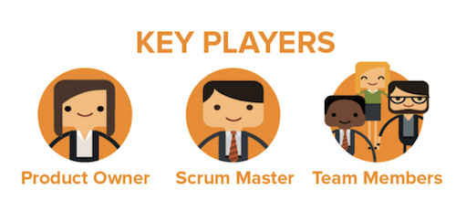
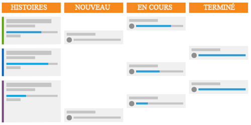
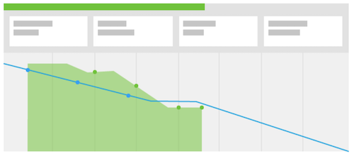

# En quoi consiste la méthodologie Scrum et comment fonctionne-t-elle ?

La méthode Scrum englobe le modèle de flexibilité, mais se distingue des autres méthodes en ce qu’elle définit des rôles pour les membres de l’équipe (comme le propriétaire du produit, le Principal Scrum, etc.) et des méthodes pour définir et terminer le travail.

## Vue d’ensemble de l’équipe Scrum

Lorsque vous décidez de passer ou non à Scrum, vous devez examiner la structure de vos équipes pour voir si elles peuvent facilement passer à la nouvelle méthodologie. Une équipe Scrum comporte trois types de membres : une personne propriétaire de produit, une personne maîtresse Scrum et des personnes membres de l’équipe.

### Personnes propriétaires de produit

Les personnes propriétaires de produits possèdent le produit et ont une vision de ce qu’est ou sera le produit. Elles sont une voix pour la clientèle et le principal moteur des décisions d’entreprise et de la définition des priorités des fonctionnalités du produit.

### Personnes maîtresses Scrum

Les personnes maîtresses Scrum aident l’équipe à accomplir son travail en trouvant les ressources nécessaires et en créant un consensus au sein de l’équipe pour que le travail soit accompli de la manière la plus efficace possible. Elles facilitent aussi la communication et le consensus tout au long du processus.

### Membres d&#39;équipe

Une équipe est généralement interfonctionnelle et ses membres ont des fonctions et des compétences variées. Elles sont chargés de la planification, de l’exécution et de la livraison des incréments de produits. Elles tireront partie d’un emplacement physique commun ou d’un accès à des outils permettant une collaboration rapide et facile, à la fois entre elles tout au long de la journée et dans leurs réunions « stand-up » quotidiennes d’équipe.

## Travailler en tant qu’équipe Scrum

Une fois que vous aurez rassemblé ces personnes clés, elles suivront un nouveau style de workflow pour accomplir leur tâche et livrer un produit à la clientèle. Là encore, par rapport à la méthodologie traditionnelle ou en cascade, elles ne suivront plus un processus linéaire consistant à élaborer un plan pour un produit final, puis à passer par les étapes ou les phases nécessaires à la livraison de ce produit. Au lieu de cela, les équipes Scrum commencent par créer une file d’attente.

### Créer une file d’attente

L’équipe Scrum examine une liste de caractéristiques prioritaires et de fonctionnalités souhaitées, appelées « stories ». Les membres doivent demander à la clientèle et discuter en tant qu’équipe de ce qu’ils veulent/ce dont ils ont besoin dans le système ou le produit qu’ils vont construire.

Une fois qu’ils ont créé leurs principales stories, ils doivent préparer leur file d’attente. En tant qu’équipe, ils doivent passer par quatre étapes majeures.

* Ils doivent ventiler les grandes stories par petits groupes en discutant de ce qui doit être fait pour chaque story.

* Ils doivent hiérarchiser leurs stories et décidez quelles fonctionnalités devraient être développées en premier.

* Ils doivent clarifier les exigences et les critères d’acceptation pour qu’une story soit considérée comme terminée.

* Ils doivent estimer la quantité d’efforts que l’équipe doit déployer pour terminer chaque story et la file d’attente. Cela peut se faire en heures ou en points. Les points vous permettent d’évaluer la difficulté ou la complexité de la story au lieu de prévoir le temps nécessaire à chaque élément de la story.

### Planification de l’itération

Une fois que la file d’attente a été établie et classée par ordre de priorité, il est temps de planifier l’itération. (De nombreuses organisations utilisent les mots « sprint » et « itération » de manière interchangeable.) L’équipe décide des articles à compléter en fonction des articles considérés comme prêts à l’emploi. L’équipe effectue des affectations et décide de la durée de l’itération.

### Exécuter l’itération

Il est maintenant temps d’exécuter l’itération. Les membres de l’équipe commencent à faire leur travail comme le ferait une équipe traditionnelle, mais intègrent maintenant une réunion rapide et quotidienne appelée « stand-up ».

Les membres de l’équipe se lèveront littéralement pour cette courte réunion et répondront à trois questions :

* Qu’ai-je accompli hier ?
* Que vais-je accomplir aujourd’hui ?
* Quels sont les obstacles qu’ils rencontrent pour empêcher la progression de leurs affectations ?

Ces réunions maintiennent chaque personne sur la même longueur d’onde et font avancer rapidement les choses.

## Utiliser un graphique d’avancement et un storyboard pour suivre la progression

Au fur et à mesure que l’équipe répond aux trois questions principales lors des réunions « stand-up », il est important qu’elle surveille et suive sa progression en vue de l’achèvement de l’itération. Cela permet aux membres de l’équipe de déterminer si ils avancent suffisamment vite dans leurs stories pour livrer toutes les fonctionnalités à temps à la fin de l’itération. Le processus Scrum comporte deux composants pour accomplir ceci.

### Storyboard

À l’aide d’un storyboard, les équipes déplacent leurs stories dans les colonnes de statut pour indiquer quand les tâches sont nouvelles, en cours ou terminées.

### Graphique d&#39;avancement

Un graphique d’avancement peut être utilisé pour vérifier si l’équipe termine les stories à un rythme suffisamment rapide, appelé « vélocité ». Les graphiques d’avancement peuvent être utilisés pour des itérations individuelles ou pour l’ensemble de la version du produit.

