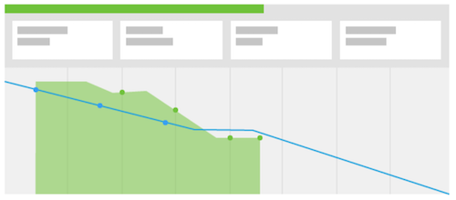

# Quelle est la méthodologie Scrum et comment fonctionne-t-elle ?

La méthodologie Scrum englobe le modèle de flexibilité, mais diffère des autres méthodes dans la mesure où elle a défini des rôles pour les membres de l’équipe, tels que le propriétaire du produit, le Principal Scrum, etc. — et des pratiques définies pour définir et terminer le travail.

## Présentation de l’équipe Scrum

Lorsque vous décidez de passer ou non à Scrum, vous devrez examiner la structure de vos équipes pour voir si elles peuvent facilement passer à la nouvelle méthodologie. Une équipe Scrum comporte trois types de membres : un propriétaire de produit, un maître de scrum et des membres de l’équipe.

### Propriétaires de produit

Les propriétaires de produits détiennent le produit et ont une vision de ce que le produit est ou sera. Ils sont une voix pour le client et le Principal moteur des décisions d’entreprise et de la définition des priorités des fonctionnalités du produit.

### Maître de script

Les gabarits aident l’équipe à faire le travail en trouvant les ressources nécessaires et en créant un consensus au sein de l’équipe pour que leur travail soit effectué le plus efficacement possible. Ils facilitent aussi la communication et le consensus tout au long du processus.

### Membres d&#39;équipe

Une équipe est généralement interfonctionnelle et compte des membres avec de nombreux rôles et compétences différents. Ils sont chargés de planifier, d’exécuter et de fournir des incréments de produit. Ils bénéficieront d&#39;un emplacement physique au même endroit ou d&#39;un accès à des outils permettant une collaboration rapide et facile, à la fois entre eux tout au long de la journée et dans leurs réunions de stand-up quotidiennes de l&#39;équipe.

## Utilisation d’une équipe Scrum

Une fois que vous avez assemblé ces lecteurs clés, ils suivront un nouveau style de workflow pour réaliser leur travail et fournir un produit au client. Encore une fois, par rapport à la méthodologie traditionnelle ou à la méthode des chutes d&#39;eau, ils ne suivront plus un processus linéaire qui consiste à élaborer un plan pour un produit final, puis à passer par les étapes ou les phases nécessaires à la livraison de ce produit. Au lieu de cela, les équipes de Scrum commencent par créer un journal des travaux en souffrance.

### Création d’un journal des travaux

L’équipe Scrum examine une liste des fonctionnalités prioritaires et souhaitées, appelées articles. Ils doivent demander au client et discuter en tant qu’équipe de ce qu’il veut/ce dont il a besoin du système ou du produit qu’il va construire.

Une fois qu&#39;ils ont créé leurs histoires principales, ils doivent rattraper leur retard. En tant qu&#39;équipe, ils doivent passer par quatre étapes majeures.

* Ventilez les grandes histoires par petits groupes en discutant de ce qui doit être fait pour chaque histoire.

* Priorisez leurs histoires et décidez quelles fonctionnalités devraient être développées en premier.

* Clarifie les exigences et les critères d’acceptation pour qu’un article soit considéré comme terminé.

* Estimez le volume d’effort que l’équipe doit consacrer pour terminer chaque article et le retard. Cela peut être fait en heures ou en points. Les points vous permettent de raconter la difficulté ou la complexité de l&#39;histoire au lieu de prévoir le temps nécessaire à chaque élément de l&#39;histoire.

### Planification de l’itération

Une fois que le journal des travaux est préparé et hiérarchisé, il est temps de planifier l’itération. (De nombreuses organisations utilisent les mots &quot;sprint&quot; et &quot;iteration&quot; de manière interchangeable.) L&#39;équipe décide des histoires à terminer en fonction d&#39;histoires qui sont considérées comme prêtes à l&#39;emploi. L’équipe effectue des affectations et décide de la durée de l’itération.

### Exécuter l&#39;itération

Il est maintenant temps d’exécuter l’itération. Les membres de l&#39;équipe commencent à faire leur travail comme le ferait une équipe traditionnelle, mais incorporent maintenant une réunion rapide et quotidienne appelée &quot;stand-up&quot;.

Les membres de l&#39;équipe se lèveront littéralement pour cette courte réunion et répondront à trois questions :

* Qu&#39;ai-je fait hier ?
* Que vais-je faire aujourd&#39;hui ?
* Quels sont les obstacles qu&#39;ils rencontrent pour empêcher la progression de leurs tâches ?

Ces réunions maintiennent chacun sur la même longueur d&#39;onde et font avancer rapidement les choses.

## Utilisation d’un graphique de condensation et d’un storyboard pour suivre la progression

Lorsqu’une équipe répond aux trois Principales questions de son plan, il est important qu’elle surveille et suive leur progression vers la fin de l’itération. Cela leur permet de déterminer s’ils se déplacent assez rapidement à travers leurs articles pour diffuser toutes les fonctionnalités à temps à la fin de l’itération. Le processus Scrum comporte deux composants.

### Storyboard

À l’aide d’un storyboard, les équipes déplacent leurs articles dans les colonnes d’état pour indiquer quand les tâches sont nouvelles, en cours ou terminées.

### Graphique en courbes de Burndown

Un graphique de condensation peut être utilisé pour déterminer si l’équipe effectue des articles à une vitesse suffisante, ou à une vitesse variable. Les graphiques de Burndown peuvent être utilisés pour des itérations individuelles ou pour l’ensemble de la version du produit.

