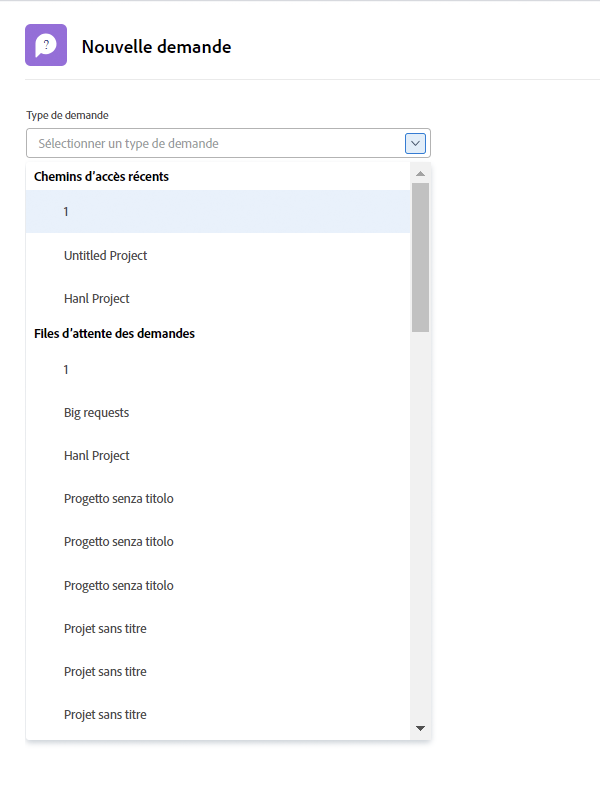
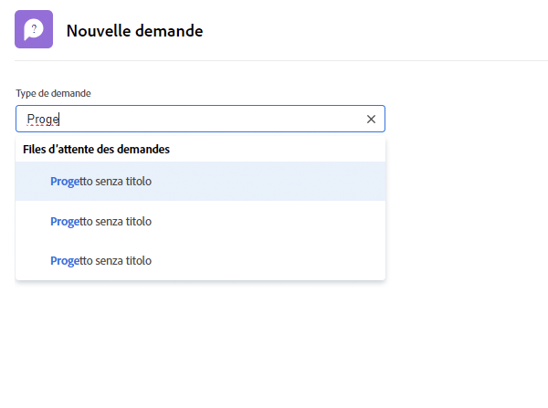

# Effectuer une demande

Dans cette vidéo, vous apprendrez à :

* Accéder à la zone de demande
* Effectuer une demande
* Afficher les demandes envoyées
* Rechercher un brouillon de demande

>[!VIDEO](https://video.tv.adobe.com/v/336092/?quality=12&learn=on&enablevpops=1)

## Accéder rapidement et facilement aux chemins des files d’attente des demandes

Lorsque vous cliquez sur le champ [!UICONTROL Type de demande], les trois derniers chemins de demandes que vous avez récemment envoyés s’affichent automatiquement en haut de la liste. Sélectionnez une option pour envoyer une autre demande à cette même file d’attente.

Au bas de la liste figurent toutes les files d’attente des demandes auxquelles vous avez accès. Si vous ne savez pas quelle file d’attente utiliser pour votre demande, utilisez la recherche par mot-clé pour trouver rapidement et facilement celle dont vous avez besoin.

Lorsque vous tapez des mots-clés, [!DNL Workfront] affiche des correspondances afin que vous puissiez trouver le chemin de la file d’attente qui correspond à vos besoins. Par exemple, pour effectuer une demande de publication sur les médias sociaux, il suffit de taper « réseaux sociaux » dans le champ [!UICONTROL Type de demande]. La liste se met alors à jour de manière dynamique pour afficher toutes les correspondances.

Sélectionnez l’option de votre choix, remplissez le formulaire de demande, puis envoyez la demande.

<!--
Learn more
Requests area overview
Create and submit Workfront requests
Guides
Make a work request
-->
