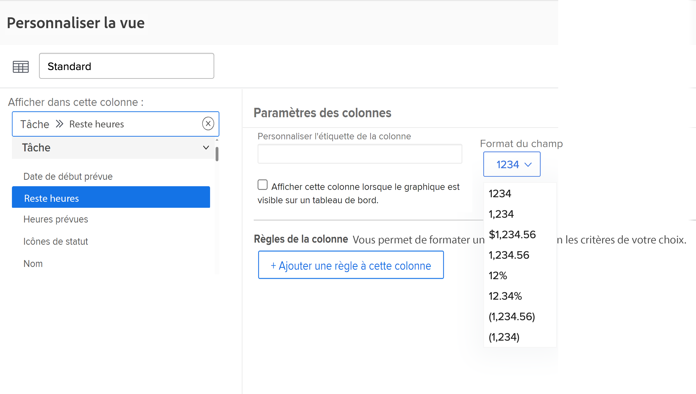
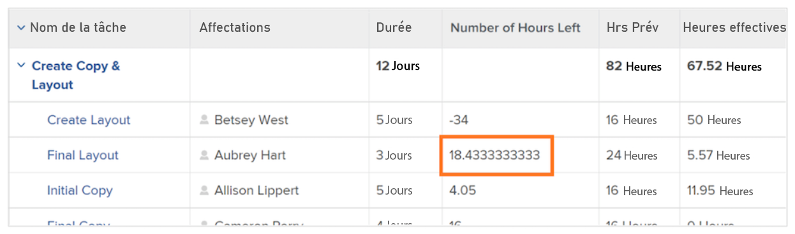
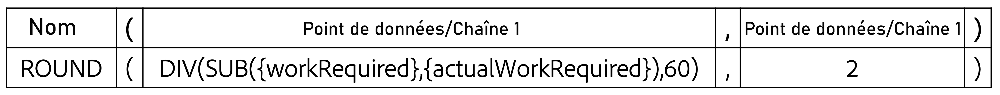

# Créer une expression de données SUB, SUM, DIV ou PROD

Dans cette vidéo, vous apprendrez :

* Utilité des expressions SUB, SUM, DIV et PROD
* Création d’une expression de données SUB dans un champ calculé

>[!VIDEO](https://video.tv.adobe.com/v/335177/?quality=12&learn=on&enablevpops)

## Informations complémentaires : expression ROUND

### Créer une expression ROUND

L’expression ROUND prend n’importe quel nombre et l’arrondit à un nombre défini de décimales.

La plupart du temps, l’expression de données ROUND est utilisée conjointement avec une autre expression de données, et lorsque le format du champ est laissé sur Texte ou Nombre.

Créons un champ calculé pour déterminer la différence entre le nombre d’heures planifiées et le nombre d’heures réellement effectuées sur une tâche, qui nécessitera l’expression SUB et ressemblera à ceci :

**SUB({workRequired},{actualWorkRequired})**

Étant donné que le temps est comptabilisé en minutes et que le format d’affichage des informations préféré est en heures, l’expression doit également être divisée par 60 et ressembler à ceci :

**DIV(SUB({workRequired},{actualWorkRequired}),60)**

Si le format est modifié en Nombre lors de la création du champ calculé dans le formulaire personnalisé, vous pouvez modifier le format du nombre lors de l’ajout du champ dans une vue.

Cependant, si le format du champ lors de la création d’un champ personnalisé est laissé en Texte, le format ne peut pas être facilement modifié dans la vue. L’expression ROUND doit être utilisée pour éviter la présence de nombres comme celui-ci dans votre projet :

<b>Utiliser l’expression de données ROUND dans un champ calculé</b>

L’expression ROUND comprend le nom de l’expression (ROUND) et, généralement, deux points de données. Ces points de données peuvent être une expression ou un champ dans Workfront, suivi d’un nombre pour indiquer le nombre de chiffres après la virgule que vous souhaitez utiliser.

Une expression serait structurée comme suit : ROUND(point de données, #).

Dans l’expression calculant la différence entre les heures planifiées et les heures réelles, utilisez cette expression : DIV(SUB({workRequired},{actualWorkRequired}),60) comme premier point de données. Assurez-vous ensuite que le nombre résultant de cette expression ne dépasse pas deux chiffres après la virgule.

L’expression pourrait être écrite comme suit : ROUND(DIV(SUB({workRequired},{actualWorkRequired}),60),2).
