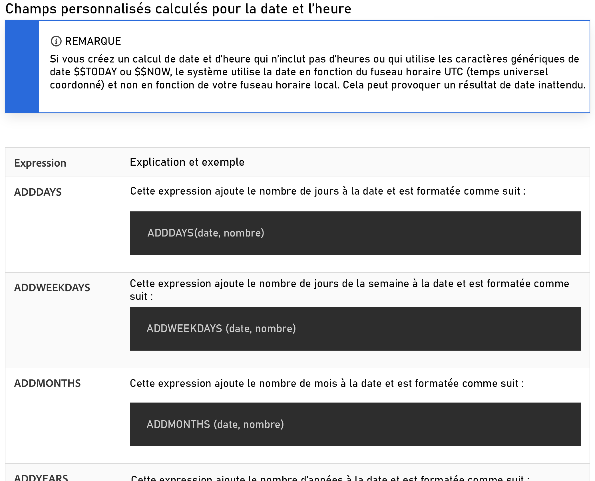
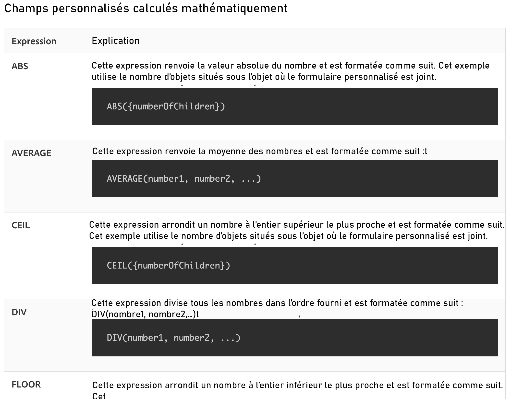

# Fonctionnement des expressions de date et d’heure et des expressions mathématiques

## Expressions de date et d’heure

Les expressions de date et d’heure vous permettent de placer les dates importantes au premier plan de vos rapports, de calculer automatiquement le nombre de jours de travail nécessaires à l’accomplissement d’une tâche ou de supprimer les horodatages de la vue lorsqu’ils ne sont pas nécessaires.

En examinant les expressions de date et d’heure disponibles, vous trouverez plusieurs options.

Il existe deux jeux d’expressions de date et d’heure qu’utilisent le plus souvent les clientes et clients de [!DNL Workfront] :

* ADDDAYS/ADDWEEKDAY/ADDMONTHS/ADDYEARS et
* DATEDIFF / WEEKDAYDIFF

## Expressions mathématiques

Les expressions mathématiques permettent à [!DNL Workfront] d’effectuer automatiquement des calculs, qu’ils soient simples ou compliqués.

En examinant les expressions de date et d’heure disponibles, vous constaterez que plusieurs options s’offrent à vous.

Les clientes et clients de Workfront utilisent couramment ces deux ensembles d’expressions mathématiques :

* SUB, SUM, DIV, PROD
* ARRONDIR

>[!NOTE]
>
>Pour obtenir la liste complète des expressions et plus d’informations sur chacune d’elles, consultez la page de documentation [Expressions de données calculées](https://experienceleague.adobe.com/en/docs/workfront/using/reporting/reports/calculated-custom-data/calculated-data-expressions).

