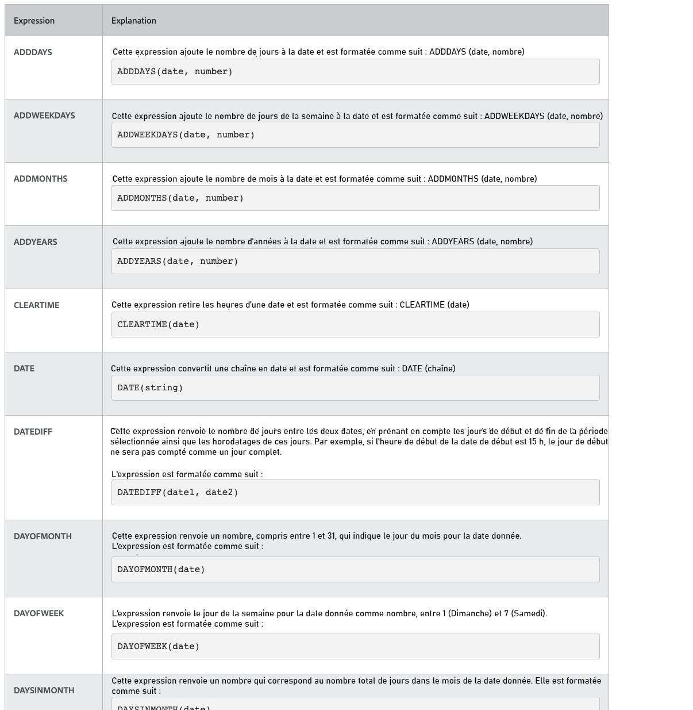
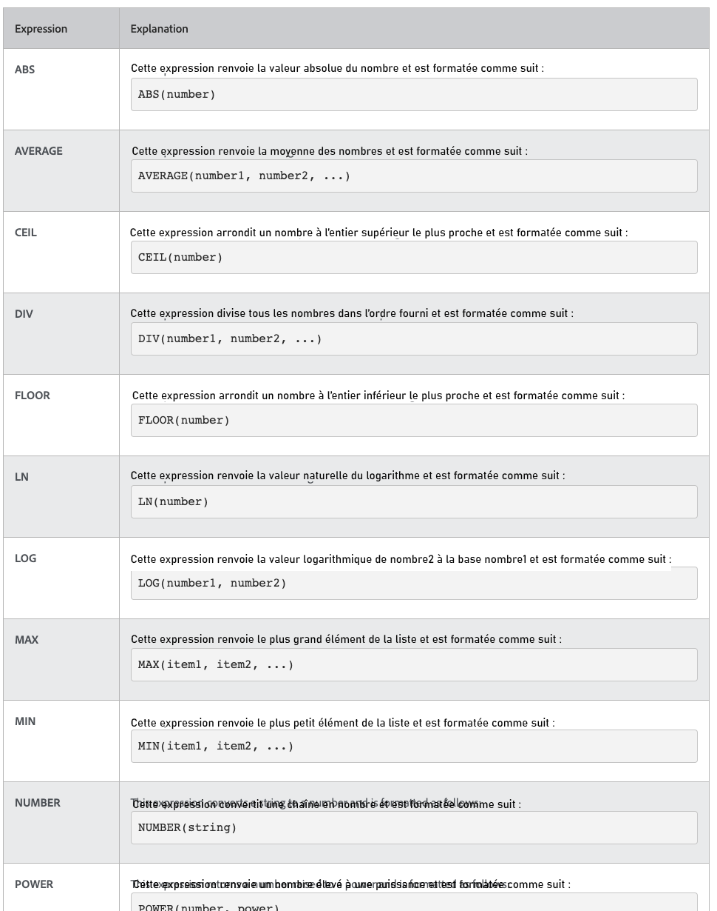

# Présentation des expressions de date et heure et mathématiques

## Expressions de date et heure

Les expressions de date et d’heure vous permettent d’extraire des dates importantes au premier plan de vos rapports, de calculer automatiquement le nombre de jours de travail nécessaires pour terminer une tâche ou de supprimer les horodatages de la vue lorsqu’ils ne sont pas nécessaires.

Lorsque vous examinez les expressions de date et d’heure disponibles, plusieurs options sont disponibles.

Il existe deux jeux d’expressions de date et d’heure utilisés le plus souvent par [!DNL Workfront] clients :

* ADDDAYS/ADDWEEKDAY/ADDMONTHS/ADDYEARS et
* DATEDIFF/WEEKDAYDIFF

## Expressions mathématiques

Expressions mathématiques autorisées [!DNL Workfront] pour effectuer automatiquement des calculs, simples ou complexes.

Lorsque vous examinez les expressions de date et d’heure disponibles, vous constatez que plusieurs options sont disponibles.

[!DNL Workfront] Les clients utilisent généralement ces deux ensembles d’expressions mathématiques :

* SOB, SUM, DIV, PROD
* ARRONDIR
