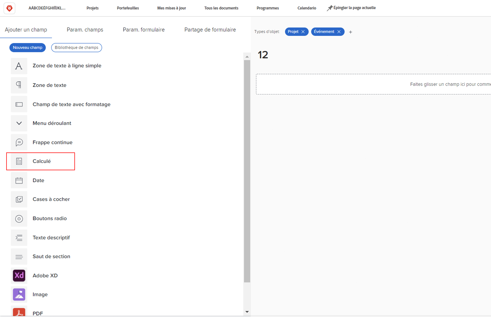
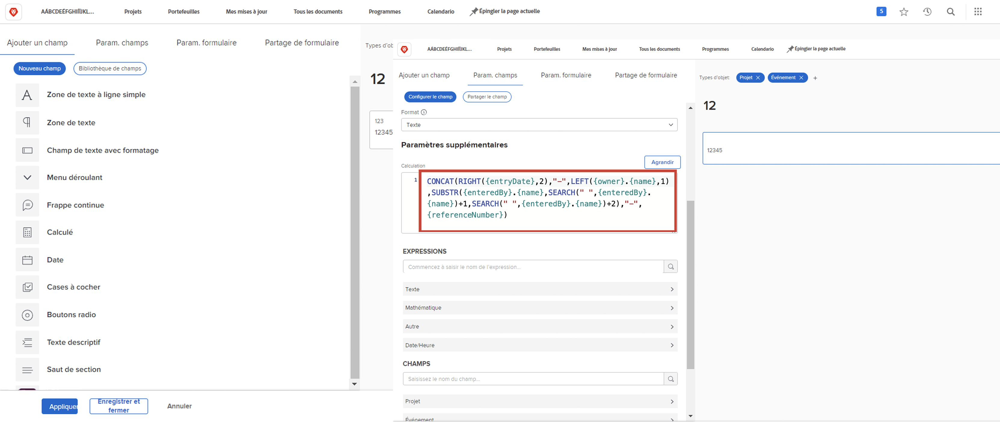
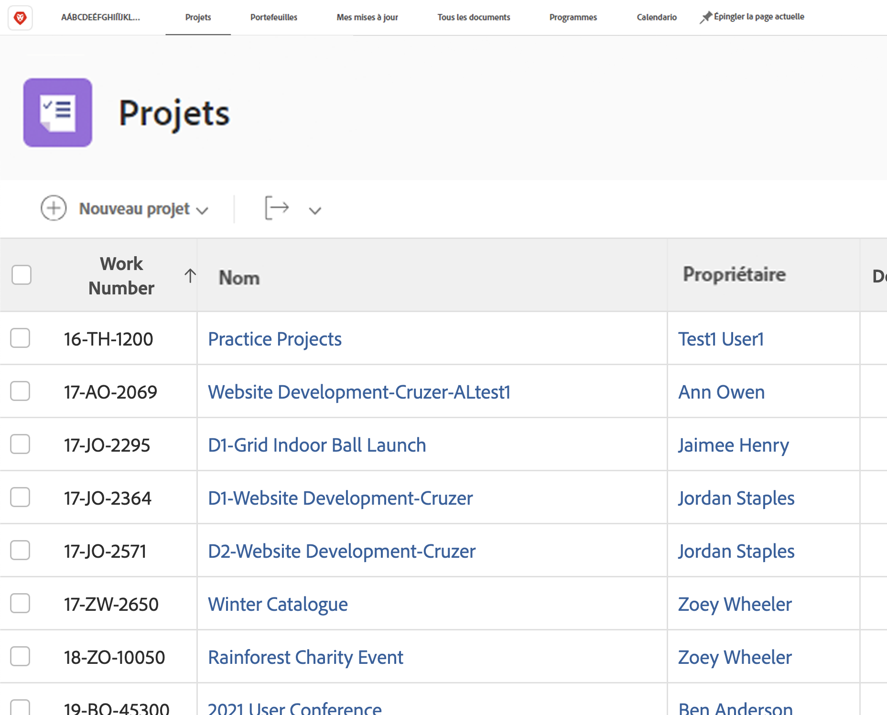
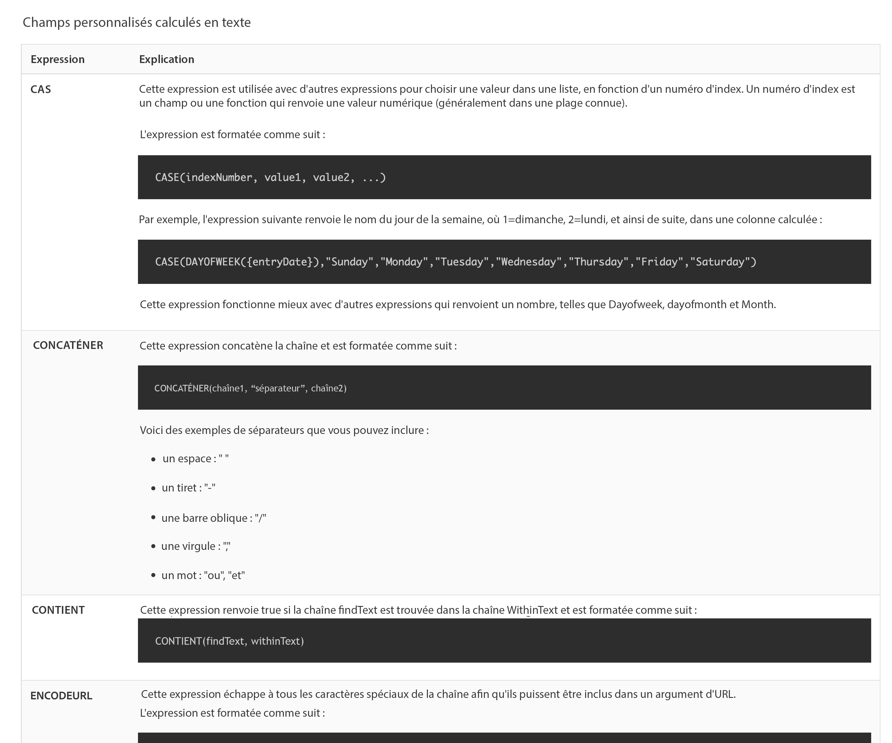

# Commencer avec les champs calculés et les expressions

<!-- **Note**: The expression examples shown are simple and some may be mitigated by fields already supplied by  . However, the examples are used to illustrate the foundational knowledge needed in order to build expressions in Workfront.-->

Workfront fournit de nombreux champs qui sont communs à de nombreux domaines d’activité et qui sont régulièrement utilisés pour la gestion du travail. Des champs tels que la date d’achèvement prévue, le budget du projet, le nom de la personne désignée de la tâche, etc.

Pourtant, chaque organisation dispose de données spécifiques à son secteur et à son entreprise qu’il convient de rassembler pour savoir si les objectifs de l’entreprise sont atteints. Par exemple, votre organisation souhaite effectuer un suivi des éléments suivants :

* Le secteur d’activité auquel le projet contribuera.
* Si le financement provient des fournisseurs, de l’intérieur ou des deux.
* En quoi consiste la résolution requise pour les images utilisées ?

Bien que ces champs ne soient pas intrinsèquement intégrés à [!DNL Workfront], vous pouvez créer des champs de saisie de données personnalisés et des champs de réponse préremplis à sélection multiple par le biais d’un formulaire personnalisé.

Ce parcours de formation se concentre sur le champ calculé. Vous découvrirez ce qu’est un champ calculé, les différents types d’informations que vous pouvez extraire dans le champ calculé au moyen d’expressions de données et comment créer ces champs calculés afin d’améliorer la collecte de données et la création de rapports.

## En quoi consiste un champ calculé ?

Un champ calculé contient des données personnalisées créées à l’aide d’expressions de données et de champs Workfront existants.

Par exemple, votre organisation dispose d’un système spécifique de numérotation des projets, ou numéro de travail, qui comprend les éléments suivants :

* L’année de création du projet
* Les initiales de la personne propriétaire du projet, et
* Le numéro de référence du projet [!DNL Workfront].

En utilisant des expressions dans un champ calculé, vous pouvez prendre chaque information déjà stockée dans [!DNL Workfront] et créer un ID de projet unique, ou un numéro de travail, qui peut ensuite être ajouté à un rapport comme celui-ci :

En fonction des données spécifiques requises, les champs calculés peuvent être simples, en utilisant une ou deux expressions, ou plus compliqués, en utilisant plusieurs expressions intégrées. Gardez simplement à l’esprit que Workfront ne peut utiliser que les données déjà stockées ou extraites dans le système pour les champs calculés.

## Expressions de texte

Les expressions de texte recherchent, dissèquent et combinent les informations trouvées sur [!DNL Workfront] afin de créer des données plus significatives ou d’obtenir une meilleure compréhension du travail effectué pour votre organisation.

Par exemple, les expressions de texte peuvent être utilisées pour :

* Afficher « Plus de 5 000 $ » lorsque les dépenses du projet sont supérieures à 5 000 $, ou « Moins de 5 000 $ » lorsque les dépenses sont inférieures à ce montant, dans une colonne de la vue d’un projet.

* Attribuez à chaque projet un numéro unique comprenant l’année de création du projet, le numéro de référence du projet [!DNL Workfront], le nom du projet et les initiales de la personne propriétaire du projet.

* Créez un rapport qui répertorie tous les projets qui ne sont pas affectés à un portfolio et/ou à un programme, afin de pouvoir l’utiliser lors de vos réunions avec les personnes responsables.

Les expressions de texte peuvent être utilisées dans un champ personnalisé pour effectuer ce type de recherches et de combinaisons dans Workfront.

En examinant les expressions de texte possibles, vous trouverez plusieurs options.

Six expressions de texte sont le plus souvent utilisées :

* CONCAT
* GAUCHE/DROITE
* CONTIENT
* IF
* ISBLANK