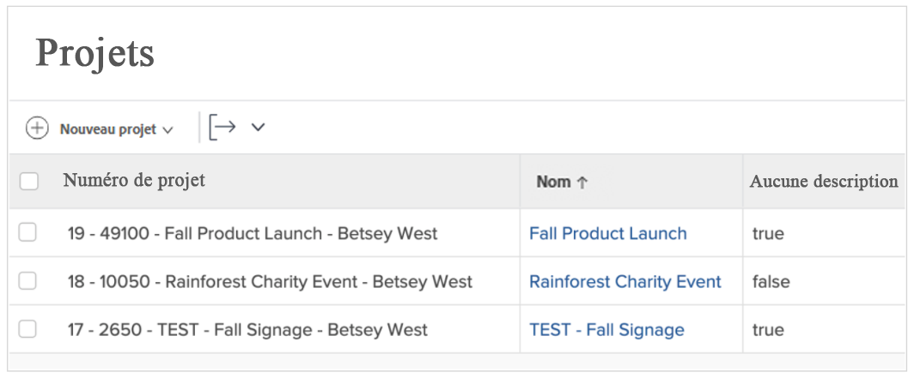
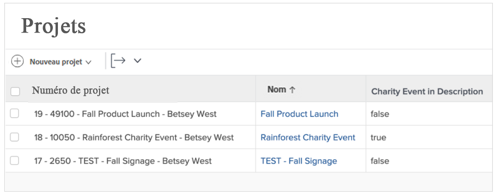
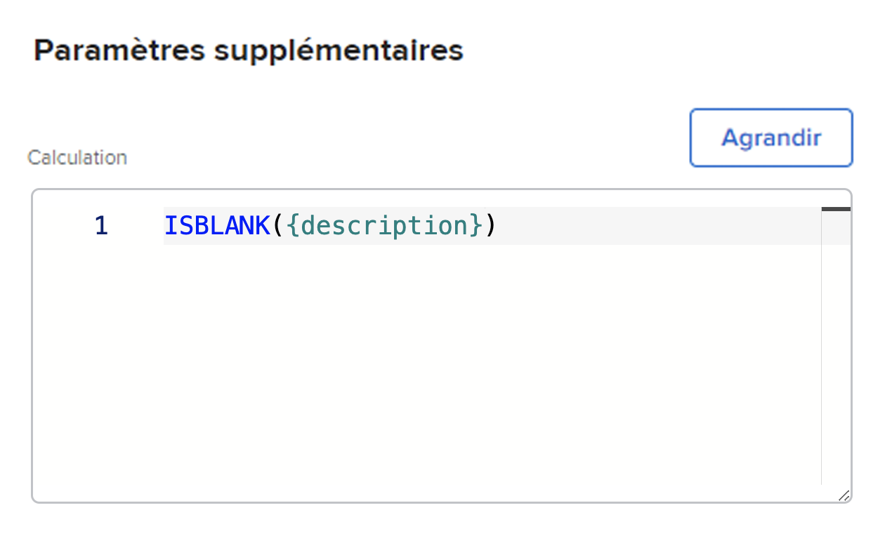
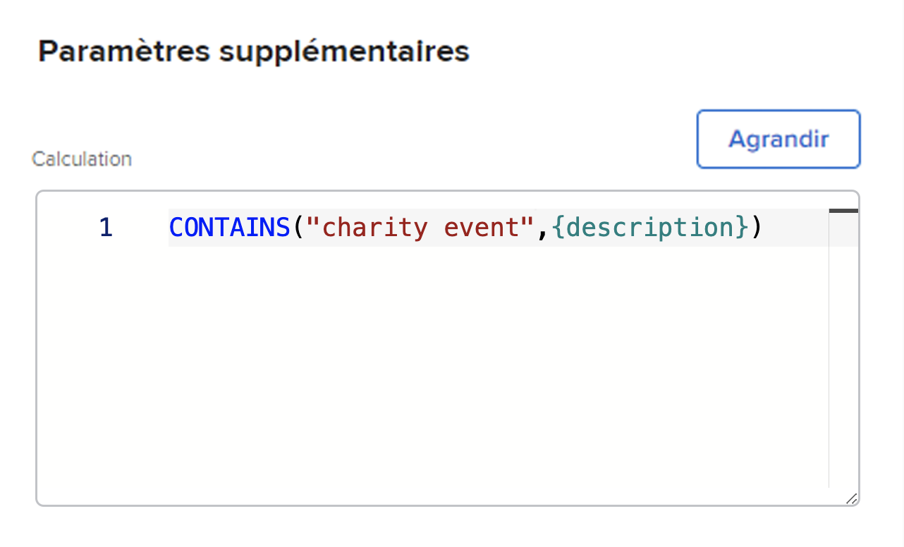

# Utiliser les expressions ISBLANK et CONTAINS

Les expressions CONTAINS et ISBLANK sont toutes deux utilisées pour fournir de simples valeurs vrai ou faux. La différence est que l’expression ISBLANK vérifie si le champ contient une valeur alors que l’expression de texte CONTAINS recherche une chaîne spécifique dans un champ.

Par exemple, pour savoir si un projet possède une description, utilisez l’expression ISBLANK. Si le champ de description est vide, l’expression renvoie la valeur Vrai. Si le champ de description n’est pas vide, elle renvoie la valeur Faux.

Pour rechercher une valeur spécifique dans la description, comme « événement caritatif », utilisez l’expression de texte CONTAINS. Si celle-ci trouve « événement caritatif » dans la description, le champ calculé indique « vrai ». Le champ affiche « faux » si l’expression ne trouve pas « événement caritatif ».

## ISBLANK

L’expression de texte ISBLANK comprend le nom de l’expression et un point de données.

**ISBLANK({data point})**

Dans l’exemple ci-dessus, dans lequel vous souhaitez savoir si le projet comporte une description, l’expression serait :

ISBLANK({description})

## CONTIENT

L’expression de texte CONTAINS inclut le nom de l’expression, le mot ou l’expression que vous recherchez et le champ à rechercher.

**CONTAINS(&quot;expression&quot;,{fields})**

Veillez à placer des guillemets autour du mot ou de l’expression que vous recherchez, sinon l’expression ne sera pas valide.

Dans l’exemple ci-dessus (vous recherchez « événement caritatif » dans la description du projet), l’expression serait :

**CONTAINS(&quot;événement caritatif&quot;,{description})**

**Remarque** : l’expression CONTAINS est sensible à la casse. Par exemple, si « Événement Caritatif » est mis en majuscules dans le champ de description, mettez cette expression en majuscules dans l’expression.

**CONTAINS(&quot;Événement Caritatif&quot;,{description})**

Les expressions ISBLANK et CONTAINS sont toutes deux utiles pour vérifier la présence d’une valeur. Cependant, il peut s’avérer plus utile de connaître la valeur, de la voir réellement ou d’avoir une sorte de descripteur pour fournir une meilleure information.

Par exemple, si, au lieu de simplement savoir qu’un projet a été converti à partir d’une requête, vous voulez connaître le nom de la requête d’origine.

Dans ce cas, utilisez l’expression CONTAINS conjointement avec une expression IF.

La plupart du temps, les expressions de texte ISBLANK et CONTAINS sont utilisées avec une expression de texte IF.
