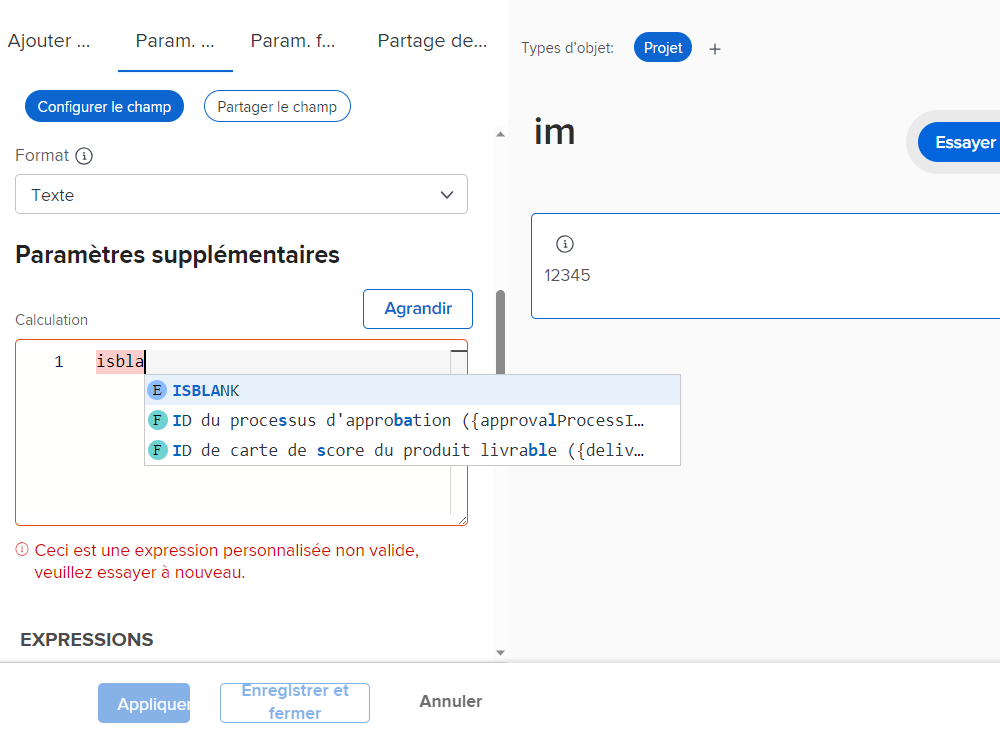
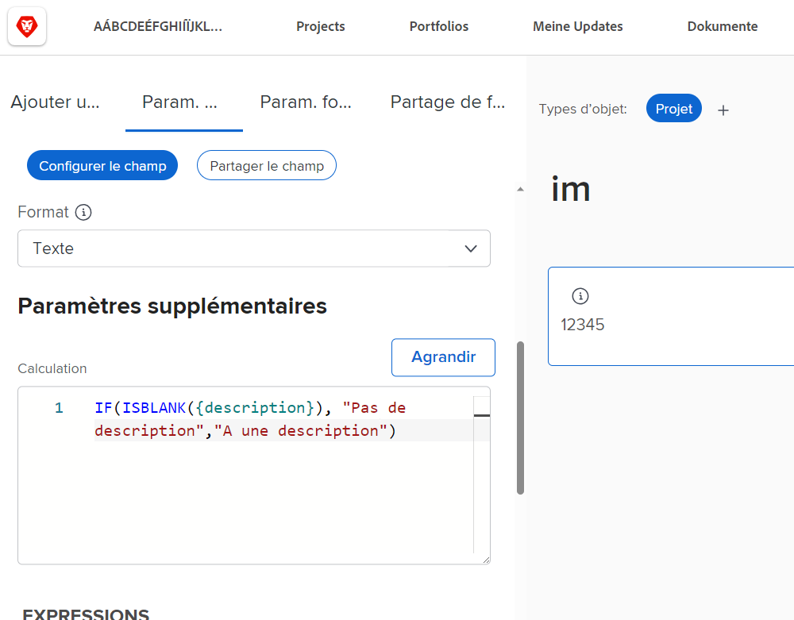
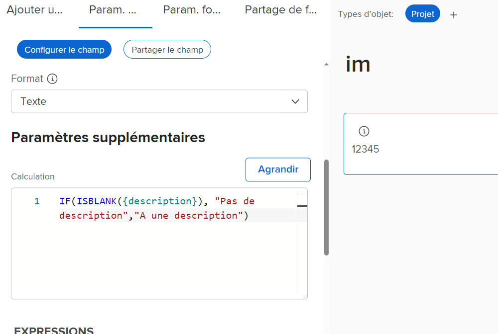
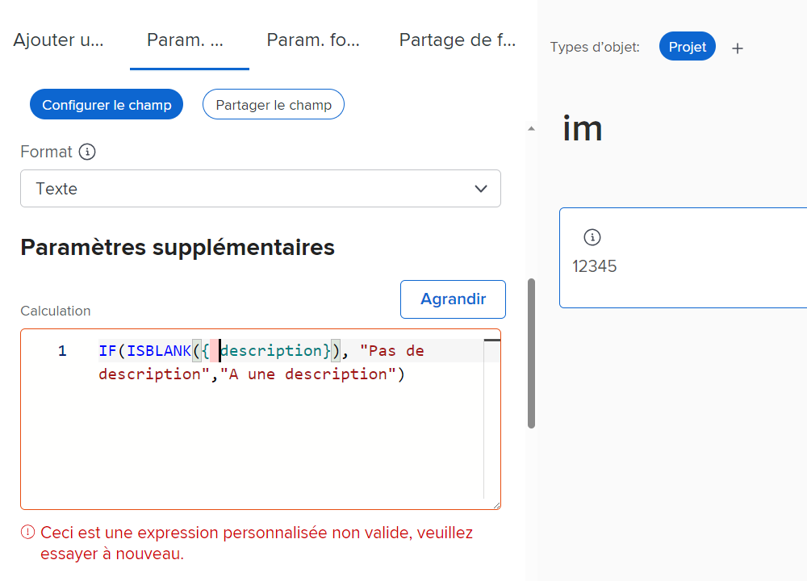
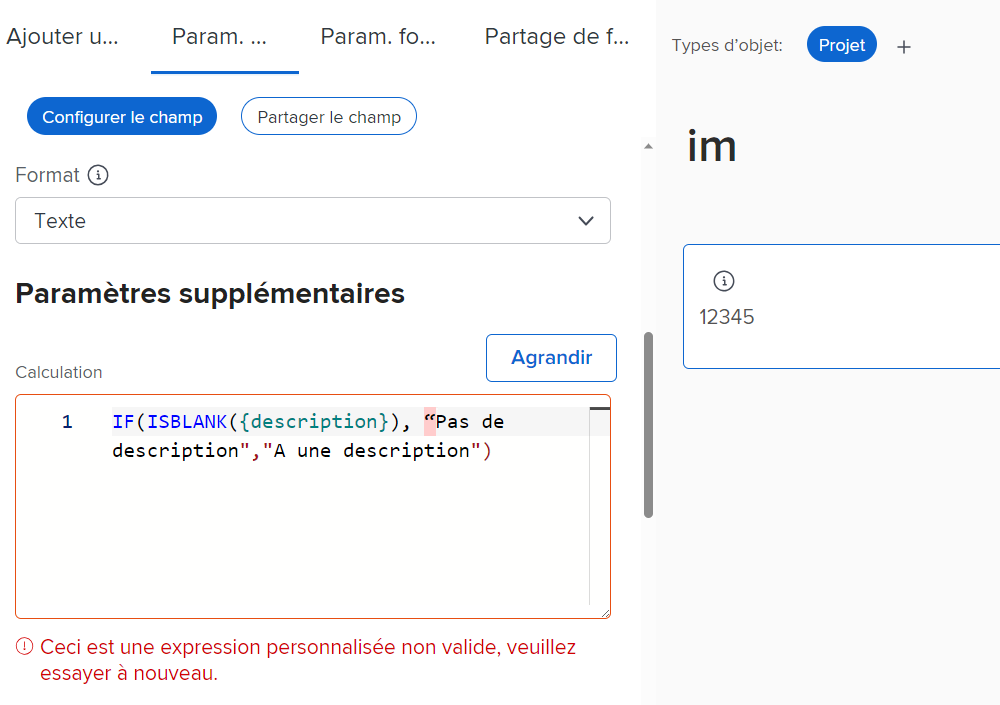
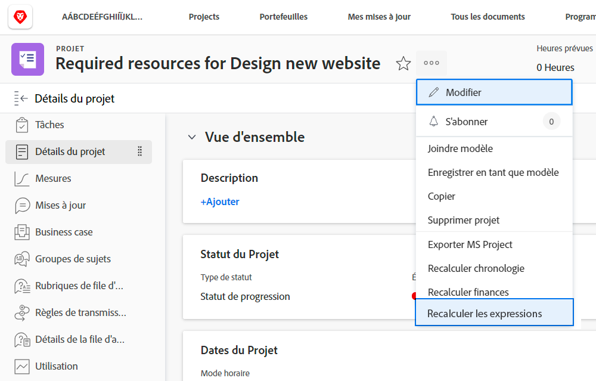
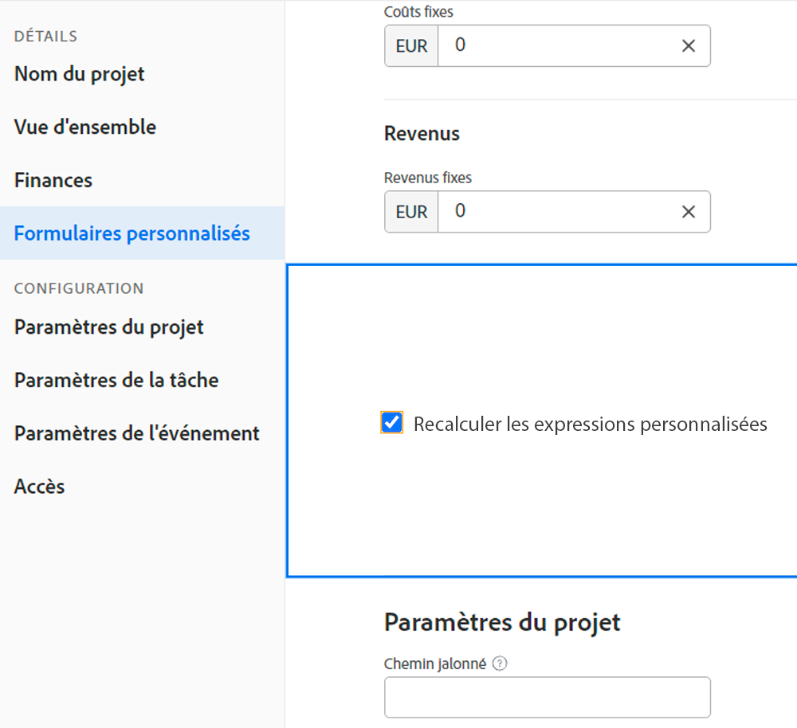

# Informations à connaître sur les expressions de champ calculées

Voici une liste des concepts à connaître lorsque vous utilisez des champs calculés personnalisés dans Workfront.

## Caching des questions dans les noms d’expression

Quand il s&#39;agit des noms d&#39;expression, la casse est importante. Lors de la création initiale d’un nom d’expression, vous pouvez utiliser des majuscules, des minuscules ou un mélange des deux.

Cependant, l’expression doit être écrite en majuscules pour que le système reconnaisse l’expression et enregistre le champ.

## Les heures sont stockées en minutes

Les heures dans la base de données Workfront sont stockées en minutes. Si vous référencez des champs tels que Heures planifiées ou Heures réelles, divisez par 60 pour afficher l’heure en heures et non en minutes.

## L’espacement n’affecte pas les expressions

La méthode recommandée pour écrire des expressions consiste à espacer peu ou pas entre chaque expression.

* IF(ISBLANK({description}), &quot;No Description&quot;, &quot;Has Description&quot;)

Cependant, si l’espacement vous permet de voir ce qui se passe, il est possible d’ajouter de l’espacement aux expressions. Les espaces supplémentaires ne doivent pas empêcher l’expression de collecter ou de calculer une valeur dans [!DNL Workfront].

* IF (ISBLANC ({description}), &quot;Aucune description&quot; , &quot;Avec description&quot; )

Les seuls éléments qui ne peuvent pas contenir d’espaces sont les champs et les accolades. Sinon, vous recevrez un message d’erreur et ne pourrez pas enregistrer le champ ou le formulaire personnalisé.

## Les guillemets doivent être droits

Lors de l’utilisation de guillemets dans une expression, assurez-vous que les guillemets sont droits (&quot;). Si les guillemets sont incurvés (&quot;), la variable [!DNL Workfront] Le système continuera à afficher un message &quot;Expression personnalisée non valide&quot;.

## Mise à jour des calculs lors de l’enregistrement d’un formulaire et de la modification d’un objet

Il s’agit d’un aspect important des champs calculés à comprendre.

Les informations affichées dans un champ calculé restent les mêmes et deviennent obsolètes, sauf si le formulaire personnalisé est recalculé.

Vous pouvez actualiser les expressions à l’aide de l’option Recalculer les expressions du menu Plus d’un objet.

Vous souhaitez voir le nombre de jours pendant lesquels un problème a été ouvert. Créez un champ calculé appelé &quot;Days Open&quot; avec l’expression DATEDIFF.

* Nom du champ = Jours ouverts
* Expression = DATEDIFF({entryDate},$$AUJOURD’HUI)

Une fois enregistré, le nombre de jours entre la première création du problème ou la saisie dans Workfront, et la date d’aujourd’hui peuvent être affichés sur la page de détails d’un objet ou dans une vue de rapport.

Lorsque vous affichez la même page de détails ou la même vue de rapport le jour suivant, vous prévoyez que ce nombre augmente d’une unité. Si le numéro est 5 aujourd&#39;hui, il devrait être 6 demain. Le jour suivant doit être 7, puis 8, etc.

Cependant, le champ continuera à afficher 5 par jour. Le champ doit être &quot;réexécuté&quot; ou recalculé pour actualiser les informations.

Pour mettre à jour un champ à l’aide de l’option Recalculer les expressions :

* Cliquez sur le nom de l’objet pour l’ouvrir.
* Cliquez sur le menu Plus .
* Sélectionnez Recalculer les expressions dans la liste.

Vous pouvez également recalculer plusieurs expressions en même temps à l’aide de la fonction &quot;modification en masse&quot; d’une liste ou d’un rapport. Supposons que vous ayez créé un rapport affichant une liste de problèmes avec le calcul Days Open apparaissant dans une colonne. Si vous souhaitez recalculer tous les problèmes à la fois :

* Sélectionnez tous les problèmes du rapport.
* Sélectionnez l’option Modifier pour modifier en masse tous les problèmes sélectionnés.
* Cliquez sur le libellé Forms personnalisé à gauche pour accéder à la section Formulaires personnalisés.
* Cochez la case Recalculer les expressions personnalisées au bas de la section Forms personnalisé .
* Cliquez sur Enregistrer les modifications.

L’écran s’actualise pour afficher les informations mises à jour dans le champ calculé.

**Remarque**: Bien qu’il existe d’autres façons de mettre à jour ou de recalculer les expressions dans un champ calculé, il s’agit de la méthode la plus rapide et la plus simple.

## Les calculs peuvent varier d’un formulaire à l’autre dans un même champ.

Dès qu’un champ calculé est enregistré sur un formulaire personnalisé et que le formulaire personnalisé est enregistré, le champ calculé est ajouté à la bibliothèque de champs afin de pouvoir être utilisé sur d’autres formulaires personnalisés.

Toutefois, si vous disposez d’un champ calculé sur le formulaire A et d’un même champ calculé sur le formulaire B, il est d’abord considéré que les calculs sont exactement les mêmes. Ce n&#39;est pas toujours le cas. Le champ calculé sur le formulaire A peut être calculé d’une manière totalement différente sur le formulaire B.

Lorsqu’un champ personnalisé calculé est sélectionné dans la bibliothèque de champs et ajouté à un formulaire personnalisé, le champ est ajouté, mais le calcul est vide. Cela est dû au fait que le calcul peut faire référence à des champs qui n’existent pas pour un autre type d’objet.

Par exemple, vous avez créé un champ calculé &quot;Jours à terminer&quot; pour déterminer le temps nécessaire pour terminer une tâche dans un projet.

* WEEKDAYDIFF({actualStartDate},{actualCompletionDate})

Vous voulez faire la même chose pour une itération. Vous pouvez utiliser la même expression ; cependant, les champs disponibles pour un objet de tâche ne sont pas toujours disponibles pour un objet d’itération. Donc [!DNL Workfront] vous donne la possibilité de créer le calcul avec les champs d’objet appropriés.

**Pro-Tip**: Copiez l’expression calculée de la zone Calcul dans le champ Instructions lors de la création de champs personnalisés. Ce champ n’est pas effacé lorsqu’un champ personnalisé calculé est ajouté au formulaire personnalisé à partir de la bibliothèque de champs.

Selon les besoins, les champs calculés dans les formulaires personnalisés peuvent être assez simples ou très complexes. Les expressions peuvent incorporer, ou imbriquer, d’autres expressions et valeurs afin de fournir le niveau de détail nécessaire pour obtenir une meilleure image de ce qui se passe avec le travail effectué au sein de votre organisation.

<!--Depending on the need, calculated fields in custom forms can be quite simple or very complex. Expressions can embed, or nest, other expressions and values to provide the level of detail needed to get a better picture of what is going on with the work being done at your organization. 

Most of the examples and exercises in this course have been relatively simple to provide a base understanding of the expressions most commonly used and how to build those expressions in a custom calculated field. 

Now you're ready to start building your own calculated custom fields.-->
