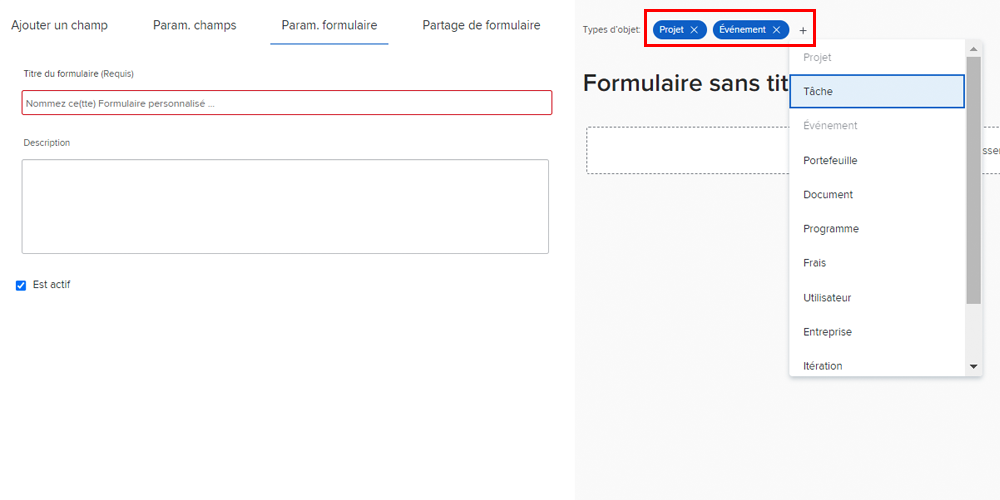

# Création et partage d’un formulaire personnalisé

Dans cette vidéo, vous apprendrez à :

* Déterminer les objets à utiliser pour votre formulaire
* Ajouter des champs uniques dans divers formats
* Organisation des champs à l’aide de sections et d’une logique
* Partage de formulaires avec d’autres utilisateurs

>[!VIDEO](https://video.tv.adobe.com/v/335172/?quality=12&learn=on)

## Les formulaires personnalisés fonctionnent avec plusieurs types d’objet

Lorsque vous cliquez sur le bouton [!UICONTROL Nouveau formulaire personnalisé] , vous pouvez sélectionner autant d’objets que vous souhaitez utiliser avec un seul formulaire personnalisé. Tous les champs que vous ajoutez à ce formulaire seront disponibles pour tous les objets sélectionnés lorsque le formulaire personnalisé y est joint.

![Fenêtre de formulaire personnalisée affichant la [!UICONTROL Nouveau formulaire personnalisé] options d’objet](assets/create-custom-form.png)

Lorsque vous modifiez un formulaire personnalisé, vous pouvez voir tous les types d’objets sélectionnés. Vous pouvez ajouter ou supprimer des types d’objet de cette liste.

Vous pouvez créer un formulaire personnalisé de type projet et problème. Lorsque vous êtes lié à un problème, vous pouvez remplir n’importe quel champ relatif au problème. Par la suite, si vous décidez de convertir le problème en projet, le formulaire personnalisé sera automatiquement chargé dans le projet et les données que vous placez dans les champs du formulaire personnalisé seront disponibles pour affichage ou modification dans le formulaire personnalisé du projet.

## Options de champ personnalisé

**[!UICONTROL Libellé] et [!UICONTROL Nom] fields**

Le [!UICONTROL Libellé] et [!UICONTROL Nom] les champs d’un champ personnalisé ont des objectifs différents. [!UICONTROL Libellé] est le nom du champ que les utilisateurs verront dans [!DNL Workfront]. [!UICONTROL Nom] est ce qui peut être utilisé avec les intégrations, telles que l’API.

![Fenêtre de formulaire personnalisée qui s’affiche [!UICONTROL Libellé] et [!UICONTROL Nom] fields](assets/custom-forms-field-label-and-name.png)

Vous avez ainsi la possibilité de modifier le libellé de l’interface utilisateur pour qu’il corresponde aux modifications de votre organisation, sans affecter les intégrations ou d’autres connexions qui dépendent d’un nom de champ spécifique.

**[!UICONTROL Champ de texte avec formatage]**

Le [!UICONTROL Champ de texte avec mise en forme]contient des outils de balisage de texte de base qui permettent aux utilisateurs d’ajouter du gras, des italiques ou du soulignement sur du texte lorsqu’ils remplissent le champ d’un formulaire personnalisé.

![Fenêtre de formulaire personnalisée qui s’affiche [!UICONTROL Champ de texte avec mise en forme] option](assets/custom-forms-text-field-with-formatting.png)

Le champ est également limité à 15 000 caractères, ce qui permet de libérer de l’espace pour fournir des informations essentielles et d’utiliser la mise en forme pour faciliter la lecture par les autres.

**[!UICONTROL Tirage anticipé] field**

Le [!UICONTROL Tirage anticipé] permet au système de renseigner automatiquement une liste d’options en fonction de l’objet sélectionné pour le champ.

![Fenêtre de formulaire personnalisée qui s’affiche [!UICONTROL Tirage anticipé] option de champ](assets/custom-forms-typeahead-1.png)

Par exemple, si vous créez une [!UICONTROL Tirage anticipé] champ intitulé &quot;Nom d’approbation du responsable marketing&quot; et sélectionnez [!UICONTROL Utilisateur] comme type d’objet référencé, une liste de noms d’utilisateur s’affiche lorsqu’un utilisateur remplit ce champ sur un formulaire personnalisé. Le [!UICONTROL Tirage anticipé] est destiné à connecter vos données personnalisées aux informations capturées dans le système et à éliminer la nécessité de conserver manuellement de nombreuses options dans les champs déroulants.

![Fenêtre de formulaire personnalisée qui s’affiche [!UICONTROL Tirage anticipé] menu déroulant](assets/custom-forms-typeahead-2.png)
