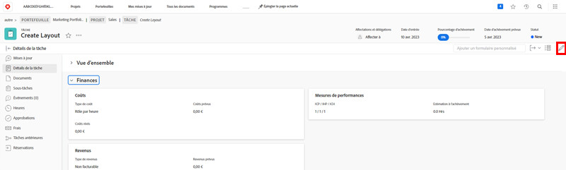

# Modifier un formulaire personnalisé

<!---
21.4 updates have been made here
--->

Vous pouvez modifier les informations d’un formulaire personnalisé après l’avoir joint à un objet.

1. Accédez à l’objet pour lequel vous souhaitez modifier des informations sur le formulaire personnalisé.
1. Cliquez sur [Type d’objet], **[!UICONTROL Détails]** dans le panneau de gauche.
1. Développez le formulaire personnalisé en cliquant sur la flèche à côté de son nom.
1. Cliquez sur un champ du formulaire personnalisé pour passer en mode édition sur ce champ. Vous pouvez également cliquer sur l’icône [!UICONTROL Modifier] dans le coin supérieur droit pour modifier tous les formulaires personnalisés ou des sections de ces derniers.
1. Saisissez les informations dans un seul champ personnalisé, même si les champs requis dans d’autres formulaires personnalisés de l’objet ne sont pas encore remplis.
1. Cliquez sur **[!UICONTROL Enregistrer les modifications]**.

