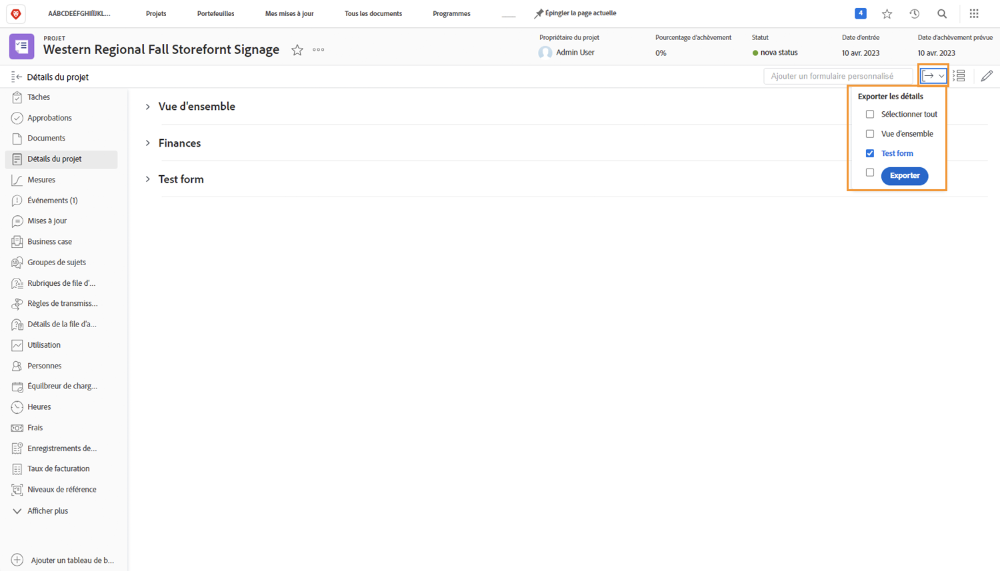
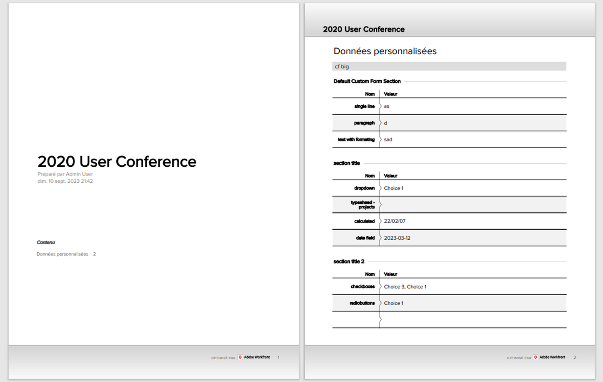

# Exportation d’un formulaire personnalisé en tant que PDF

La capture des données uniques d’une organisation est un élément essentiel de la gestion du travail. Les formulaires personnalisés sont généralement utilisés à cette fin. La possibilité d’exporter des formulaires personnalisés permet de les diffuser et de les partager facilement. Vous pouvez exporter des formulaires personnalisés à partir de projets, de tâches ou de problèmes lorsque vous accédez au formulaire dans le [!UICONTROL Détails] des objets.

Vous pouvez également inclure la variable [!UICONTROL Présentation] dans le PDF exporté.

Par exemple, pour exporter un formulaire personnalisé nommé Informations marketing vidéo joint à un projet :

1. Cliquez sur le bouton **[!UICONTROL Exporter]** icône . Tous les formulaires personnalisés associés au projet apparaissent dans le menu déroulant, y compris le [!UICONTROL Présentation] .
1. Sélectionnez Informations sur le marketing vidéo dans la liste.
1. Cliquez sur **[!UICONTROL Exporter]** en bas de la liste.

Un fichier de PDF formaté est téléchargé.

