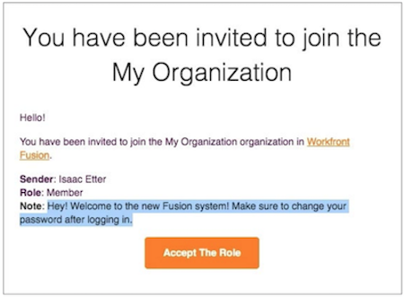
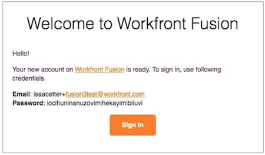

# Connexion en tant que nouvel utilisateur ou nouvelle utilisatrice

Lorsque vous êtes invité à rejoindre une instance Workfront Fusion en tant que nouvel utilisateur ou nouvelle utilisatrice, vous recevez deux e-mails.

L’un des e-mails contient une note que l’administrateur ou l’administratrice du système Workfront Fusion a ajoutée lorsqu’il u elle a créé votre profil et vous a invité à rejoindre l’organisation. Au bas de l’e-mail se trouve le bouton [!UICONTROL Accepter le rôle]. **Ne cliquez pas encore sur ce bouton.**

L’autre e-mail contient vos informations de connexion.

Pour commencer à utiliser Workfront Fusion, cliquez sur le bouton [!UICONTROL Se connecter] dans le deuxième e-mail et connectez-vous à l’aide du mot de passe fourni.

Après la première connexion, vous êtes invité à modifier votre mot de passe.

Une fois la connexion effectuée, revenez à l’autre e-mail et cliquez sur le bouton [!UICONTROL Accepter le rôle].

Une fois que vous avez fait cela, retournez à Workfront Fusion et rafraîchissez la page. Vous pouvez maintenant voir votre équipe et les sections de vue d’ensemble dans le panneau de gauche.
