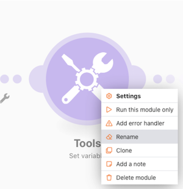

# Accessibilité et clarté

Au début de la formation à Workfront Fusion, vous avez appris quelques bonnes pratiques de base pour faciliter la lecture, le partage et la compréhension des scénarios. Ces pratiques facilitent la tâche des futurs utilisateurs de Workfront Fusion ou de toute personne souhaitant résoudre les problèmes ou prendre en charge votre instance Workfront Fusion. Payez-le en suivant les instructions ci-dessous lors de la conception de scénarios.

## Étiquettes et notes

En règle générale, un objectif Principal de Workfront Fusion est toujours d’avoir des conceptions de scénario simples. Voici quelques façons de créer des conceptions simples à interpréter.

* Veillez à nommer tous les modules. Cliquez avec le bouton droit de la souris sur un module, puis sélectionnez Renommer. Les libellés de module doivent être courts mais compréhensibles pour ce que le module effectue. Par exemple, &quot;Créer un profil Mktg avec modèle Ch&quot;.
  
* Étiqueter également les chemins de routage. Même si un chemin n&#39;utilise pas de filtre directement après un routeur, vous pouvez appliquer un libellé sans remplir la logique de filtrage. Cela permet à d’autres personnes de comprendre quels lots transmettent quels chemins et pourquoi. Pour créer un libellé pour un chemin de routeur sans filtre, cliquez avec le bouton droit sur le chemin, ajoutez un libellé et enregistrez.
  
* Ajoutez des notes le cas échéant dans un scénario si une étiquette de module ou de chemin de routage est trop courte pour clarifier ce qui se passe réellement. Vous pouvez ajouter des notes lorsque vous le souhaitez tout au long du processus de conception et d’itération.

Cependant, il peut être plus facile de lire et de comprendre si vous ajoutez des notes à la fin de la conception de scénario lorsque vous êtes prêt à démarrer. Travaillez à partir de la fin de la conception de votre scénario (tout en bas, dans le coin droit) vers l’arrière. Ainsi, les notes qui s’appliquent au début de votre scénario se trouvent en haut de la liste lors de l’ouverture du panneau Notes.

Après avoir enregistré ou fermé le panneau Notes, les notes sont triées avec les notes créées le plus récemment en haut. Dans l’image ci-dessous, la première note créée s’affiche au bas de la liste. Les notes ont été créées intentionnellement du bas à droite vers le chemin d’accès au-dessus et enfin vers le déclencheur : essentiellement l’ordre inverse dans lequel un lot de données transmettrait dans le scénario. Cela fait apparaître les notes dans l’ordre dans lequel le scénario s’exécute réellement sur le lot de données.

## Modèles de fusion Workfront

L’utilisation de modèles constitue un excellent moyen de rationaliser l’étiquetage des modules et des chemins de routage. Les modèles de bonnes pratiques peuvent accélérer la création de scénarios pour les cas d’utilisation courants.

### Exemple de modèle

Lors du démarrage d’un scénario, vérifiez d’abord s’il existe un modèle qui vous aidera. Par exemple, vous souhaitez créer un scénario qui commence par télécharger un document CSV à partir de Workfront, puis l’analyse.

Cliquez sur la section Modèles pour voir si des modèles publics répondent à vos besoins.

Cliquez sur l’onglet Modèles d’équipe pour voir si un membre de votre équipe a créé un modèle qui peut s’avérer utile.

Si vous trouvez un modèle à utiliser, cliquez sur son nom pour l’ouvrir.

Ensuite, accédez au coin supérieur droit, cliquez sur Options, puis sélectionnez Créer un scénario.

### Créer un modèle

Vous pouvez créer un modèle dans la section Modèles d’équipe . Le modèle que vous créez est disponible pour vous et votre équipe, mais lorsque vous cliquez sur le bouton Publier , vous pouvez le partager avec des personnes en dehors de votre équipe.

Lors de la création du modèle, vous pouvez inclure un assistant pour guider les personnes qui l’utilisent pour créer leurs scénarios, modifier les connexions, les données mappées et d’autres champs de panneau, le cas échéant.

Cochez la case &quot;Utiliser dans l’assistant&quot; pour ajouter des instructions qui seront disponibles lorsqu’une personne crée un scénario à l’aide de votre modèle. Ces informations s’affichent dans le champ Aide . Pour permettre aux utilisateurs de voir ce texte lors de l’utilisation du modèle, activez l’option Utiliser comme valeur par défaut.

## Vous souhaitez en savoir plus ? Nous vous recommandons ce qui suit :

[Documentation de Workfront Fusion](https://experienceleague.adobe.com/docs/workfront/using/adobe-workfront-fusion/workfront-fusion-2.html?lang=en)
