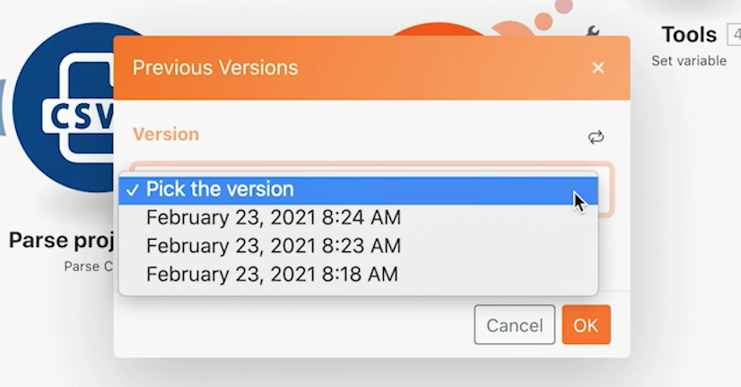

# Accès aux versions précédentes

Découvrez comment revenir à une version précédente d’un scénario.

## Vue d’ensemble de l’exercice

Découvrez comment restaurer des versions précédentes après avoir apporté des modifications à un scénario et l’avoir enregistré plusieurs fois.

## Étapes à suivre

1. Clonez votre scénario d’utilisation du filtre puissant et nommez-le « Accès aux versions précédentes ».
1. Ajoutez un module Définir la variable après le module Créer des projets Workfront. Nommez la variable « Test ».
1. Faites-la glisser vers un nouvel emplacement et enregistrez le scénario.

   

1. Ajoutez un module Répéteur, dissociez-le du module précédent, puis enregistrez à nouveau le scénario.

   

1. Supprimez maintenant tous vos modules et enregistrez.
1. Dans la barre d’outils, cliquez sur le menu à trois points de suspension et sur l’option Versions précédentes. La liste de sélection affiche les horodatages de date et d’heure pour chaque version enregistrée.

   

1. Choisissez une version précédente et notez la façon dont le scénario du concepteur revient à l’emplacement où vous avez enregistré.
