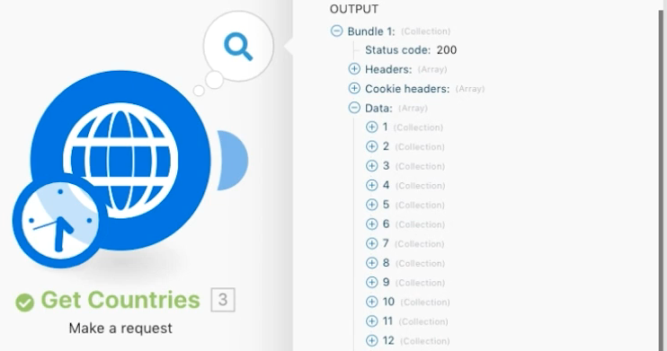
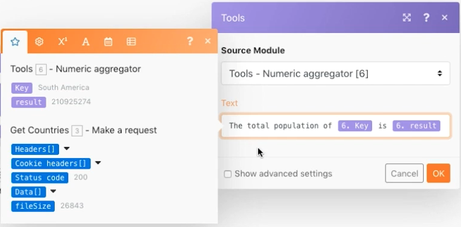

# Agrégation avancée

Découvrez comment utiliser les regroupements lors de l’agrégation.

## Présentation de l’exercice

Appelez un service Web pour renvoyer des informations sur plusieurs pays et identifier la population totale de tous les pays, regroupée par sous-région.

## Étapes à suivre

**Obtenir les détails du pays.**

1. Créez un scénario et nommez-le &quot;agrégation avancée&quot;.
1. Définissez le module de déclenchement sur HTTP - Effectuer un module de requête.
1. Utiliser cette URL, `https://restcountries.com/v2/lang/es`, qui donne la liste de tous les pays où l&#39;espagnol est parlé.
1. Laissez la méthode définie sur Get.
1. Cochez la case Analyse de la réponse .
1. Renommez ce module &quot;Get Countries&quot;.
1. Cliquez une fois sur Enregistrer et Exécuter.

   **La sortie est un seul lot, mais elle est fournie dans un tableau de 24 collections, une pour chaque pays hispanophone.**

   

   **Vous devez collecter des informations sur chaque sous-région pour chacun des pays. Vous devrez donc effectuer une requête HTTP supplémentaire.**

1. Ajoutez une autre requête pour obtenir des informations sur la sous-région. Il ne reviendra que le premier pays, mais c&#39;est normal pour l&#39;instant. Ajoutez un autre module HTTP Make a request et utilisez l’URL `https://restcountries.com/v2/name/{country name}`.
1. Pour obtenir le nom du premier pays, accédez au panneau Mappage et cliquez sur Données, puis sur Nom dans le tableau. Le [1] dans le champ de données signifie qu’il renverra le premier élément du tableau .

   + Cliquez sur le nombre et modifiez l’index si nécessaire, mais dans ce cas, vous souhaitez uniquement le premier élément.

1. Cochez Parse response dans le panneau de mappage, puis cliquez sur OK.
1. Renommez cette option &quot;Obtenir des détails sur les pays&quot;.
1. Cliquez sur Enregistrer, puis sur Exécuter une fois.

   + Le résultat est une information pour un seul pays.

1. Pour obtenir les autres pays, vous devez effectuer une itération sur le tableau . Ajoutez un itérateur qui prend une liste d’éléments et génère un lot pour chaque élément de la liste.

   **Ajoutez l’itérateur et l’agrégateur.**

1. Cliquez avec le bouton droit de la souris entre les modules HTTP et ajoutez le module Iterator Flow Control .
1. Dans le champ Tableau , sélectionnez Données dans le module Obtenir les pays .

   

1. Dans le module Obtenir les détails du pays , mettez à jour le champ URL pour extraire le champ nom de l’itérateur au lieu du module Obtenir les pays .

   

1. Ajoutez maintenant un agrégateur numérique après Obtenir les détails du pays pour regrouper et additionner les populations.
1. Le module source est le module d’itérateur.
1. La fonction d’agrégat est SUM.
1. La valeur est [données:population] à partir du module Obtenir les détails du pays .
1. Cliquez sur l’option Afficher les paramètres avancés en bas de l’écran et regroupez les [données:sous-région] à partir du module Obtenir les détails du pays .

   

   **Terminez avec un agrégateur de texte pour agréger ce que vous avez regroupé dans l&#39;agrégateur numérique.**

1. Ajoutez un agrégateur de texte à la fin.
1. Le module source est l’agrégateur numérique.
1. Dans la zone Texte, insérez &quot;La population totale de [CLÉ] is [result].&quot;

   

1. Enregistrez et exécutez une fois.

   + Examinez la sortie du module final.
