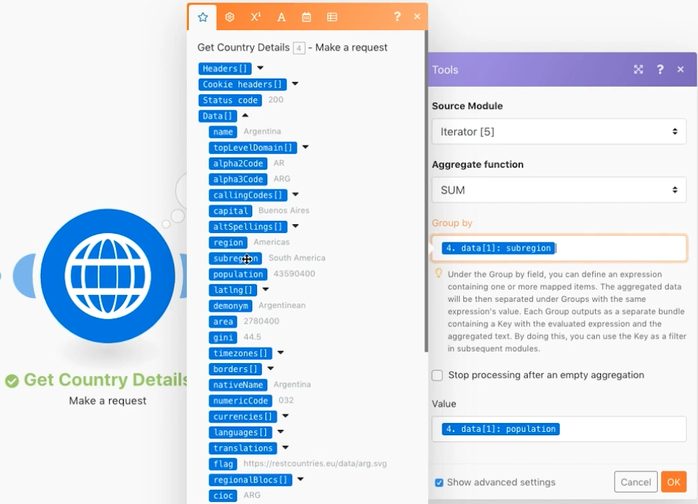

# Agrégation avancée

Découvrez comment utiliser les regroupements lors de l’agrégation.

## Vue d’ensemble de l’exercice

Appelez un service web pour renvoyer des informations sur plusieurs pays et identifier la population totale de tous les pays, regroupée par sous-région.

## Étapes à suivre

**Obtenez des informations sur le pays.**

1. Créez un scénario et nommez-le « Agrégation avancée ».
1. Définissez le module de déclenchement sur un module HTTP - Effectuer une demande.
1. Utilisez cette URL, `https://restcountries.com/v2/lang/es`, qui vous donne une liste de tous les pays où l’on parle espagnol.
1. Conservez la méthode Get.
1. Cochez la case Analyser la réponse.
1. Renommez ce module « Obtenir des pays ».
1. Cliquez sur Enregistrer et Exécuter une fois.

   **La sortie est un lot unique, mais elle se présente sous la forme d’un tableau de 24 collections, une pour chaque pays hispanophone.**

   

   **Vous devez collecter des informations sur les sous-régions pour chacun des pays. Vous devrez donc effectuer une requête HTTP supplémentaire.**

1. Ajoutez une autre demande pour obtenir des informations sur les sous-régions. Elle ne renverra que le premier pays, mais ce n’est pas grave pour l’instant. Ajoutez un autre module HTTP Effectuer une demande et utilisez l’URL `https://restcountries.com/v2/name/{country name}`.
1. Pour obtenir le nom du premier pays, allez dans le panneau de mappage et cliquez sur Données, puis sur Nom dans le tableau. Le [1] dans le champ de données signifie qu’il renverra le premier élément du tableau.

   + Cliquez sur le nombre et modifiez l’index si nécessaire, mais dans ce cas, seul le premier élément est important.

1. Cochez Analyser la réponse dans le panneau de mappage, puis cliquez sur OK.
1. Renommez ceci « Obtenir les détails du pays ».
1. Cliquez sur Enregistrer, puis sur Exécuter une fois.

   + La sortie est une information pour un seul pays.

1. Pour obtenir les autres pays, vous devez itérer le tableau. Ajoutez un itérateur qui prend une liste d’attributs et génère un lot pour chaque élément de la liste.

   **Ajoutez l’itérateur et l’agrégateur.**

1. Faites un clic droit entre les modules HTTP et ajoutez le module Contrôle du flux de l’itérateur.
1. Dans le champ Tableau, sélectionnez Données dans le module Obtenir les pays.

   

1. Dans le module Obtenir les détails du pays, mettez à jour le champ URL pour que le nom provienne de l’itérateur plutôt que du module Obtenir des pays.

   

1. Ajoutez maintenant un agrégateur numérique après Obtenir les détails du pays afin de regrouper et d’additionner les populations.
1. Le module source est le module d’itérateur.
1. La fonction d’agrégation est SUM.
1. La valeur est [data:population] provenant du module Obtenir les détails du pays.
1. Cliquez sur l’option Afficher les paramètres avancés en bas et effectuez un regroupement par [data:subregion] à partir du module Obtenir les détails du pays.

   

   **Terminez par un agrégateur de texte pour agréger ce que vous avez regroupé dans l’agrégateur numérique.**

1. Ajoutez un agrégateur de texte à la fin.
1. Le module source est l’agrégateur numérique.
1. Dans la zone de texte, insérez « La population totale de [KEY] est [result]. »

   

1. Enregistrez et Exécutez une fois.

   + Examinez la sortie du module final.
