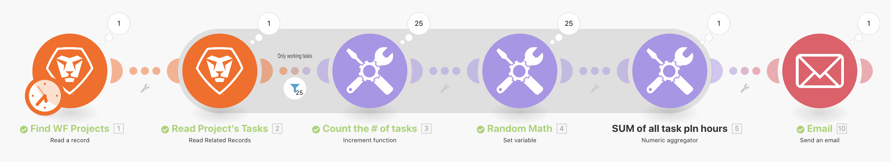

# Exercice d’agrégation

Découvrez comment agréger plusieurs bundles d’informations en une seule valeur.

## Vue d’ensemble de l’exercice

En utilisant le scénario « Introduction à l’itération » que vous avez créé lors de l’exercice précédent, agrégez le nombre d’heures prévues sur chaque tâche opérationnelle du projet et envoyez-vous un e-mail contenant ces informations.

## Étapes à suivre

**Ajoutez un filtre et faites la SOMME du nombre d’heures prévues.**

1. Clonez le scénario « Introduction à l’itération » que vous avez créé lors de l’exercice précédent et nommez-le « Introduction à l’agrégation ».
1. Ajoutez un filtre entre le module Lire les tâches du projet et le module Compter le nombre de tâches. Nommez le filtre « Uniquement les tâches opérationnelles ».
1. Définissez la condition sur Nombre d’enfants [Opérateur numérique : égal à] 0.

   

1. Après le module Math aléatoire, ajoutez un module d’outil Agrégateur numérique.
1. Définissez le module source sur Lire les tâches du projet.
1. Définissez la fonction Agrégat sur SOMME.
1. Définissez la Valeur sur le champ Travail à partir du module Lire les tâches du projet.
1. Renommez ce module « SOMME de toutes les heures de planification de la tâche ».

   

   **Notez l’ombre qui indique que l’agrégation termine l’itération.**

   

   **Envoyez un e-mail avec les heures agrégées.**

1. Ajoutez un module Envoyer un e-mail à partir de l’application de messagerie, après l’agrégateur numérique.
1. Envoyez-vous l’e-mail.
1. L’objet est « Détails du projet ».
1. Dans le champ Contenu, indiquez « Il existe un projet appelé [nom du projet] qui a un nombre total du [résultat] d’heures prévues ». Le « [nom du projet] » provient du module Lecture d’un enregistrement et « [résultat] » provient du module d’agrégation.

   

1. Enregistrez et exécutez une fois. Recherchez l’e-mail dans votre boîte de réception.

Au sein de l’itération, il est possible d’accéder aux différents paquets. En dehors de l’itération, dans le module Envoyer un e-mail, seuls les champs agrégés sont accessibles.
