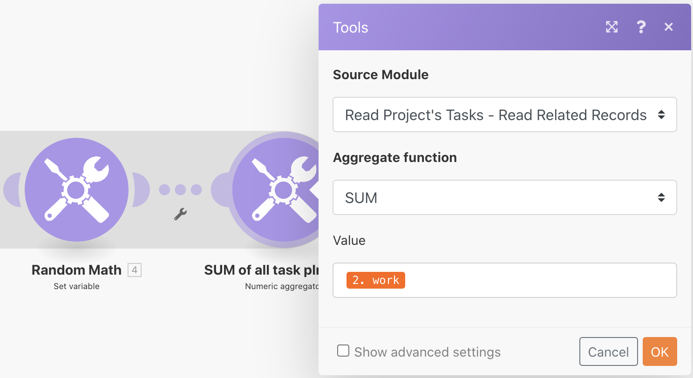

# Agrégation

Découvrez comment regrouper plusieurs lots d’informations en une seule valeur.

## Présentation de l’exercice

En utilisant le scénario &quot;Introduction à l’itération&quot; que vous avez créé lors du dernier exercice, agrégez les heures planifiées sur chaque tâche opérationnelle du projet et envoyez-vous un email contenant ces informations.

## Étapes à suivre

**Ajoutez un filtre et conservez les heures prévues.**

1. Cloner le scénario &quot;Introduction à l’itération&quot; que vous avez créé lors de l’exercice précédent et nommer-le &quot;Introduction à l’agrégation&quot;.
1. Ajoutez un filtre entre le module Lecture des tâches du projet et le module Comptage du nombre de tâches. Nommez le filtre &quot;Uniquement les tâches opérationnelles&quot;.
1. Définissez la condition sur Nombre d’enfants [Opérateur numérique : Égal à] 0.

   

1. Après le module Math aléatoire, ajoutez un module d’outil Agrégateur numérique .
1. Définissez le module source sur Lire les tâches du projet.
1. Définissez la fonction Agrégat sur SUM.
1. Définissez la Valeur sur le champ Travail à partir du module Lecture des tâches du projet .
1. Renommez ce module &quot;SOMME de toutes les heures de planification de la tâche&quot;.

   

   **Notez l’ombre qui indique que l’agrégation termine l’itération.**

   

   **Envoyez un email avec des heures agrégées.**

1. Ajoutez un module Envoyer un email à partir de l’application de messagerie, après l’agrégateur numérique.
1. Envoyez-vous l&#39;email.
1. L’objet est &quot;Détails du projet&quot;.
1. Dans le champ Contenu, indiquez &quot;Il existe un projet appelé [nom du projet] qui a un nombre total de [result] les heures prévues.&quot; Le &quot;[nom du projet]&quot; provient du module Lecture d’un enregistrement et &quot;[result]&quot; provient du module d’agrégation.

   

1. Enregistrez et exécutez une fois. Recherchez l’adresse électronique dans votre boîte de réception.

Dans l’itération, les lots individuels sont accessibles. En dehors de l’itération, dans le module Envoyer un email , seuls les champs agrégés sont accessibles.
