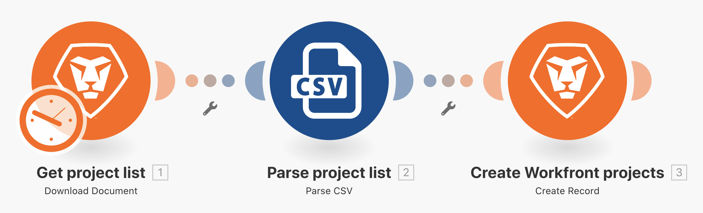
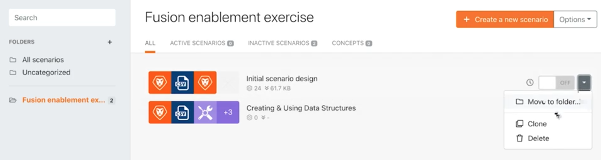

# Au-delà de l’exercice sur le mappage de base

Découvrez comment utiliser les formules du panneau de mappage pour manipuler ou convertir le ou les champs envoyés à un module.

## Vue d’ensemble de l’exercice

Modifiez le nom du projet, la date de début prévue et la priorité à partir des exercices « Au-delà du mappage de base » en utilisant les formules du panneau de mappage.

## Étapes à suivre

**Faites un clone de votre conception initiale du scénario.**

1. Sélectionnez l’option Cloner à droite de la conception initiale du scénario dans la section des scénarios, comme indiqué ci-dessous. Nommez-le « Au-delà du mapping de base ».

   

   **Nous allons maintenant utiliser le panneau de mappage du module Créer des projets Workfront pour configurer le nom du projet, la date de début prévue et les champs de priorité.**

1. Cliquez sur le module Créer des projets Workfront pour modifier les paramètres. À l’aide du panneau de mappage, remplacez le champ Nom « [Nom de mon projet] par [Sponsor] ».

   + Le [Nom de mon projet] correspond à la colonne 1 du module Analyse CSV et le [Sponsor] à la colonne 6. Le mot « par » est simplement tapé entre les deux.

1. Passez ensuite à la date de début prévue et utilisez la formule addDays pour ajouter 15 jours au champ, comme décrit dans la vidéo de présentation Au-delà du mappage de base.
1. Recherchez le champ Priorité et activez le bouton Mapper en haut à droite du champ. Le menu de la liste de sélection se transforme en numéro. Créez une instruction If pour qualifier un projet de priorité élevée (4) si l’indice de confiance du fichier CSV est inférieur à 100, sinon il peut être considéré comme normal (2).

   + La cote de confiance figure dans la colonne 4.

   **À ce stade, votre panneau de mappage doit ressembler à celui-ci :**

   

1. Cliquez sur OK, puis sur Exécuter une fois.
1. Recherchez le projet dans votre instance Workfront pour vérifier que tout a été correctement mappé.
1. Enregistrez votre scénario.
