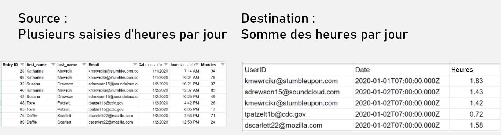

# Exercice sur les structures de données

Transformez les données d’un fichier source en un fichier de destination.

## Vue d’ensemble de l’exercice

Ouvrez un fichier CSV contenant une liste d’entrées de temps. Ces entrées de temps correspondent à des minutes enregistrées tout au long de certains jours par plusieurs utilisateurs et utilisatrices. L’objectif est de prendre ces informations et de produire un nouveau fichier CSV qui montre le temps total, en heures, enregistré par chaque utilisateur ou utilisatrice, chaque jour.

Dans ce scénario, vous ouvrirez un fichier contenant une liste d’entrées de temps pour les minutes travaillées, comprenant la date et l’heure, le nombre de minutes saisies et l’adresse e-mail de la personne qui a effectué la saisie. Il y a 100 entrées de temps, dont certaines ont été faites par les mêmes personnes et certaines ont été faites le même jour que d’autres.

Pour produire un fichier indiquant le temps total, en heures, travaillé chaque jour par chaque individu, vous devez suivre les étapes suivantes :

1. Dans le module du déclencheur, récupérez un fichier dans le dossier Workfront. Téléchargez le fichier.
1. Dans le premier module CSV, analysez les données relatives à la saisie des temps afin de produire une liasse pour chaque saisie des temps. Il s’agit d’un itérateur.
1. Le premier module Outils est un agrégateur numérique. Cette opération permet de faire la SOMME de toutes les minutes et de regrouper les lignes par e-mail, puis par date. Le résultat est le nombre total de minutes travaillées chaque jour par adresse e-mail.
1. Le deuxième module Outils est un module Définir la variable. Utilisez-le pour formater les minutes afin de les diviser par 60 et de les arrondir à 2 décimales.
1. Dans le deuxième module CSV, configurez le fichier de sortie.
1. Dans le dernier module, chargez le fichier CSV dans Workfront.

## Étapes à suivre

**Téléchargez le fichier à partir de Workfront.**

1. Dans le dossier Workfront « Fusion Exercise Files », sélectionnez « _Fusion1.0JanTime.csv » et cliquez sur Détails du document.
1. Copiez le premier numéro d’identifiant de l’adresse URL.
1. Créez un nouveau scénario. Nommez-le « Création et utilisation des structures de données ».
1. Commencez par le module Télécharger le document de l’application Workfront.
1. Configurez votre connexion Workfront et incluez l’identifiant de document que vous avez copié à partir de l’URL Workfront.

   

   **Analysez les données de saisie des temps.**

1. Ajoutez un autre module, en sélectionnant Analyse CSV.
1. Configurez Analyse CSV pour 7 colonnes. Vérifiez que le CSV contient bien une zone d’en-têtes. Sélectionnez le type de délimiteur virgule et placez les données dans le champ CSV.

   

1. Cliquez sur Exécuter une fois pour afficher la sortie.
1. Ouvrez l’inspecteur d’exécution pour voir les entrées et les sorties du module Analyse CSV. Il existe un bundle (un fichier CSV) en entrée et plusieurs bundles en sortie (un bundle pour chaque ligne du fichier CSV). Il devrait ressembler à ceci :

   

   **Ensuite, transformez les données dans le format de sortie souhaité, avec des totaux de temps agrégés exprimés en heures au lieu de minutes.**

1. Ajoutez un module d’outil Agrégateur numérique.
1. Sélectionnez le module source, qui est le module Analyse CSV.
1. Sélectionnez SUM pour la fonction d’agrégat.
1. Le champ Valeur est la colonne 7 du fichier CSV. Il s’agit des minutes enregistrées par chaque utilisateur ou utilisatrice.
1. Pour additionner les champs par groupe, cliquez sur Paramètres avancés et définissez Grouper par sur e-mail (colonne 4), date (colonne 5).

   + Ce calcul s’applique à toutes les combinaisons de l’e-mail et de la date. Veillez à mettre une virgule entre la colonne 4 et la colonne 5. Elle sera utilisée comme délimiteur par la suite.

   **Votre panneau de mappage doit ressembler à ceci :**

   

1. Cliquez sur Exécuter une fois pour vérifier la sortie de l’agrégation.

   **Les offres de sortie devraient ressembler à ceci :**

   

   **Convertissez maintenant les minutes agrégées en heures.**

1. Ajoutez un autre module d’outils, en sélectionnant Définir la variable.
1. Nommez la variable « Heures ».
1. Définissez la valeur de la variable sur formatNumber(result/60;2;.;,)

   **Votre panneau de mappage doit ressembler à ceci :**

   

   **Ensuite, il faut définir les valeurs du fichier de sortie. Vous souhaitez que l’ID utilisateur et la valeur de la date soient utilisés pour les regroupements. Vous souhaitez également connaître les heures qui ont été calculées.**

1. Ajoutez un autre module-CSV grâce à l’agrégateur Créer CSV (avancé).
1. Le module source est le module Outils - Agrégateur numérique.
1. Cliquez sur Ajouter dans le champ Structure de données et nommez notre structure de données « Nombre total d’heures enregistrées par jour ».
1. Cliquez sur Ajouter un élément pour créer le premier élément.
1. Nommez l’élément « UserID » et définissez le type sur Texte. Cliquez sur Ajouter.
1. Cliquez à nouveau sur Ajouter un élément pour créer le second élément.
1. Nommez l’élément « Date », définissez le type sur Date, puis cliquez sur Ajouter.
1. Cliquez à nouveau sur Ajouter un élément.
1. Nommez l’élément « Heures », définissez le type sur Nombre, puis cliquez sur Ajouter.

   **Votre structure de données devrait ressembler à ceci :**

   

1. Cliquez sur Enregistrer pour terminer la structure de données du Nombre total d’heures enregistrées par jour.

   **Vous devez maintenant fournir les valeurs des trois champs que vous venez de créer. Ces trois champs doivent apparaître dans le panneau de mappage CSV.**

1. Cliquez dans le champ UserID et sélectionnez GET dans l’onglet Fonctions générales. Dans le premier paramètre, placez PARTAGE à partir de l’onglet Texte et fonctions binaires. Le premier paramètre de la fonction PARTAGE est le champ Clé. Ajoutez une virgule comme délimiteur et 1 comme index. Cela indique que vous souhaitez que la fonction GET récupère le premier champ du tableau Clé.
1. Copiez cette expression dans le champ Date. Remplacez l’index de 1 à 2 pour obtenir (GET) la seconde valeur du tableau.
1. Pour le champ Heures, ajoutez le champ Heures à partir de l’outil Définir la variable.

   **Votre panneau de mappage CSV devrait ressembler à ceci :**

   

   **Si vous exécutez le scénario maintenant, vous devriez obtenir le résultat suivant :**

   

   **Maintenant, ajoutez un module pour prendre ce résultat et le charger en tant que document dans un projet existant dans Workfront.**

1. Ouvrez le projet dans Workfront et copiez l’ID de projet à partir de l’URL.
1. Revenez au scénario dans Fusion et ajoutez un autre module : le module Charger le document à partir de l’application Workfront.
1. Collez l’ID de projet dans le champ ID d’enregistrement associé.
1. Sélectionnez Projet pour le type d’enregistrement associé.
1. Choisissez l’option Mappage pour le fichier source.
1. Pour le Nom du document, utilisez le nom du fichier que vous avez téléchargé et ajoutez « Mis à jour » devant.
1. Pour le contenu du fichier, utilisez la sortie texte du module Créer CSV.

   **Votre panneau de mappage doit ressembler à ceci :**

   

1. Cliquez sur OK et enregistrez le scénario.
1. Cliquez sur Exécuter une fois pour exécuter le scénario.

   **Vérifiez l’Inspecteur d’exécution dans le module Charger le document pour confirmer que le document a été chargé.**

   
