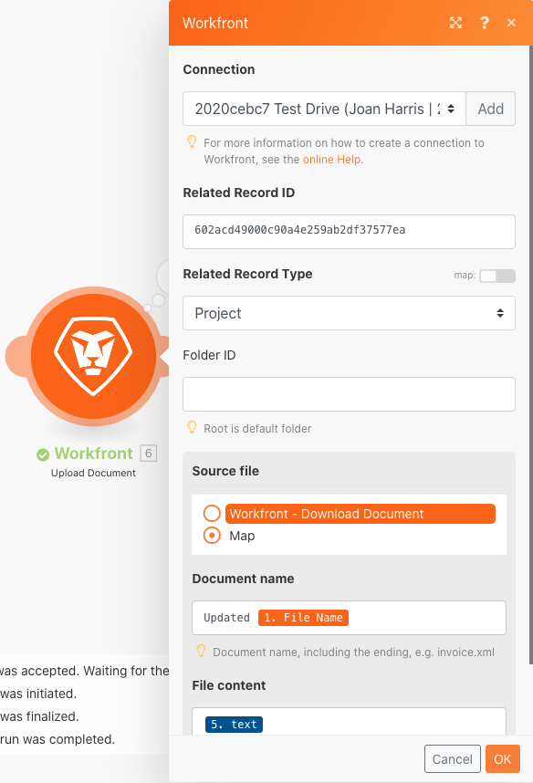

# Structures de données

Transforme les données d’un fichier source en fichier de destination.

## Présentation de l’exercice

Ouvrez un fichier CSV contenant une liste d’entrées d’heure. Ces entrées temporelles sont enregistrées pendant les minutes enregistrées pendant certains jours par plusieurs utilisateurs. L’objectif est de prendre ces informations et de produire un nouveau fichier CSV qui indique la durée totale, en heures, consignée par chaque utilisateur, chaque jour.

Dans ce scénario, vous allez ouvrir un fichier qui contient une liste d’entrées d’heure pour les minutes de travail, y compris la date et l’heure, le nombre de minutes saisies et l’adresse électronique de l’auteur de l’entrée. Il y a 100 entrées, certaines réalisées par les mêmes individus et certaines ont été faites le même jour que d&#39;autres.

Pour produire un fichier qui indique le temps total, en heures, travaillé chaque jour par chaque personne, procédez comme suit :

1. Dans le module de déclenchement, récupérez un fichier du dossier Workfront. Téléchargez le fichier .
1. Dans le premier module CSV, analysez les données d’entrée de temps pour générer un lot pour chaque entrée de temps. C&#39;est un itérateur.
1. Le premier module Outils est un agrégateur numérique. Cette opération additionne toutes les minutes et regroupe les lignes par adresse électronique, puis par date. Le résultat est le nombre total de minutes travaillées chaque jour par adresse email.
1. Le deuxième module Outils est un module Définir la variable . Utilisez cette option pour formater les minutes à diviser par 60 et arrondir à 2 décimales.
1. Dans le deuxième module CSV, configurez le fichier de sortie.
1. Dans le module final, téléchargez le fichier CSV dans Workfront.

## Étapes à suivre

**Téléchargez le fichier depuis Workfront.**

1. Dans le dossier Workfront &quot;Fusion Exercise Files&quot;, sélectionnez &quot;_Fusion1.0JanTime.csv&quot; et cliquez sur Document Details.
1. Copiez le premier numéro d’identifiant de l’adresse URL.
1. Créez un scénario. Nommez-le &quot;Création et utilisation des structures de données&quot;.
1. Commencez par télécharger le module de document à partir de l’application Workfront.
1. Configurez votre connexion Workfront et incluez l’ID de document que vous avez copié à partir de l’URL Workfront.

   

   **Analysez les données de saisie de l’heure.**

1. Ajoutez un autre module, en sélectionnant Parse CSV (Analyse CSV).
1. Configurez l’analyse CSV pour 7 colonnes. Cochez la case CSV contient des en-têtes . Sélectionnez le type de délimiteur virgule et placez les données dans le champ CSV.

   

1. Cliquez une fois sur Exécuter pour afficher la sortie.
1. Ouvrez l’Inspecteur d’exécution pour afficher les entrées et les sorties du module CSV Parse. Il existe un lot (un fichier CSV) en entrée et plusieurs lots en sortie (un lot pour chaque ligne du fichier CSV). Cela devrait ressembler à ceci :

   

   **Ensuite, transformez les données en formulaire de sortie souhaité, avec des totaux de temps agrégés exprimés en heures au lieu de minutes.**

1. Ajoutez un module d’outil Agrégateur numérique .
1. Sélectionnez le module source, qui est le module CSV Parse.
1. Sélectionnez SUM pour la fonction d’agrégat.
1. Le champ Valeur est la colonne 7 du fichier CSV. Il s’agit des minutes consignées par chaque utilisateur.
1. Pour additionner les champs par groupe, cliquez sur Paramètres avancés et définissez le groupe par sur email (colonne 4), date (colonne 5).

   + Cette somme correspond à chaque combinaison de l’email et de la date. Veillez à placer une virgule entre la colonne 4 et la colonne 5. Il sera utilisé ultérieurement comme délimiteur.

   **Votre panneau de mappage doit ressembler à ceci :**

   

1. Cliquez une fois sur Exécuter pour vérifier la sortie de l’agrégation.

   **Les lots de sortie doivent se présenter comme suit :**

   

   **Convertissez maintenant les minutes agrégées en heures.**

1. Ajoutez un autre module d’outils, en sélectionnant Définir la variable.
1. Nommez la variable &quot;Hours&quot;.
1. Définissez la valeur de la variable sur formatNumber(result/60;2;.;,)

   **Votre panneau de mappage doit ressembler à ceci :**

   

   **Ensuite, récupérez les valeurs configurées pour le fichier de sortie. Vous souhaitez que l’ID utilisateur et la valeur de date soient utilisés pour les regroupements. Vous souhaitez également connaître les heures calculées.**

1. Ajoutez un autre module-CSV à l’aide de l’agrégateur Créer un CSV (avancé).
1. Le module source est l’agrégateur Outils - Numérique .
1. Cliquez sur Ajouter en regard du champ Structure de données et nommez notre structure de données &quot;Durée journalière consignée&quot;.
1. Cliquez sur Ajouter un élément pour créer le premier élément.
1. Nommez l’élément &quot;UserID&quot; et définissez le type sur Texte. Cliquez sur Ajouter.
1. Cliquez à nouveau sur Ajouter un élément pour créer le second élément.
1. Nommez l’élément &quot;Date&quot;, définissez le type sur Date, puis cliquez sur Ajouter.
1. Cliquez une fois de plus sur Ajouter un élément .
1. Nommez l’élément &quot;Hours&quot;, définissez le type sur Nombre, puis cliquez sur Ajouter.

   **Votre structure de données doit se présenter comme suit :**

   

1. Cliquez sur Enregistrer pour terminer la structure de données de la somme journalière consignée du temps .

   **Vous indiquez maintenant les valeurs des trois champs que vous venez de créer. Ces trois champs doivent apparaître dans le panneau de mappage CSV.**

1. Cliquez dans le champ UserID et sélectionnez GET dans l’onglet Fonctions générales. Dans le premier paramètre, placez SPLIT à partir de l’onglet Texte et fonctions binaires . Le premier paramètre de la fonction SPLIT est le champ Clé . Ajoutez une virgule comme délimiteur et 1 comme index. Cela indique que vous souhaitez que le GET récupère le premier champ du tableau Clé.
1. Copiez cette expression dans le champ Date . Remplacez l’index de 1 à 2 par la seconde valeur du tableau.
1. Pour le champ Heures , ajoutez le champ Heures de l’outil Définir la variable .

   **Votre panneau de mappage CSV doit ressembler à ceci :**

   

   **Si vous exécutez le scénario maintenant, vous devriez voir cette sortie :**

   

   **Maintenant, ajoutez un module pour prendre cette sortie et téléchargez-la en tant que document dans un projet existant dans Workfront.**

1. Ouvrez le projet dans Workfront et copiez l’ID de projet à partir de l’URL.
1. Revenez au scénario dans Fusion et ajoutez un autre module : le module Télécharger le document à partir de l’application Workfront.
1. Collez l’ID de projet dans le champ Identifiant d’enregistrement associé .
1. Sélectionnez Projet pour le type d’enregistrement associé.
1. Choisissez l’option Mappage pour le fichier source.
1. Pour le Nom du document, utilisez le nom de fichier que vous avez téléchargé, en ajoutant &quot;Mis à jour&quot; devant.
1. Pour le contenu du fichier, utilisez la sortie Texte du module Créer CSV .

   **Votre panneau de mappage doit ressembler à ceci :**

   

1. Cliquez sur OK et enregistrez le scénario.
1. Cliquez une fois sur Exécuter pour exécuter le scénario.

   **Vérifiez l’Inspecteur d’exécution dans le module Télécharger le document pour confirmer que le document a été téléchargé.**

   