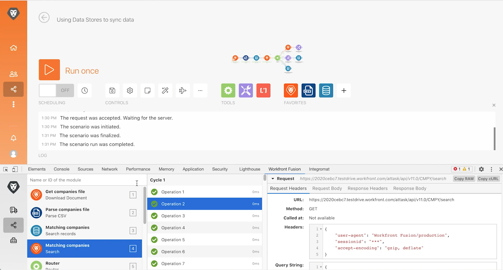

# Exercice sur les outils de développement

Améliorez vos capacités de dépannage d’un scénario et simplifiez les configurations complexes à l’aide de l’outil de développement.

## Vue d’ensemble de l’exercice

Installez et utilisez les différentes zones de l’outil de développement Workfront pour examiner de plus près les requêtes/réponses effectuées et les astuces de conception de scénario avancées.

>[!NOTE]
>
>L’outil de développement de Workfront Fusion n’est disponible que dans le navigateur Chrome lors de l’utilisation de l’[Outil de développement Chrome](https://developer.chrome.com/docs/devtools?hl=fr).

## Étapes à suivre

**Installez l’outil de développement.**

1. Téléchargez le document « workfront-fusion-devtool.zip » qui se trouve dans le dossier Fusion Exercise Files du lecteur de test.
1. Extrayez les fichiers Zip dans un dossier.
1. Ouvrez un onglet dans Chrome et saisissez **chrome://extensions**.
1. Activez le mode Développeur à l’aide du commutateur situé en haut à droite, puis cliquez sur le bouton « Load unpacked » qui apparaît en haut à gauche. Sélectionnez le dossier contenant l’outil de développement (là où vous l’avez décompressé).

   

1. Une fois décompressé, l’outil de développement apparaît parmi vos autres extensions.

   

   **Utilisez le Live Stream.**

1. Commencez par ouvrir le scénario « Utiliser des magasins de données pour synchroniser les données ».
1. Ouvrez l’outil de développement en tapant F12 ou avec la fonction F12. Vous pouvez également cliquer sur le menu à trois points dans la barre d’adresse de Chrome et accéder aux outils de développement.

   

1. Cliquez sur l’onglet Workfront Fusion, puis sélectionnez Live Stream dans la liste de gauche.
1. Cliquez sur Exécuter une fois pour afficher les événements au fur et à mesure qu’ils se produisent.
1. Cliquez sur un événement pour afficher les onglets situés à droite pour les sections En-têtes de requête, Corps de requête, En-têtes de réponse et Corps de réponse.

   

   **Utiliser le débogueur de scénario**

1. Sélectionnez Débogueur de scénario et cliquez sur un module pour afficher des informations sur les opérations de ce module.

   

1. Naviguez jusqu’à l&#39;onglet Historique. Cliquez sur Détails sur une exécution pour examiner les détails de l’opération du module pour une exécution spécifique.

   

   **Utiliser les outils**

1. Retournez dans le concepteur de scénarios et sélectionnez Outils dans l’outil de développement. Cette option affiche les outils disponibles.

   

+ Cibler un module : recherchez et ouvrez rapidement un module à l’aide de l’identifiant de module.
+ Rechercher un ou plusieurs modules par mappage : recherchez un scénario à l’aide d’un mot-clé pour trouver des valeurs et/ou des clés mappées dans les modules.
+ Obtenir les métadonnées de l’application : reportez-vous aux métadonnées de l’application sélectionnée dans un scénario.
+ Copier le mappage : copie le mappage d’un module à un autre. Vous pouvez également cloner le module dans le concepteur.
+ Copier le filtre : copie un filtre. Le filtre est toujours affecté au module à sa droite.
+ Intervertir la connexion : l’outil prend la connexion du module sélectionné et établit la même connexion pour tous les modules de la même application dans le scénario. Cette fonction est utile si vous devez changer de connexion au cours d’un scénario achevé. Cet outil vous évite de perdre tous les mappages et vous permet de gagner du temps.
+ Intervertir une variable : retrouve toutes les occurrences de la variable donnée dans l’ensemble du scénario ou dans un module, et les remplace par la nouvelle. Les caractères génériques ne sont pas pris en charge. Si vous avez accidentellement mappé une valeur sur l’ensemble du scénario, cela peut vous aider à la remplacer facilement par la valeur correcte.
+ Permuter l’application : échange l’application donnée avec une autre.
+ Base 64 - Coder les données saisies en Base64 ou décoder du Base64. Ceci est utile lorsque vous souhaitez rechercher des données spécifiques dans la requête codée.
+ Copier le nom du module : copie le nom du module sélectionné dans le presse-papiers.
+ Remapper la source - Modifier la source de mappage d’un module à un autre. Vous devez d’abord ajouter le module à utiliser comme module source à l’itinéraire dans un scénario.
+ Migrer OS - Conçu spécifiquement pour mettre à niveau les modules Google Sheets (ancienne version) vers la dernière version de Google Sheets. Cela ajoute une nouvelle version du module juste après l&#39;ancienne version du module dans l’itinéraire du scénario.
