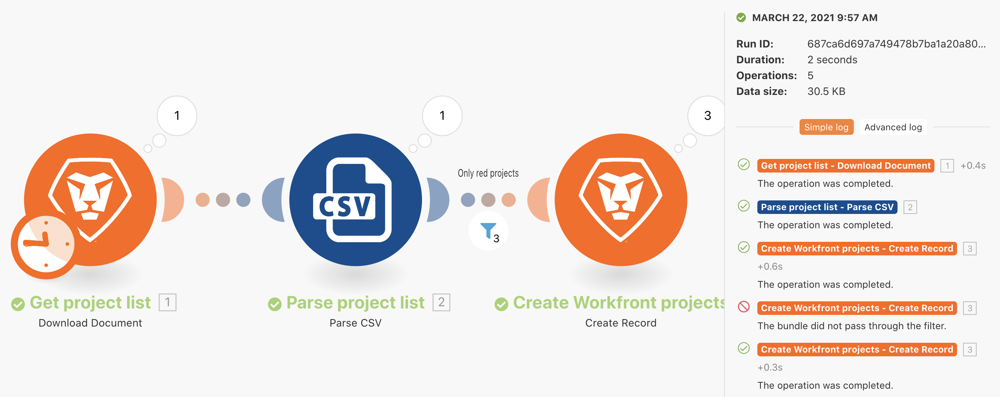

# Exercice sur l’historique d’exécution

Examinez et auditez les détails des exécutions passées et des configurations de scénarios.

## Vue d’ensemble de l’exercice

Examinez l’historique des exécutions du scénario « Utilisation du filtre de puissance » pour comprendre ce qui s’est passé lors des exécutions et comment elles ont été structurées au moment où elles ont été exécutées.

## Étapes à suivre

1. Ouvrez votre scénario « Utiliser le filtre de puissance ».
1. Dans la page de vue d’ensemble, cliquez sur l’onglet Historique (en haut, sous le nom du scénario).

   

1. Recherchez une exécution et cliquez sur le bouton « Détails » pour ouvrir une page qui présente les opérations spécifiques effectuées (ou non effectuées) dans le panneau de droite. Dans le panneau de gauche, vous pouvez examiner le scénario tel qu’il se présentait au moment de l’exécution.

   

1. Lorsque vous cliquez sur un module dans le panneau de scénario, un panneau d’inspecteur de module apparaît, affichant des informations sur les paramètres du module. Cliquez sur l’inspecteur d’exécution en regard d’un module ou d’un filtre pour voir quels sont les bundles d’informations qui ont été exécutés.

   

   

1. Dans le panneau de droite, faites défiler ou cliquez sur le journal simple pour voir les détails de l’exécution « lecture par lecture ».

   + Vous pouvez voir quand les opérations ont été effectuées dans les modules et quand les bundles sont passés (ou non) par les filtres.

   

   + Cliquez sur un élément du journal pour ouvrir le panneau des opérations dans le panneau du scénario. Les journaux sont répertoriés par ordre chronologique de leur date d’apparition.

   

1. Le journal avancé contient des informations similaires. Cependant, il fournit des informations supplémentaires sur le nombre de cycles exécutés par exécution et vous permet de déterminer plus en détail les bundles d’informations qui ont été traités au cours de chaque cycle.

