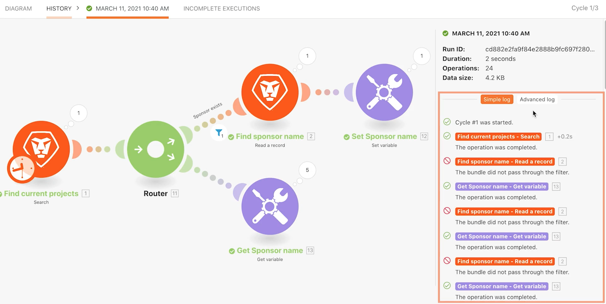
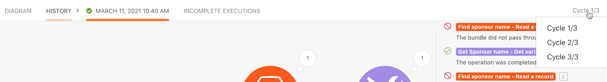

# Explorer les exécutions, les cycles et les lots

Découvrez comment les exécutions, les cycles et les bundles se comportent en utilisant l’historique d’exécution d’un scénario.

## Vue d’ensemble de l’exercice

Effectuez des exercices avec différentes configurations de scénario pour explorer l’utilisation des exécutions et des cycles.

## Étapes à suivre

1. Clonez le scénario nommé « Partage de variables entre les chemins de routage ». Nommez le nouveau scénario « Partage de variables entre chemins de routage - Test de cycles ».
1. Supprimez le module Envoyer un e-mail, puisqu’il est inutile pour ce test.

   **Configurez votre scénario pour qu’il traite 3 cycles par exécution. Traitez 5 projets dans chaque cycle.**

1. Cliquez sur le module de déclenchement et définissez le champ Maximal sur 5, de sorte que seuls 5 projets soient traités dans chaque cycle.
1. Dans les critères de recherche, supprimez le second filtre qui limite la recherche à un seul projet.
1. Cliquez sur OK.

1. Dans la barre d’outils Fusion, ouvrez les paramètres du scénario et faites passer le champ Nombre max. de cycles de 1 à 3.
1. Cliquez sur OK.

   

   **Planifiez l’exécution du scénario toutes les minutes.**

1. Cliquez sur l’icône de l’horloge en regard du module de déclenchement et définissez le champ Minutes sur 1 minute.

   

1. Ensuite, activez le bouton Planification situé sous le bouton Exécuter une fois. Enregistrez votre scénario.

   

1. Accédez à l’historique d’exécution du scénario et observez l’apparition d’un nouvel enregistrement dans la minute qui suit. Vous devrez peut-être actualiser la page.

   

1. Cliquez sur le bouton Détails d’une exécution. Cliquez sur le lien de connexion simple dans le panneau de droite, comme vous l’avez fait dans la partie Historique d’exécution de la formation Workfront Fusion.
1. Les enregistrements des opérations traitées sont divisés en cycles.

   

1. Un menu déroulant en haut à droite de la fenêtre vous permet de sélectionner l’un des trois cycles que vous avez configurés pour qu’il s’exécute à chaque fois.

   
