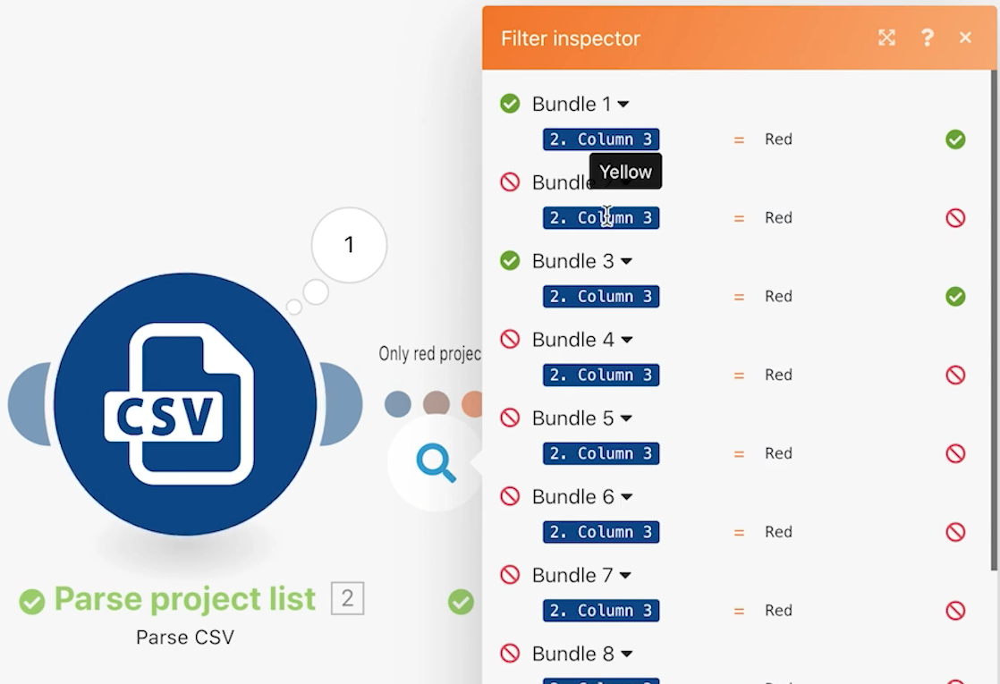

# Exercice sur les filtres

Découvrez comment utiliser le filtre entre les modules pour n’autoriser que certains types de bundles.

## Vue d’ensemble de l’exercice

Ajoutez un filtre entre les deux modules dans le scénario Au-delà du mappage de base pour créer uniquement des projets dont la couleur de projet est « Rouge » dans le fichier CSV.

## Étapes à suivre

1. Créez un clone du scénario « Au-delà du mappage de base » et nommez-le « Utilisation du filtre puissant ».

   **Ajoutez un filtre avant le module Créer des projets Workfront afin de n’autoriser la création que de projets rouges.**

   

1. Ajoutez un filtre en cliquant sur la ligne pointillée reliant les modules ou en cliquant sur la clé à molette et en sélectionnant Configurer un filtre.
1. Utilisez le champ Libellé pour nommer le filtre « Projets rouges uniquement ».
1. Dans le champ Condition, mappez le champ Couleur du projet (colonne 3 dans le fichier CSV). Sélectionnez l’opérateur Égal à (non sensible à la casse), puis saisissez « rouge ».
1. Cliquez sur OK.

   

   **Testez le filtre et vérifiez les résultats.**

1. Cliquez sur Enregistrer pour enregistrer le scénario, puis sur Exécuter une fois.
1. Cliquez sur l’Inspecteur d’exécution relatif au filtre afin de voir comment chaque bundle a été traité par le filtre et s’il a pu être déplacé ou non vers le module Créer des projets Workfront.

   

1. Recherchez les projets créés dans votre instance Workfront.
